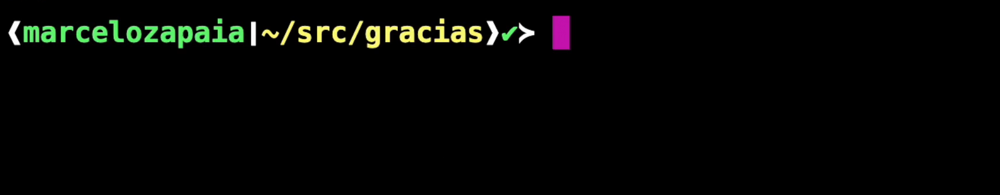
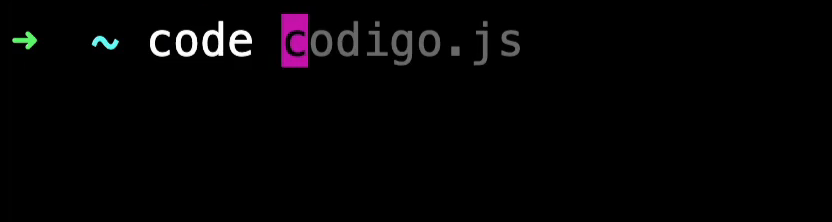

### ¿Qué es javascript?

JavaScript es un lenguaje de programación que se ejecuta en el navegador y que permite crear interactividad en las páginas web.

### ¿Qué es un lenguaje de programación?

Un lenguaje de programación es un conjunto de reglas que permiten al programador escribir instrucciones que el ordenador puede entender y ejecutar.

### ¿Qué es un ordenador?

Un ordenador es una máquina que puede procesar información.

### ¿Qué es información?

La información es cualquier dato que tenga sentido para el ordenador.

### ¿Qué es un dato?

Un dato es cualquier valor que tenga sentido para el ordenador.

### ¿Que es un interprete?
Un interprete o un compilador (dependiendo del caso)  es un programa capaz de analizar y ejecutar código escrito en un lenguaje de programación.


El interprete  de JavaScript para computadora es Node.js

Para instalar Node.js desde el sitio web oficial de Node.js.

https://nodejs.org/es y presionar en Descargar Node.js(LTS)


### La línea de comandos

La línea de comandos es una herramienta que permite al usuario interactuar con el ordenador a través de comandos.

Hay dos tipos de lineas de comandos:

1. Para navegar en las carpetas y archivos del ordenador
2. Para ejecutar aplicaciones

Las acciones que realizo para interactuar con la computadora es muy comun trabajar con  la terminal, para ejecutar programas, bajar programas, interactuar con elementos del sistema operativo.

La terminal es una herramienta que nos muestra un linea de comandas, para basicamete chatear con nuestro computador, las cascaras que mas nos permiten interactuar con el sistema operativo son:

1. BASH(Bourne Again SHell)
    Es el shell predeterminado de la mayoria de las distros de linux y macos. Es conocida por su robustez y amplio uso en script.
2. FISH(Friendly Interactive Shell):
    Se sentra en la facilidad de uso y la interactividad. Ofrece caracteristicas como autocompletado, coloracion sintactica y sugerencias de comandos. Sin configuracion adicional.   

3. ZSH(Z Shell):
    Es un shell extensible que incorpora muchas de las caracteristicas de Bash, ksh, tcsh, ademas de añadir las propias. Es altamte configurable y populr por sus funciones de autocompletado, correcion ortografica de comandos, y personalizacion del prompt. Los frameworks como "Oh My Zsh" facilita la configuracion y la adición de plugins y temas.

### Un SHELL

Es un programa que actúa como una interfaz entre el usuario y el sistema operativo. Te permite interactuar con el sistema operativo mediante la introducción de comandos de texo, El shell interpreta estos comandos y le dice al sistema operativo qué acciones realizar.

Pienzalo como un traductor o un intermediario: tú le das instrucciones en lenguaje que el shell entiende (comandos) , y el shell traduce esas intruccione a un lenguaje que el nucleo (el kernel) del sistema operativo puede entender y ejecutar. 


En este chat tenemos dos partes:

1. El usuario (el user con el accediste)
2. En donde estas (el directorio actual que estas)


Simpre estamos situados en un directorio, que es una carpeta en el ordenador.

El sistema operativo tiene otras carpetas estandares donde se situan ciertos archivos y carpetas.


Los comandos clasicos que vienen con el sistema operativo:

-   PWD: Print Working Directory
    Muestra el directorio actual


-   CD: Change Directory
    Cambia de directorio


-   LS: List
    Lista los archivos y carpetas del directorio actual


-   MKDIR: Make Directory
    Crea una carpeta


-   RM: Remove
    Elimina un archivo o carpeta


Se puede abrir un archivo con una aplicacion especifica como un archivo de js con visual studio code.



### La terminal
Cuando escribimos un comando en la terminal estamos escribiendo código. Ese código es interpretado por la terminal para hablar con el sistema operativo y pedirle cosas como crear una carpeta, mostrar una lista de archivos o ejecutar una aplicación.


### Bash
Lo más común es que la terminal que usemos use bash como lenguaje. Especialmente en sistemas UNIX como Linux y macOS.

Vamos a ir aprendiendo lo necesario de Bash a medida que usemos la terminal a diario.

´´´bash
ls -la   # Este comando Bash muestra una lista de todos los archivos en la carpeta donde nos encontremos
´´´	

Por esto, todos sabemos algo de bash.

### Windows
Viene de fábrica dos tipos de terminales: PowerShell y CMD, también conocido como Símbolo del sistema.


En ninguna de estas terminales podemos escribir comandos bash, que son necesarios para poder trabajar con normalidad.

Por eso, para poder ejecutar comandos bash en Windows, necesitamos instalar una herramienta adicional como Git Bash.

### Git Bash


Git Bash emula una terminal bash dentro Windows. Esto nos permite usar herramientas de desarrollo que están diseñadas para ejecutarse en bash (que son muchas) y convenientemente nos va a servir en el futuro cercano cuando usemos Git, ya que Git está diseñado para trabajar en un entorno UNIX, que es lo que emula Git Bash.


### Desafio HOLA TERMINAL
Si estás usando Windows instalá Git Bash.

Si estás usando Linux o Mac buscá la aplicación llamada: Terminal.

Una vez que tengas la terminal abierta ejecutá el siguiente comando para verificar que Node.js esté instalado.

´´´ bash
node --version
´´´


### Comandos básicos  de la terminal
Usamos la terminal porque:

- Es la forma más eficiente, segura y sencilla (aunque todavía no lo creas) para comunicarnos con el sistema operativo.
- Para nuestro trabajo, es lento e incómodo usar la interfaz gráfica.
- Los servidores no tienen salida gráfica, entonces, la terminal es la única forma de acceder a ellos.
- Con la terminal tenemos un manejo más preciso de los datos que estamos manipulando.

#### Los más usados
A continuación, una lista de los comandos que vamos a usar frecuentemente en la terminal. No es necesario que los aprendas de memoria ya que los vamos a ir incorporando a medida que los usemos.


Abrir todos los archivos donde estoy parado con el comando "code ."


Limpiar la terminal con el comando "clear"


Salir de la terminal con el comando "exit"

### Desafio Carpeta "código"
En este ejercicio te proponemos explorar tu computadora y practicar algunos de los comandos básicos de la terminal.

Utiliza los comandos pwd, cd y ls para navegar las carpeta de tu computadora.

Cuando encuentres un buen lugar, utiliza el comando mkdir para crear una carpeta llamada source (o src) donde guardaremos nuestro código fuente (source code).


¿Porque JavaScript?
- Porque es el lenguaje de la web
Los lenguejes que el navegador entiende son tres:
- HTML
- CSS
- JavaScript


HTML:
La responsabilidad de HTML es la interfaz los elementos que estaran presentes en la interfaz, cosas no visibles como el lenguaje de la pagina.

CSS:
La responsabilidad de CSS es la apariencia de la interfaz, como se ve o como se muestran estos elementos de la interfaz, la posición de las cosas.

JavaScript:
La interactividad de la interfaz, como se comportan estos elementos de la interfaz, como se responde a los eventos, como se comportan los usuarios.


## VISUAL STUDIO CODE

Es un editor de codigo o un editor de texto, al final el codigo es un archivo de texto, es un archivo que contine nuestro codigo, el editor de codigo conoce el lenguaje en el escibimos, puede darnos asistencia al momento de escribir el codigo, en las ultimas versiones se integra IA, la cual puede generar codigo dado el contexto de tu proyecto.

Los lenguajes de programación tienen reglas específicas, es decir, una manera particular en la que se debe escribir el código. A esta serie de reglas la denominamos sintaxis.

**Sintaxis:**
La sintaxis en los lenguajes de programación es mucho más estricta que en los lenguajes naturales y hasta el más mínimo punto o coma equivocado puede causar problemas en una aplicación.

Por ejemplo, si nos falta un punto y coma (;) el algún lugar de nuestro código donde se espera este símbolo, la computadora no tiene la capacidad de intuir lo que quisimos decir. El programa simplemente no funcionará o lo hará de una forma inesperada.


**Editores de código:**
Por suerte existen herramientas especialmente diseñadas para ayudarnos a codear. Estos son los editores de código.


Los editores de código nos permiten formatear el código que estamos escribiendo para que sea fácil de leer, mediante el uso de colores y del formateado del código.

Además, el editor entiende la sintaxis de cada lenguaje y nos ayuda sugiriendo cambios o dándonos opciones de autocompletado, muy similar a lo que sucede con el corrector del teclado de nuestros celulares.


**Instalemos VS Code:**
Pasa finalizar vamos a instalar Visual Studio Code, uno de los editores de código más usados. Para esto vamos a ingresar al sitio de Visual Studio Code, descargar el instalador y seguir los pasos que nos propone.

https://code.visualstudio.com/


Una vez instalado
Utiliza la terminal para crear un nuevo proyecto (una nueva carpeta) y abre la carpeta con VSC.

```bash
# ingresamos a nuestra carpeta de código
# En tu computadora puede llamarse distinto
cd source

# creamos una nueva carpeta para nuestro proyecto
mkdir nuevo-proyecto

# abrimos la carpeta recien creada con vscode
code nuevo-proyecto

# el comando 'code' es algo que se instala cuando 
# instalamos vscode, si no funciona de entrada
# reiniciá la terminal o la compu
```
Tip

En windows, el comando `code` que usamos para abrir VSC desde la terminal, a veces no funciona apenas instalamos Visual Studio. Si te pasa, intentá reiniciando la terminal, la compu completamente o ejecutando este comando en la terminal y reiniciándola.

```bash
echo 'alias code="cmd //C code $*"' >> ~/.bash_profile
```

Ejecutar el e codigo de test Hola Mundo,
En javascript para testear la creacion de una carpeta prueba-vivo, el archivo index.js se ejecuta de la siguente forma:

```bash
PS C:\Users\L03533767\Desktop\SofwareDeveloper\nivel0\prueba-vivo> node .\index.js
hola mundo
```

### Objetivo del nivel
Manipular datos en un lenguejes de programación, ya que programar se trata de resolver problemas. Para eso debemos entender el problema, analizar el problema, y despues diseñar una solución, esa solución contiene datos estos datos  se reciven desde el exterior, estos datos se manipula, estos datos se almacena, y luego se pueden retornar o mostrar. 
El programar es crear soluciones que manipulan datos.

Estos datos en una computadora viven en la memoria RAM, estos conceptos basicos son universales, los cuales se comparten entre todos los lenguajes de programación.
Los datos tienen un tipo y estos tipos tienen una regla de operacion basica dependiendo del tipo, del dato.

Los datos se ocupan en toda las soluciones que desarollemos desde tipos de datos primitivos numeros cadenas boleanos, datos compuestos como arreglos y objetos, para manipular y agrupar adecuadamente la información.

### Primeros datos

Un programa recibe inputs (clicks, texto que introducimos, comandos de voz, etc) los procesa y genera outputs (texto, gráfico, etc).

Cualquier interacción con el programa genera un dato que es guardado en la memoria RAM. Cuando introducimos nuestro nombre en algún campo de texto que nos lo solicite, generamos un dato que es almacenado.


Una vez que podemos acceder al input vamos tener que codear los pasos necesarios que transforman ese input en un output y para eso vamos a necesitar varios datos auxiliares que representan los pasos intermedios para resolver el problema.

Esta serie de pasos que toma un input y resuelve un problema a través de una serie de pasos es conocida como algoritmo.

```javascript

// diametro sería el input
const diametro = 5;
// más adelante vamos a aprender 
// cómo pedirle este dato al usuario


// estas lineas serían la lógica de nuestra app
const radio = diametro / 2;
const radioAlCuadrado = radio * radio;
const area = Math.PI * radioAlCuadrado;


// esto sería el output
console.log("area de la circunferencia", area);

```

Los datos viven en la RAM
Los datos que declaramos en nuestro código son la forma que tenemos de decirle a la memoria RAM que guarde un valor. Son espacios reservados en la memoria de una computadora.


Cuando declaramos(creamos) un dato en nuestro programa, lo que hace el procesador es asignarle un lugar en la memoria RAM. Ese lugar tiene una identificación única, una dirección de memoria. De esta forma, el intérprete sabe dónde está almacenado ese dato y puede buscarlo para manipularlo de cualquier forma.


### Un algoritmo
Es una secuencia finita y ordenada de pasos o instrucciones que se diseñan para resolver un problema o llevar a cabo una tarea especifica.

Estos pasos se describen de manera precisa y no ambigua para que una computadora pueda ejecutarlos de manera sistemática y obtener un resultado deseado.

Cuando se escribe codigo, estamos escribiendo instrucciones al sistema operativo para resolver un problema.

Estas lineas de codigo cumplen tres tareas principales:

1. Capturar el input (un texto escrito por el usuario, un click, un formulario). 
2. Manipular los datos de entrada, para combertirlos en datos intermedios que senboque en los datos de resultado que necesitamos.
3. Generar el output (un texto en pantalla, un grafico, mostrar el resultado por el sistema operativo, voz).


### Primeras lineas de codigo
```bash
mkdir datos
```

```bash
cd datos
```

```bash
cd datos
```

```bash
touch codigo.js
```

La extension .js es la extension de un archivo de javascript. Le indica al editor vs code que es un archivo de javascript.

para ejecutar el programa codigo.js
```bash
node codigo.js
```

const le dice a javascript que guarde en la memoria RAM un valor, que no cambia. El identificador es el nombre que le damos a la variable. El identifador debe hacer refencia al nombre del valor que contiene. 
Para nombrar una variable se debe usar un nombre que sea descriptivo y que haga referencia al valor que contiene. El nombre o identificador por lo regular se usa la forma camelCase, es decir, la primera letra de la variable es minuscula y las siguientes son mayusculas.
Despues se le asigna el valor que contiene la variable, con un signo de igualdad = "el valor que contiene la variable". Para acceder a este valor que almacena la varible se usa el nombre o identificador de la variable. Todos los datos que manipulemos en nuestro codigo viven en la memoria RAM. Al leer un archivo en el disco de la memoria permanente (disco duro) se carga en la RAM para ser ejecutado o leido.

En javascript existen varios tipos de datos primitivos, los cuales son:

1. String:  se escribe entre comillas "hola mundo", basicamente es texto.
2. Number:  se escribe sin comillas 123, basicamente es un numero, puede ser entero o decimal.
3. Boolean:  se escribe sin comillas true o false, basicamente es un valor binario, es decir, puede ser verdadero o falso.
4. Undefined:  se escribe sin comillas undefined, basicamente es un valor indefinido.
5. Null:  se escribe sin comillas null, basicamente es un valor nulo.

Cada sentencia termina con un punto y coma; El valor de una constante no se puede modifcar, por lo que se hace uso de let en lugar de const para declarar una variable que puede ser modificada. let solo se usa cuando el dato puede cambiar, por lo que se usa const cuando el dato no puede cambiar. var es una forma de declarar una variable que puede ser modificada, pero no es recomendada ya que puede causar problemas de seguridad.

Usar var solo se debe de usar cuando se entiede que es scope y cuando se entiende que es hoisting. 
El scope es el alcance de una variable, es decir, el lugar donde se puede acceder a la variable. El hoisting es el movimiento de las declaraciones de variables y funciones al inicio del archivo.


