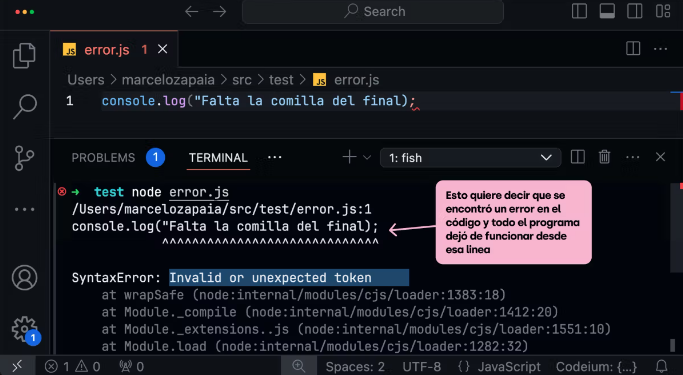

### ¿Qué es javascript?

JavaScript es un lenguaje de programación que se ejecuta en el navegador y que permite crear interactividad en las páginas web.

### ¿Qué es un lenguaje de programación?

Un lenguaje de programación es un conjunto de reglas que permiten al programador escribir instrucciones que el ordenador puede entender y ejecutar.

### ¿Qué es un ordenador?

Un ordenador es una máquina que puede procesar información.

### ¿Qué es información?

La información es cualquier dato que tenga sentido para el ordenador.

### ¿Qué es un dato?

Un dato es cualquier valor que tenga sentido para el ordenador.

### ¿Que es un interprete?
Un interprete o un compilador (dependiendo del caso)  es un programa capaz de analizar y ejecutar código escrito en un lenguaje de programación.


El interprete  de JavaScript para computadora es Node.js

Para instalar Node.js desde el sitio web oficial de Node.js.

https://nodejs.org/es y presionar en Descargar Node.js(LTS)


### La línea de comandos

La línea de comandos es una herramienta que permite al usuario interactuar con el ordenador a través de comandos.

Hay dos tipos de lineas de comandos:

1. Para navegar en las carpetas y archivos del ordenador
2. Para ejecutar aplicaciones

Las acciones que realizo para interactuar con la computadora es muy comun trabajar con  la terminal, para ejecutar programas, bajar programas, interactuar con elementos del sistema operativo.

La terminal es una herramienta que nos muestra un linea de comandas, para basicamete chatear con nuestro computador, las cascaras que mas nos permiten interactuar con el sistema operativo son:

1. BASH(Bourne Again SHell)
    Es el shell predeterminado de la mayoria de las distros de linux y macos. Es conocida por su robustez y amplio uso en script.
2. FISH(Friendly Interactive Shell):
    Se sentra en la facilidad de uso y la interactividad. Ofrece caracteristicas como autocompletado, coloracion sintactica y sugerencias de comandos. Sin configuracion adicional.   

3. ZSH(Z Shell):
    Es un shell extensible que incorpora muchas de las caracteristicas de Bash, ksh, tcsh, ademas de añadir las propias. Es altamte configurable y populr por sus funciones de autocompletado, correcion ortografica de comandos, y personalizacion del prompt. Los frameworks como "Oh My Zsh" facilita la configuracion y la adición de plugins y temas.

### Un SHELL

Es un programa que actúa como una interfaz entre el usuario y el sistema operativo. Te permite interactuar con el sistema operativo mediante la introducción de comandos de texo, El shell interpreta estos comandos y le dice al sistema operativo qué acciones realizar.

Pienzalo como un traductor o un intermediario: tú le das instrucciones en lenguaje que el shell entiende (comandos) , y el shell traduce esas intruccione a un lenguaje que el nucleo (el kernel) del sistema operativo puede entender y ejecutar. 


En este chat tenemos dos partes:

1. El usuario (el user con el accediste)
2. En donde estas (el directorio actual que estas)


Simpre estamos situados en un directorio, que es una carpeta en el ordenador.

El sistema operativo tiene otras carpetas estandares donde se situan ciertos archivos y carpetas.


Los comandos clasicos que vienen con el sistema operativo:

-   PWD: Print Working Directory
    Muestra el directorio actual


-   CD: Change Directory
    Cambia de directorio


-   LS: List
    Lista los archivos y carpetas del directorio actual


-   MKDIR: Make Directory
    Crea una carpeta


-   RM: Remove
    Elimina un archivo o carpeta


Se puede abrir un archivo con una aplicacion especifica como un archivo de js con visual studio code.


### La terminal
Cuando escribimos un comando en la terminal estamos escribiendo código. Ese código es interpretado por la terminal para hablar con el sistema operativo y pedirle cosas como crear una carpeta, mostrar una lista de archivos o ejecutar una aplicación.


### Bash
Lo más común es que la terminal que usemos use bash como lenguaje. Especialmente en sistemas UNIX como Linux y macOS.

Vamos a ir aprendiendo lo necesario de Bash a medida que usemos la terminal a diario.

´´´bash
ls -la   # Este comando Bash muestra una lista de todos los archivos en la carpeta donde nos encontremos
´´´	

Por esto, todos sabemos algo de bash.

### Windows
Viene de fábrica dos tipos de terminales: PowerShell y CMD, también conocido como Símbolo del sistema.


En ninguna de estas terminales podemos escribir comandos bash, que son necesarios para poder trabajar con normalidad.

Por eso, para poder ejecutar comandos bash en Windows, necesitamos instalar una herramienta adicional como Git Bash.

### Git Bash


Git Bash emula una terminal bash dentro Windows. Esto nos permite usar herramientas de desarrollo que están diseñadas para ejecutarse en bash (que son muchas) y convenientemente nos va a servir en el futuro cercano cuando usemos Git, ya que Git está diseñado para trabajar en un entorno UNIX, que es lo que emula Git Bash.


### Desafio HOLA TERMINAL
Si estás usando Windows instalá Git Bash.

Si estás usando Linux o Mac buscá la aplicación llamada: Terminal.

Una vez que tengas la terminal abierta ejecutá el siguiente comando para verificar que Node.js esté instalado.

´´´ bash
node --version
´´´


### Comandos básicos  de la terminal
Usamos la terminal porque:

- Es la forma más eficiente, segura y sencilla (aunque todavía no lo creas) para comunicarnos con el sistema operativo.
- Para nuestro trabajo, es lento e incómodo usar la interfaz gráfica.
- Los servidores no tienen salida gráfica, entonces, la terminal es la única forma de acceder a ellos.
- Con la terminal tenemos un manejo más preciso de los datos que estamos manipulando.

#### Los más usados
A continuación, una lista de los comandos que vamos a usar frecuentemente en la terminal. No es necesario que los aprendas de memoria ya que los vamos a ir incorporando a medida que los usemos.


Abrir todos los archivos donde estoy parado con el comando "code ."


Limpiar la terminal con el comando "clear"


Salir de la terminal con el comando "exit"

### Desafio Carpeta "código"
En este ejercicio te proponemos explorar tu computadora y practicar algunos de los comandos básicos de la terminal.

Utiliza los comandos pwd, cd y ls para navegar las carpeta de tu computadora.

Cuando encuentres un buen lugar, utiliza el comando mkdir para crear una carpeta llamada source (o src) donde guardaremos nuestro código fuente (source code).


¿Porque JavaScript?
- Porque es el lenguaje de la web
Los lenguejes que el navegador entiende son tres:
- HTML
- CSS
- JavaScript


HTML:
La responsabilidad de HTML es la interfaz los elementos que estaran presentes en la interfaz, cosas no visibles como el lenguaje de la pagina.

CSS:
La responsabilidad de CSS es la apariencia de la interfaz, como se ve o como se muestran estos elementos de la interfaz, la posición de las cosas.

JavaScript:
La interactividad de la interfaz, como se comportan estos elementos de la interfaz, como se responde a los eventos, como se comportan los usuarios.


## VISUAL STUDIO CODE

Es un editor de codigo o un editor de texto, al final el codigo es un archivo de texto, es un archivo que contine nuestro codigo, el editor de codigo conoce el lenguaje en el escibimos, puede darnos asistencia al momento de escribir el codigo, en las ultimas versiones se integra IA, la cual puede generar codigo dado el contexto de tu proyecto.

Los lenguajes de programación tienen reglas específicas, es decir, una manera particular en la que se debe escribir el código. A esta serie de reglas la denominamos sintaxis.

**Sintaxis:**
La sintaxis en los lenguajes de programación es mucho más estricta que en los lenguajes naturales y hasta el más mínimo punto o coma equivocado puede causar problemas en una aplicación.

Por ejemplo, si nos falta un punto y coma (;) el algún lugar de nuestro código donde se espera este símbolo, la computadora no tiene la capacidad de intuir lo que quisimos decir. El programa simplemente no funcionará o lo hará de una forma inesperada.




**Editores de código:**
Por suerte existen herramientas especialmente diseñadas para ayudarnos a codear. Estos son los editores de código.


Los editores de código nos permiten formatear el código que estamos escribiendo para que sea fácil de leer, mediante el uso de colores y del formateado del código.

Además, el editor entiende la sintaxis de cada lenguaje y nos ayuda sugiriendo cambios o dándonos opciones de autocompletado, muy similar a lo que sucede con el corrector del teclado de nuestros celulares.


**Instalemos VS Code:**
Pasa finalizar vamos a instalar Visual Studio Code, uno de los editores de código más usados. Para esto vamos a ingresar al sitio de Visual Studio Code, descargar el instalador y seguir los pasos que nos propone.

https://code.visualstudio.com/


Una vez instalado
Utiliza la terminal para crear un nuevo proyecto (una nueva carpeta) y abre la carpeta con VSC.

```bash
# ingresamos a nuestra carpeta de código
# En tu computadora puede llamarse distinto
cd source

# creamos una nueva carpeta para nuestro proyecto
mkdir nuevo-proyecto

# abrimos la carpeta recien creada con vscode
code nuevo-proyecto

# el comando 'code' es algo que se instala cuando 
# instalamos vscode, si no funciona de entrada
# reiniciá la terminal o la compu
```
Tip

En windows, el comando `code` que usamos para abrir VSC desde la terminal, a veces no funciona apenas instalamos Visual Studio. Si te pasa, intentá reiniciando la terminal, la compu completamente o ejecutando este comando en la terminal y reiniciándola.

```bash
echo 'alias code="cmd //C code $*"' >> ~/.bash_profile
```

Ejecutar el e codigo de test Hola Mundo,
En javascript para testear la creacion de una carpeta prueba-vivo, el archivo index.js se ejecuta de la siguente forma:

```bash
PS C:\Users\L03533767\Desktop\SofwareDeveloper\nivel0\prueba-vivo> node .\index.js
hola mundo
```

### Objetivo del nivel
Manipular datos en un lenguejes de programación, ya que programar se trata de resolver problemas. Para eso debemos entender el problema, analizar el problema, y despues diseñar una solución, esa solución contiene datos estos datos  se reciven desde el exterior, estos datos se manipula, estos datos se almacena, y luego se pueden retornar o mostrar. 
El programar es crear soluciones que manipulan datos.

Estos datos en una computadora viven en la memoria RAM, estos conceptos basicos son universales, los cuales se comparten entre todos los lenguajes de programación.
Los datos tienen un tipo y estos tipos tienen una regla de operacion basica dependiendo del tipo, del dato.

Los datos se ocupan en toda las soluciones que desarollemos desde tipos de datos primitivos numeros cadenas boleanos, datos compuestos como arreglos y objetos, para manipular y agrupar adecuadamente la información.

### Primeros datos

Un programa recibe inputs (clicks, texto que introducimos, comandos de voz, etc) los procesa y genera outputs (texto, gráfico, etc).

Cualquier interacción con el programa genera un dato que es guardado en la memoria RAM. Cuando introducimos nuestro nombre en algún campo de texto que nos lo solicite, generamos un dato que es almacenado.


Una vez que podemos acceder al input vamos tener que codear los pasos necesarios que transforman ese input en un output y para eso vamos a necesitar varios datos auxiliares que representan los pasos intermedios para resolver el problema.

Esta serie de pasos que toma un input y resuelve un problema a través de una serie de pasos es conocida como algoritmo.

```javascript

// diametro sería el input
const diametro = 5;
// más adelante vamos a aprender 
// cómo pedirle este dato al usuario


// estas lineas serían la lógica de nuestra app
const radio = diametro / 2;
const radioAlCuadrado = radio * radio;
const area = Math.PI * radioAlCuadrado;


// esto sería el output
console.log("area de la circunferencia", area);

```

Los datos viven en la RAM
Los datos que declaramos en nuestro código son la forma que tenemos de decirle a la memoria RAM que guarde un valor. Son espacios reservados en la memoria de una computadora.


Cuando declaramos(creamos) un dato en nuestro programa, lo que hace el procesador es asignarle un lugar en la memoria RAM. Ese lugar tiene una identificación única, una dirección de memoria. De esta forma, el intérprete sabe dónde está almacenado ese dato y puede buscarlo para manipularlo de cualquier forma.


### Un algoritmo
Es una secuencia finita y ordenada de pasos o instrucciones que se diseñan para resolver un problema o llevar a cabo una tarea especifica.

Estos pasos se describen de manera precisa y no ambigua para que una computadora pueda ejecutarlos de manera sistemática y obtener un resultado deseado.

Cuando se escribe codigo, estamos escribiendo instrucciones al sistema operativo para resolver un problema.

Estas lineas de codigo cumplen tres tareas principales:

1. Capturar el input (un texto escrito por el usuario, un click, un formulario). 
2. Manipular los datos de entrada, para combertirlos en datos intermedios que senboque en los datos de resultado que necesitamos.
3. Generar el output (un texto en pantalla, un grafico, mostrar el resultado por el sistema operativo, voz).


### Primeras lineas de codigo
```bash
mkdir datos
```

```bash
cd datos
```

```bash
cd datos
```

```bash
touch codigo.js
```

La extension .js es la extension de un archivo de javascript. Le indica al editor vs code que es un archivo de javascript.

para ejecutar el programa codigo.js
```bash
node codigo.js
```

const le dice a javascript que guarde en la memoria RAM un valor, que no cambia. El identificador es el nombre que le damos a la variable. El identifador debe hacer refencia al nombre del valor que contiene. 
Para nombrar una variable se debe usar un nombre que sea descriptivo y que haga referencia al valor que contiene. El nombre o identificador por lo regular se usa la forma camelCase, es decir, la primera letra de la variable es minuscula y las siguientes son mayusculas.
Despues se le asigna el valor que contiene la variable, con un signo de igualdad = "el valor que contiene la variable". Para acceder a este valor que almacena la varible se usa el nombre o identificador de la variable. Todos los datos que manipulemos en nuestro codigo viven en la memoria RAM. Al leer un archivo en el disco de la memoria permanente (disco duro) se carga en la RAM para ser ejecutado o leido.

En javascript existen varios tipos de datos primitivos, los cuales son:

1. String:  se escribe entre comillas "hola mundo", basicamente es texto.
2. Number:  se escribe sin comillas 123, basicamente es un numero, puede ser entero o decimal.
3. Boolean:  se escribe sin comillas true o false, basicamente es un valor binario, es decir, puede ser verdadero o falso.
4. Undefined:  se escribe sin comillas undefined, basicamente es un valor indefinido.
5. Null:  se escribe sin comillas null, basicamente es un valor nulo.

Cada sentencia termina con un punto y coma; El valor de una constante no se puede modifcar, por lo que se hace uso de let en lugar de const para declarar una variable que puede ser modificada. let solo se usa cuando el dato puede cambiar, por lo que se usa const cuando el dato no puede cambiar. var es una forma de declarar una variable que puede ser modificada, pero no es recomendada ya que puede causar problemas de seguridad.

Usar var solo se debe de usar cuando se entiede que es scope y cuando se entiende que es hoisting. 
El scope es el alcance de una variable, es decir, el lugar donde se puede acceder a la variable. El hoisting es el movimiento de las declaraciones de variables y funciones al inicio del archivo.


### Comentarios

Los comentarios son textos que se agregan en el código para proporcionar explicaciones o notas que no se ejecutan como parte del programa. Sirven para hacer el código más legible y para dejar instrucciones para otros devs. Hay dos tipos principales de comentarios en JavaScript:

Una sola línea
Se crean con //. Todo lo que viene después de // en esa línea se considera un comentario y se ignora durante la ejecución.


```javascript
// Esto es un comentario de una sola línea
const dato = 5; // También se puede agregar al final de una línea de código

console.log(dato);
```


Múltiples líneas
Se crean entre /* y */.

Pueden abarcar múltiples líneas y pueden contener texto explicativo más extenso.

```javascript
/* Este es un comentario
   de múltiples líneas
   útil para explicar bloques de código */

const resultado = 10; 

console.log(resultado);
```

### Ejemplo:
```javascript
// Datos del restaurante
const nombreRestaurante = "La Deliciosa Cocina"; // Nombre del restaurante
const direccionRestaurante = "123 Calle Principal, Ciudad"; // Dirección del restaurante
const telefonoRestaurante = "+1 (123) 456-7890"; // Número de teléfono del restaurante

// Datos del menú del restaurante
const plato1Nombre = "Pizza Margarita";
const plato1Precio = 12.99;
const plato1Descripcion = "Una deliciosa pizza con tomate y albahaca.";

const plato2Nombre = "Pasta Alfredo";
const plato2Precio = 14.99;
const plato2Descripcion = "Fettuccine con salsa cremosa de queso parmesano.";

const plato3Nombre = "Ensalada César";
const plato3Precio = 8.99;
const plato3Descripcion = "Lechuga, crutones, parmesano y aderezo César.";

// Horario de funcionamiento del restaurante

const horarioLunes = "10:00 AM - 9:00 PM";
const horarioMartes = "10:00 AM - 9:00 PM";
const horarioMiercoles = "10:00 AM - 9:00 PM";
const horarioJueves = "10:00 AM - 9:00 PM";
const horarioViernes = "10:00 AM - 10:00 PM";
const horarioSabado = "11:00 AM - 10:00 PM";
const horarioDomingo = "11:00 AM - 8:00 PM";

// Comentarios explicativos

/*
   En este código
   - Tenemos información como el nombre, dirección y teléfono del restaurante.
   - También representamos el menú del restaurante mediante múltiples variables para cada plato, incluyendo nombre, precio y descripción.
   - Adicionalmente, se muestra el horario de funcionamiento del restaurante para cada día de la semana utilizando variables separadas.
*/


console.log(horarioLunes);

```

### Tipos de datos
Los tipos de datos definen cómo se almacena, se organiza y se opera con la información dentro de un programa, permitiendo que trabajemos con números, texto, fechas y estructuras complejas de manera efectiva.

- Programar es principalmente manipular datos.
- Los datos tienen un tipo y estos tipos tienen una regla de operacion basica dependiendo del tipo, del dato.

### Tipos de datos primitivos

1. String:  se escribe entre comillas "hola mundo", basicamente es texto.
2. Number:  se escribe sin comillas 123, basicamente es un numero, puede ser entero o decimal.
3. Boolean:  se escribe sin comillas true o false, basicamente es un valor binario, es decir, puede ser verdadero o falso.
4. Undefined:  se escribe sin comillas undefined, basicamente es un valor indefinido.
5. NaN:  se escribe sin comillas NaN, basicamente es un valor no numerico.

- Los tipos de datos son etiquetas que le indican al lenguaje de programación como interpretar y manipular estos datos.

Tenemos tipados de datos extrictos y no extrictos.

- Tipados estrictos:    
Una variable es de un tipo de datos y no puede ser de otro tipo de datos.

- Tipados inferidos:    
Una variable puede ser de un tipo de datos y puede ser de otro tipo de datos.

En javascript no se puede (todavía) señalar
el tipo de dato, ya que es un lenguaje 
de "tipo inferido".

Esto quiere decir que reconoce el tipo y se lo asigna
en base al valor que le asignamos al dato. 

La compilacion es el proceso de convertir el codigo fuente en codigo objeto. Y la interpretacion es el proceso de convertir el codigo fuente en codigo objeto en tiempo de ejecucion.

Para saber el tipo de dato en javascript se puede usar el operador typeof.

```javascript
console.log(typeof "hola mundo"); // string
console.log(typeof 123); // number
console.log(typeof true); // boolean
console.log(typeof undefined); // undefined
console.log(typeof NaN); // number
```

Motivos para saber el tipo de dato:

- Es importante saber que el tipo de dato porque asi javascrip puede saber como guardarlo en la memoria RAM permite a la computadora reservar la cantidad adecuada de memoria para 
almacenar un valor, no es mismo guardar un numero que guardar un texto.

- Cada tipo de dato, nos va a permitir realizar operaciones diferentes, por el tipo de dato.


JavaScript no va interpretar lo mismo cuando queramos sumar dos números y dos textos.
Dependiendo del tipo de dato va a ejecutar dos operaciones diferentes.

```javascript
console.log(1 + 2); // 3
console.log("1" + "2"); // "12"
```

Codigo de clase:
```javascript

const peli = "Jurassic Park";
const estreno = 1993;

const currentYear = 2023;
const tiempo = peli - estreno;
console.log(tiempo);

/* 
NaN: Not a number

Programar es manipular datos. 
Datos que tienen que ver con el problema que estamos resolviendo.
Estos datos van a ser cosas como números, textos, fechas, etc.

Los lenguajes de programación diferencian cada tipo de dato 
y esto nos ayuda a manipularlos.

Hoy vamos a introducirnos al concepto: tipos de datos 
 */
```

```typescript
const movieName: string = "Jurassic Park";
const releaseDate: number = 1993;

console.log(movieName, releaseDate);

/* 
Podemos pensar a los tipos como "etiquetas" 
que se le asignan a los datos para 
saber qué tipo de información representan.

En lenguajes como Typescript (Nivel 1) podemos 
indicarle el tipo de a cada dato. Esto sirve.

Estas etiquetas le dicen al lenguaje de programación 
cómo debe interpretar y manipular esos valores. 
*/

const nombre: number = 123;
console.log(nombre);

// tsc (para typechecking)
```

```c
#include <stdio.h>

int main() {
    int numero = 42;

    char texto[] = "Hola mundo!";

    printf("Entero: %d\n", numero);
    printf("Texto: %s\n", texto);

    return 0;
}

/* 
En algunos lenguajes como C, es obligatorio
indicar el tipo de cada dato.
*/

// clang -o programita-en-c estricto.c
```

``` javascript
const peli = "Jurassic Park";
console.log(peli, typeof peli);

const estreno = 1993;
console.log(estreno, typeof estreno);

// const nombre: string = "Marce";

/* 
En javascript no se puede (todavía) señalar
el tipo de dato, ya que es un lenguaje 
de "tipo inferido".

Esto quiere decir que reconoce el tipo y se lo asigna
en base al valor que le asignamos al dato. 
*/
```

```javascript
// typeof
const movieName = "Jurassic Park";
console.log("Nombre de peli:", movieName);
console.log("Tipo:", typeof movieName);

console.log("------");

const year = 1993;
const tipoDeYear = typeof year;
//        ^----------"number"

console.log("tipoDeYear:", tipoDeYear);

/* 
https://developer.mozilla.org/es/docs/Web/JavaScript/Reference/Operators/typeof
*/
```

```javascript
const bebida = "Mate";
// 01101101 01100001 01110100 01100101

const mundial = 2022;
// 11111100110

/* ¿Para que sirven?
Los tipos de datos ayudan a la computadora 
a asignar y gestionar la memoria de manera eficiente. 

Saber el tipo de dato permite a la computadora 
reservar la cantidad adecuada de memoria para 
almacenar un valor.
*/
```

## Caracteres ASCII en binario

<!-- https://developer.mozilla.org/es/docs/Glossary/ASCII -->

| Carácter | Valor ASCII | Binario ASCII |
| -------- | ----------- | ------------- |
| A        | 65          | 1000001       |
| B        | 66          | 1000010       |
| C        | 67          | 1000011       |
| D        | 68          | 1000100       |
| E        | 69          | 1000101       |
| F        | 70          | 1000110       |
| G        | 71          | 1000111       |
| H        | 72          | 1001000       |
| I        | 73          | 1001001       |
| J        | 74          | 1001010       |
| K        | 75          | 1001011       |
| L        | 76          | 1001100       |
| M        | 77          | 1001101       |
| N        | 78          | 1001110       |
| O        | 79          | 1001111       |
| P        | 80          | 1010000       |
| Q        | 81          | 1010001       |
| R        | 82          | 1010010       |
| S        | 83          | 1010011       |
| T        | 84          | 1010100       |
| U        | 85          | 1010101       |
| V        | 86          | 1010110       |
| W        | 87          | 1010111       |
| X        | 88          | 1011000       |
| Y        | 89          | 1011001       |
| Z        | 90          | 1011010       |
| a        | 97          | 1100001       |
| b        | 98          | 1100010       |
| c        | 99          | 1100011       |
| d        | 100         | 1100100       |
| e        | 101         | 1100101       |
| f        | 102         | 1100110       |
| g        | 103         | 1100111       |
| h        | 104         | 1101000       |
| i        | 105         | 1101001       |
| j        | 106         | 1101010       |
| k        | 107         | 1101011       |
| l        | 108         | 1101100       |
| m        | 109         | 1101101       |
| n        | 110         | 1101110       |
| o        | 111         | 1101111       |
| p        | 112         | 1110000       |
| q        | 113         | 1110001       |
| r        | 114         | 1110010       |
| s        | 115         | 1110011       |
| t        | 116         | 1110100       |
| u        | 117         | 1110101       |
| v        | 118         | 1110110       |
| w        | 119         | 1110111       |
| x        | 120         | 1111000       |
| y        | 121         | 1111001       |
| z        | 122         | 1111010       |
| 0        | 48          | 0110000       |
| 1        | 49          | 0110001       |
| 2        | 50          | 0110010       |
| 3        | 51          | 0110011       |
| 4        | 52          | 0110100       |
| 5        | 53          | 0110101       |
| 6        | 54          | 0110110       |
| 7        | 55          | 0110111       |
| 8        | 56          | 0111000       |
| 9        | 57          | 0111001       |
| !        | 33          | 0100001       |
| @        | 64          | 1000000       |
| ?        | 63          | 0111111       |

```javascript
const peli = "Jurassic Park";

console.log("Dato: peli");
console.log("Valor:", peli);
console.log("Tipo:", typeof peli);
console.log("Cantidad de letras:", peli.length);

const estreno = 1993;

console.log("Dato: estreno");
console.log("Valor:", estreno);
console.log("Tipo:", typeof estreno);
console.log("Cantidad de letras:", estreno.length);

/* 
El tipo de dato también va a definirnos que tipo
de operaciones podemos hacer con este dato. 
Por ejemplo: Los strings tienen una propiedad
length que nos dice la cantidad de caracteres que
tiene el texto. 

Los numbers no tienen esta propiedad.

Esto de .length lo vamos a entender en profundidad
cuando veamos objetos.
*/
```

```javascript
const numA = 9;
const numB = 3;
const resultado = numA + numB;

console.log("Resultado:", resultado);

const nombre = "Marce";
const apellido = "Zapaia";
console.log(typeof nombre, typeof apellido);
const nombreCompleto = nombre + apellido;

console.log("nombreCompleto:", nombreCompleto);

// console.log("nombre:", nombre);
// console.log("apellido:", apellido);

/* 
De la misma forma, Javascript no va a interpretar
lo mismo cuando queramos sumar dos números y dos textos.

Dependiendo de su tipo de dato va a ejecutar
dos operaciones diferentes.
 */
```

```javascript
let edad = 30;
console.log("Edad:", edad);
console.log("Tipo:", typeof edad);

console.log("----");

edad = "Treinta";
console.log("Edad:", edad);
console.log("Tipo:", typeof edad);

/* Javascript, además de ser de tipo inferido,
es de tipo dinámico.

Esto significa que, en el caso de las variables, 
les asigna el tipo de dato a medida que va ejecutando el
programa. 

O sea que un idenfiticador puede cambiar su tipo ya que depende
de su valor.

ADVERTENCIA
Esta es una práctica que tiene sus riesgos.
Tratemos de que el código sea predecible.
No vale la pena ahorrar en variables/constantes.
*/
```

### Primitivos
Cuando programamos, manipulamos un montón de datos. Esos datos van a vivir dentro de la memoria en forma de unos y ceros aunque para nosotros (devs) van a ser más que eso. Esos unos y ceros van a representar el email de una persona, su contraseña, la cantidad de productos en un carrito de compras, el precio de los productos, etc.

Para crear aplicaciones que contemplen todos estos datos, JavaScript nos ofrece 7 tipos de datos llamados primitivos para representar todo lo que vamos a construir.

```javascript

const nombrePlaneta = "Tierra"; // string
const diametro = 12742; // number
const temperaturaMedia = 14.9; // number
const tieneLunas = true; // boolean

let fechaDescubrimiento; // undefined
const datosAtmosfera = null; // null

const codigoIdentificacion = Symbol("Tierra"); // Symbol
const poblacion = 7800000000n; // BigInt
```

Además de los datos primitivos existen los denominados objetos, que son formas de agrupar datos que pueden ser primitivos u otros objetos.

```javascript
// esta es una de las formas de crear objetos
const planeta = {
  nombre: "Tierra",
  diametro: 12742
}

console.log(planeta.diametro);
```

Vamos a hablar sobre objetos en profundidad más adelante y durante toda la carrera.

### Átomos
Los datos primitivos en JavaScript se llaman así debido a que son los elementos más básicos o fundamentales que se utilizan para representar valores en un programa.

Podemos comparar a los primitivos con las letras de un alfabeto, donde las letras en sí representan un valor muy atómico o pequeño. Al igual que con las letras, al combinar algunos de estos primitivos, podemos crear palabras con significado, como "casa" o "perro". Y, de manera similar, al agrupar palabras podemos construir frases.

```
A B C D E F G H I J K L M N O P Q R S T U V W X Y Z

PERRO - GATO - CASA - JUGAR

EL PERRO ESTÁ JUGANDO
```

En el caso de los datos primitivos sucede algo parecido. Estos nos sirven para representar partes del problema que estamos resolviendo y al agruparlos en un objeto es que podemos representar cosas más complejas como una “persona” o un “producto”.

```javascript
const nombre = "JavaScript Apart Hotel";
const habitaciones = 4;
const hayDisponibilidad = true;

// agrupados en un objeto
const hotel = {
  nombre: "JavaScript Apart Hotel",
  habitaciones: 4,
  hayDisponibilidad: true,
}

console.log(hotel.nombre);
```

En esta clase vamos a explorar los datos primitivos y sus usos básicos. Más adelante cuando entendamos el concepto de objeto y de funcion vamos a ver operaciones más realistas y complejas de estos datos.

String
Un string en JavaScript es un tipo de dato que se utiliza para representar texto, como palabras, frases o caracteres. String es el nombre que se le da a los textos en varios lenguajes. En otros lenguajes existe el tipo char (carácter en inglés) que representa a datos de un solo carácter (“a”). String (cadena en inglés) se refiere a un texto con varios caracteres, o sea una cadena de caracteres.

Los strings se crean mediante la agrupación de caracteres entre comillas simples (' '), comillas dobles (" ") o comillas invertidas (`).
```javascript
// Comillas dobles 
const textoA = "Este es un string con comillas dobles."; 
// - opción favorita
// - no puedo usar comillas dobles dentro del string
// - no se pueden insertar saltos de línea


// Comillas simples
const textoB = 'Este es un "string" con comillas simples.';
// Por lo general se usa para poder usar comillas dobles

// Comillas invertidas (template literals)
const nombre = "Marce";
const textoC = `
Hola ${nombre}, 
Este es un string con comillas invertidas.
Al uso de comillas invertidas para crear strings 
se lo conoce como template literals.
`;
// Se pueden interpolar datos y usar saltos de linea
```

Number
El tipo de dato number se utiliza para representar números, ya sean enteros o números decimales (números de punto flotante). Este tipo de dato es fundamental para realizar operaciones matemáticas y cálculos en JavaScript.
```javascript
// Números enteros
const edad = 30;
const cantidadDeProductos = 10;

// Números de punto flotante (decimales)
const precio = 19.99;
const pi = 3.14159265359;

// Operaciones matemáticas
const suma = 5 + 3; // Suma
const resta = 10 - 4; // Resta
const multiplicacion = 6 * 7; // Multiplicación
const division = 20 / 5; // División

// Otros usos
const total = precio * cantidadDeProductos;
const radio = 5;
const areaDeCirculo = Math.PI * (radio * radio); 
// Usando la constante Math.PI
```

Boolean
Este tipo de dato puede tener uno de dos valores posibles: true (verdadero) o false (falso).

```javascript
const hayStock = true;
const tieneEnvio = false;

console.log(typeof hayStock, typeof tieneEnvio);
```
El nombre "boolean" proviene del matemático y lógico británico George Boole.

Los booleanos son fundamentales tomar de decisiones y el control de flujo en la programación, ya que permiten evaluar condiciones y determinar qué acciones tomar.

Podemos crear un boolean asignando el valor true o false directamente a un identificador.

```javascript
const mostrarPromo = true;

if(mostrarPromo){
  console.log("¡Promoción especial!");
}
```

Aunque, por lo general van a ser generados a partir de operaciones que tienen como respuesta si o no.
```javascript
const precio =  15;
const esCaro = precio > 10;

console.log(typeof esCaro, esCaro);

if(esCaro){
  console.log("¡Muy caro!");
}
```
Más adelante, examinaremos con atención estos operadores de comparación (>) y la estructura if.

Undefined
Es un valor que indica que un identificador ha sido declarado pero no tiene asignado ningún valor. Es una representación de la ausencia de un valor válido.

Esto puede ocurrir cuando se declara una variable pero no se le asigna ningún valor o cuando se accede a una propiedad que no existe en un objeto.
```javascript
// undefined es un tipo
// console.log(estoNoExiste);
console.log(typeof estoNoExiste);
console.log(typeof estoNoExiste === "undefined");

// y también es un valor
let variableSinValor;
console.log(variableSinValor);
console.log(typeof variableSinValor);
console.log(variableSinValor === undefined);
```

Null
Es un valor especial que se utiliza para indicar que una variable o propiedad existe, pero no tiene ningún valor asignado. A diferencia de "undefined", que indica que la variable no ha sido inicializada, "null" es una asignación intencional que indica la ausencia de un valor válido. Se usa comúnmente cuando deseas establecer una variable u objeto en un estado inicial vacío o cuando deseas desvincular una variable de su valor anterior.

```javascript
// si el valor podría existir pero por algún motivo no existe
// lo mejor sería utilizar null

const persona = {
  nombre: "Juli",
  email: null
};

console.log(persona.email);

// existe un bug histórico en JavaScript 
// que define el typeof de null como "object"

console.log(typeof persona.email);
```

- null vs undefined es que null es un valor intencional que indica que una variable o propiedad existe, pero no tiene ningún valor asignado. Por otro lado, undefined indica que no existe la variable o no se a asignado la variable. 

Vamos a entender los casos donde podamos usar null a medida que nos metamos a conceptos más avanzados como objetos o funciones.

BigInt y Symbol
Estos tipos primitivos tienen casos de usos más específicos y avanzados así que por ahora simplemente los vamos a nombrar y vamos a ver mucho más adelante en qué casos podríamos llegar a necesitarlos.

```javascript
// BigInt
console.log("El número más grande posible dentro de un number", Number.MAX_SAFE_INTEGER);
// BigInt al rescate
const muchoMuyGrande = BigInt(
  Number.MAX_SAFE_INTEGER * Number.MAX_SAFE_INTEGER
);

// Garantiza que los cálculos con números gigantes 
// se realicen de manera precisa
console.log(muchoMuyGrande);

// Sybmbol
const idPrivado = Symbol("nombre");

const objeto = {
  [idPrivado]: "Marce",
  getNombre: function () {
    return this[idPrivado];
  },
};

console.log(objeto.nombre); // No se puede
console.log(objeto.getNombre()); // Hay que usar el Symbol
```

Conclusión
Aun siendo solo 7 los tipos de datos primitivos, en la práctica, los más utilizados suelen ser string, number, boolean, y null. Con estos bloques fundamentales, y al agruparlos en objetos y estructuras de datos, vamos a poder crear aplicaciones muy sencillas y también muy complejas.

## Objetos

En un dato de tipo primitivo (string, number, etc) podemos guardar el título de una película, una sinopsis e inclusive podemos guardar su fecha de estreno declarando distintos datos para cada parte de la fecha (día, mes, año). Es decir, los primitivos son datos que representan cosas muy puntuales.


```javascript
const titulo = "Jurassic Park";
const sinopsis = "Un multimillonario construye un parque de dinosaurios clonados, pero todo sale mal cuando los dinosaurios escapan y aterrorizan a los visitantes.";
const añoEstreno = 1993;
const mesEstreno = 6;
const diaEstreno = 11;

const director = "Steven Spielberg";
const duracionMinutos = 127;
const calificacionIMDb = 8.1;
```

Pero, ¿qué pasa si tenemos muchas películas? ¿cómo hacemos para organizar esa información?

Si utilizamos solo datos primitivos, al no poder utilizar el mismo identificador más de una vez, nos vemos en la obligación de tener que generar una gran cantidad de identificadores distintos. Cada dato de cada película debe, entonces, tener un nombre distinto y además tendríamos que recordarlos para poder accederlos.

```javascript
const tituloJurassicPark = "Jurassic Park";
const sinopsisJurassicPark = "Un multimillonario construye un parque temático con dinosaurios clonados, pero todo sale mal cuando los dinosaurios escapan y aterrorizan a los visitantes.";
const añoEstrenoJurassicPark = 1993;
const directorJurassicPark = "Steven Spielberg";
const duracionMinutosJurassicPark = 127;
const calificacionIMDbJurassicPark = 8.1;

const tituloTerminator2 = "Terminator 2: Judgment Day";
const sinopsisTerminator2 = "Un cyborg y un niño deben evitar que un avanzado Terminator de metal líquido provoque el fin del mundo.";
const añoEstrenoTerminator2 = 1991;
const directorTerminator2 = "James Cameron";
const duracionMinutosTerminator2 = 137;
const calificacionIMDbTerminator2 = 8.5;

const tituloPulpFiction = "Pulp Fiction";
const sinopsisPulpFiction = "Las vidas de dos sicarios de la mafia, un boxeador, la esposa de un gángster y una pareja de bandidos de un restaurante se entrelazan en cuatro relatos de violencia y redención.";
const añoEstrenoPulpFiction = 1994;
const directorPulpFiction = "Quentin Tarantino";
const duracionMinutosPulpFiction = 154;
const calificacionIMDbPulpFiction = 8.9;

// Para utilizar estos datos tengo que de alguna forma saber el nombre de cada dato
```

En este ejemplo podemos ver que tan solo con 3 películas la cosa se empieza a poner confusa. Imaginen que tenemos que gestionar 50 películas… 1000 películas, la cosa se vuelve insostenible.

Estructuras de datos


Para resolver este problema de organización de datos es que los lenguajes de programación nos ofrecen distintas formas de agrupar estos datos en estructuras que nos van a permitir manipular estos datos de formas mucho más ordenadas y a la vez complejas.

En esta clase vamos a hablar de objetos. El otro tipo de dato que existe en JavaScript además de los primitivos. Eventualmente vamos a entender que en una app creada con JavaScript, casi todo es un objeto.


Objeto literal
La forma más simple de empezar a entender los objetos es creando los llamados objetos literales. Esta es solo una de las tantas formas que existen para crear objetos y es una de las más directas y simples.

Un objeto literal se crea muy similar a cualquier otro dato pero en vez de asignarle un valor entre comillas o un número como hacemos con los primitivos, lo que hacemos es usar el formato JSON.

JavaScript Object Notation
JSON es el formato que admite javascript para escribir objetos literales.

```javascript
// ------------------| lo que está entre llaves {} es JSON

const miPrimerObjeto = { // aqui empieza el objeto
  nombre: "Marce",
  apx: true
}; // aqui se termina el objeto

console.log(typeof miPrimerObjeto);
console.log(miPrimerObjeto.nombre);
console.log(miPrimerObjeto.apx);
```
Esas llaves le indican a javascript que, lo que queremos asignarle a nuestro identificador, es un objeto literal. Al final de esta clase vamos a ver porque se llaman objetos literales.

Lo que declaremos entre las llaves serán los valores que ese objeto contendrá.


Los datos contenidos dentro de un objeto se llaman propiedades. Por eso es que nos referimos muchas veces a la propiedad del objeto. Al estar estos datos contenidos dentro del objeto podemos crear varios objetos que contengan propiedades con el mismo nombre.

```javascript
// usando solo primitivos tenemos que usar muchos nombres
const tituloJurassicPark = "Parque Jurásico";
const añoEstrenoJurassicPark = 1993;
const duracionMinutosJurassicPark = 127;


const tituloTerminator2 = "Terminator 2: Judgment Day";
const añoEstrenoTerminator2 = 1991;
const duracionMinutosTerminator2 = 137;

console.log(tituloJurassicPark);
console.log(tituloTerminator2);

// usando objetos podemos repetir los nombres dentro de los objetos
const jurassicPark = {
  titulo: "Parque Jurásico",
  estreno: 1993,
  duracionMinutos: 127,
}

const terminator2 = {
  titulo: "Terminator 2: Judgment Day",
  estreno: 1991,
  duracionMinutos: 137,
};

// la propiedad titulo del objeto jurassicPark
console.log(jurassicPark.titulo);

// la propiedad titulo del objeto terminator2
console.log(terminator2.titulo);

```

Objeto vacio
Para poder entender mejor la sintaxis de JSON vamos de menos a más. Por ejemplo, si quisiéramos crear un objeto vacío lo único que tenemos que hacer es usar la llave de inicio y la llave de fin. Esto le indica a javascript que queremos crear un objeto sin propiedades.

```javascript
const peli = {};
console.log(typeof peli, peli);
```

Objeto con una propiedad inicial
Si quisiéramos crear un objeto con una sola propiedad inicial, debemos escribir dentro de las llaves la propiedad. Para eso simplemente escribimos el nombre de la propiedad (sin const ni let), a continuación el símbolo “:” (dos puntos) y luego de esos dos puntos, el valor que le queremos asignar a la propiedad. Este valor puede ser de cualquier tipo primitivo o inclusive otro objeto.

```javascript
const peli = { titulo:"Jurassic Park" };
console.log(typeof peli, peli);

const otraPeli = { durationMinutes:60 };
console.log(typeof otraPeli, otraPeli);
```
En el caso de los objetos no necesitamos definir si los datos internos del objeto (las propiedades) son variables (let) o constantes (const) ya que vamos a poder modificar cualquier parte del objeto en cualquier momento. Vamos a entender el porqué más adelante y también vamos a ver formas de modificar este comportamiento.

Objeto con varias propiedades iniciales
Si queremos que nuestro objeto nazca con varias propiedades iniciales podemos seguir declarando otros datos dentro de las llaves separando a cada dato por una “,” (coma).

```javascript
const peli = { titulo:"Jurassic Park", estreno: 1993 };
console.log(typeof peli, peli);
```

Separando el objeto en líneas
Si bien no es necesario dividir la declaración del objeto en varias líneas de código, al querer declarar varias propiedades es mucho más fácil de leer si usamos varias líneas. Para eso la convención es dejar la coma separadora al final de cada línea.

```javascript
// con dos propiedades todavía es comodo tener todo en la misma linea
const peli = { titulo:"Jurassic Park", estreno: 1993 };
console.log(typeof peli, peli);

// con muchas propiedades lo mejor es usar varias lineas
const jurassicParkData = {
  titulo: "Parque Jurásico",
  sinopsis: "Un multimillonario construye un parque temático con dinosaurios clonados, pero todo sale mal cuando los dinosaurios escapan y aterrorizan a los visitantes.",
  añoEstreno: 1993,
  director: "Steven Spielberg",
  duracionMinutos: 127,
  calificacionIMDb: 8.1
};
```

El uso de varias líneas para declarar muchas propiedades es posible ya que los indicadores que JavaScript atiende para entender dónde empieza y dónde termina el objeto: son las llaves.

Indentación
También notarán que al comienzo de cada línea dentro del objeto hay un espacio extra. Este espacio se conoce como indentación. La indentación sirve para poder leer rápidamente qué código está “dentro” de otro. No afecta al funcionamiento, es solo una ayuda para leer mejor el código. Vamos a aprender eventualmente como nuestro editor de código puede ayudarnos a formatear nuestro código para respetar las mejores prácticas.


Vamos a ver muchos casos donde usamos llaves {} para delimitar un bloque de código y en esas ocasiones vamos a indentar lo que esté dentro del bloque para entender rápidamente qué es lo que está sucediendo.

Accediendo a las propiedades
Una vez que tenemos un objeto creado, el objeto en sí es solo un contenedor de datos que vamos a utilizar. Para acceder a los datos de un objeto existen dos formas muy sencillas.

```javascript
const peli = {
  titulo: "Jurassic Park",
  añoEstreno: 1993,
  director: "Steven Spielberg",
  duracionMinutos: 127,
};
// esto mostrará todo el objeto
console.log(peli);
console.log(typeof peli);
// el . nos permite ingresar a la propiedad título
console.log(peli.titulo);
console.log(typeof peli.titulo);

// podemos usar las propiedades de los objetos como cualquier otro dato
const textoA = "hola";
const textoB = textoA;
console.log(textoA, textoB);

const nombreDePeli = peli.titulo;
console.log(nombreDePeli);

// la otra forma de acceder a una propiedad es 
// usando corchetes y un string para indicarle el nombre de la propiedad
// a la que queremos acceder

// peli[nombreDeLaPropiedad]
console.log(peli["director"]);

// esta forma es especialmente util cuando queremos acceder
// a una propiedad pero el nombre está determinado por alguna lógica
// vamos a ver estos casos avanzados más adelante

// también podemos usar el string guardado en otro dato
const key = "director";
console.log(peli[key]);

const directorDePeli = peli[key];
console.log(directorDePeli);
// al nombre de la propiedad también se lo conoce como key o clave
```
Modificando y agregando nuevas propiedades
Una vez que el objeto está creado podemos ingresar a sus propiedades para leer sus datos, modificarlos e inclusive crear nuevas propiedades.


```javascript
const peli = {
  titulo: "Jurassic Park",
};
// esto mostrará todo el objeto
console.log(peli);
// el . nos permite ingresar a la propiedad título
console.log(peli.titulo);

// modificando una propiedad del objeto
peli.titulo = "Parque Jurasico";

console.log(peli);
console.log(peli.titulo);

// también podemos crear nuevas propiedades simplemente asignandoles un valor
peli.estreno = 1993;
// En este caso usamos el signo = porque no estamos creando el objeto
// los : solo se usan en el formato JSON que usamos para crear objetos literales

// también podemos usar los corchetes para crear nuevas propiedades
peli["director"] = "Steven Spielberg";

// también podemos crear un objeto vacío e ir llenandolo
const persona = {};
persona.nombre = "Marce";
console.log(persona);
```

Objeto literal
Los objetos que creamos utilizando JSON (llaves, dos puntos, etc) son llamados objetos literales. Estos son objetos que creamos directamente, sin ningún intermediario que lo genere. Existen otras formas de crear objetos a través de los llamados constructores que vamos a ver en profundidad en el Nivel 1 cuando nos adentremos al paradigma orientado a objetos.

```javascript
// creando un objeto literal
const objetoLiteralFecha = {
  day: 18,
  month: 12,
  year: 2022
};
console.log(objetoLiteralFecha.year);

// usando un constructor
const objetoCreadoPorUnConstructor = new Date("2022-12-18");
console.log(objetoCreadoPorUnConstructor.getFullYear());
```

Conclusión
Los objetos son fundamentales para la programación en JavaScript y en muchísimos otros lenguajes. Este pantallazo general es una introducción que nos sirve para entender qué son y cómo funcionan, pero no se preocupen en memorizar cosas ni tratar de imaginar casos de uso realistas ahora mismo. Los objetos son simplemente una forma de agrupar/estructurar datos. A partir de ahora vamos a usar objetos para todo y vamos a ir descubriendo otros mecanismos del lenguaje que en conjunto con los objetos nos van a permitir crear aplicaciones.

### Arrays

Ya vimos que los objetos son cruciales para organizar datos que representam entidades como usuarios, productos o lugares. Una entidad en este contexto se refiere a un elemento o concepto del mundo real modelado en el sofware. Estas entidades representadas mediante **objetos**, permiten gestionar información de manera estructurada,definiendo propiedades y comportamientos únicos para cada categoría.

Por ejemplo, un objeto representa a un usuario podría incluir propiedades como nombre, email y fecha de creación. Esta abstrapción facilita la manipulación de datos y la implementación de lógicas especificas en el desarollo de software.

```js
const usuario = {
  id: 1,
  email: "marce@apx.school",
  fechaCreacion: "2019-09-01",
  nombre: "Marce",
  pais: "Argentina",
  suscripcion: "Premium",
  ultimaConexion: "2023-12-12",
  intereses: ["Gastronomía", "Viajes", "Tecnología"],
  redesSociales: {
    instagram: "https://www.instagram.com/apx.school/",
    tiktok: "https://www.tiktok.com/@apx.school",
  },
};

// Producto
const producto = {
  id:23,
  numeroProducto: "PRD001",
  nombre: "Libro: El Señor de los Anillos",
  precio: 100,
  stock: 50,
  descripcion: "Épica obra de J.R.R. Tolkien",
  categoria: "Fantasía",
  autor: "J.R.R. Tolkien",
  editorial: "Editorial Fantasy",
  fechaPublicacion: "1954-07-29",
};

// Objeto Lugar
const lugar = {
  latitud: 40.7128,
  longitud: -74.0060,
  nombre: "Pizzeria La Mezzeta",
  tipo: "Pizzeria",
  telefono: "+123456789",
  direccion: "Av. Álvarez Thomas 1321, Buenos Aires",
  ciudad: "Ciudad Ejemplo",
  horario: "11:00 AM - 10:00 PM",
};

```

### Listas
Pero ¿Qué sucede si tenemos que organizar una lista de datos en un orden determinado?, ¿Qué pasa si queremos guardar una lista con los nombres de nuestras películas favoritas?
Podriamos crear un objeto que tenga esa informació.

```js
const pelis  =  {
  titanic: "Titanic",
  jurassicPark: "Jurassic Park",
  matrix: "Matrix",
  forrestGump: "Forrest Gump",
  pulpFiction: "Pulp Fiction",
  theShawshankRedemption: "The Shawshank Redemption",
  theLionKing: "El Rey León",
  terminator2: "Terminator 2: Judgment Day",
  theSilenceOfTheLambs: "El Silencio de los inocenes",
  theMatrix: "Matrix",
  braveheart: "Corazón Valiente",
  theSixthSense: "El Sexto Sentido",
  savingPrivateRyan: "Rescatando al Soldado Ryan",
  theTrumanShow: "El Show de Truman",
  theBigLebowski: "El Gran Lebowski",
  fightClub: "Club de la Pelea",
  theBlairWitchProject: "El Proyecto de la Bruja de Blair",
  theFifthElement: "El Quinto Elemento",
  theMummy: "La Momia",
  austinPowers: "Austin Powers",
  theMask: "La Máscara",
  goodFellas: "Goodfellas",
  clueless: "Clueless",
  homeAlone: "Mi Pobre Angelito",
};
```

Esto es totalmete válido pero tenemos un problema: tenemos que nombrar a cada propiedad. Esto nos obliga a inventar un nombre nuevo para cada propiedad que contenga el nombre de cada película. No es gravísimo pero se puede hacer mejor.

#### ORDEN

¿Y? qué pasa si quiero manipular una serie de pasos de una receta de cocina?. Necesito guardar esta información en un orden especifico. Los objetos no ordenan sus propiedades en ningun orden en particular, ya que cuando las accedemos, lo hacemos por su nombre y no hay nada que nos indique cuáal viene despues. Más allá de que escribamos en un orden no hay nada que nos indique cual es el primer paso salvo nuestra memoria.

```js
const receta = {
  hornearTorta: "Hornea durante 30-40 minutos o hasta que al insertar un palillo este salga limpio.",
  mezclarIngredientesSecos: "En un tazón grande, mezcla 2 tazas de harina, 1 taza de azúcar y 1 cucharadita de polvo de hornear.",
  batirHuevosYLiquidos: "En otro recipiente, bate 3 huevos y agrégales 1 taza de leche y 1 taza de aceite vegetal.",
  añadirVainilla: "Añade 1 cucharadita de extracto de vainilla y mezcla bien.",
  prepararMolde: "Engrasa y enharina un molde para torta y vierte la masa en él.",
  decorarTorta: "Decora la torta con frutas frescas o chocolate rallado según tu preferencia.",
  enfriarTorta: "Deja enfriar la torta antes de desmoldarla.",
  incorporarIngredientes: "Incorpora los ingredientes secos a la mezcla húmeda y revuelve hasta obtener una masa homogénea.",
  precalentarHorno: "Precalienta el horno a 180°C.",
};

console.log("Algun paso:", receta.prepararMolde); 
console.log("Otro paso:", receta.enfriarTorta);
console.log("Algun otro paso:", receta.prepararMolde);

// Al usar el nombre de la propiedad, no hay un orden específico
// No tenemos una forma segura de acceder al "primer paso" o al "segundo paso"
// En un software realista esta receta vendría de una base de datos y no podríamos saber como fué declarada. O sea, simplemente tendríamos acceso al objeto "receta".
```

#### Modificaciones
Otro problema que tiene el uso de objetos para guardar una lista de cosas que puede ir creciendo o modificándose a lo largo de nuestro programa, es que tenemos que tener cuidado al modificar o agregar nuevos ítems ya que podemos llegar a pisar un dato existente.


```js
const carritoDeCompras = {
  item1: "Remera negra",
  item2: "Zapas deportivas",
  item3: "Libro 'Demian' de Hermann Hesse",
  item4: "Rompecabezas de 1000 piezas",
};

// Si eventualmente tengo que agregar un item a mi lista 
carritoDeCompras.itemNuevo = "iPhone 13";

// Si vuelvo a usar el mismo nombre puedo generar un efecto indeseado
carritoDeCompras.itemNuevo = "Mazo de cartas";

console.log(carritoDeCompras);
```

De nuevo, este problema de nombrar propiedades no es gravísimo pero se puede hacer mejor.

#### Array
Para resolver este problema de agrupar datos ordenados, JavaScript nos ofrece una estructura denominada array. Los arrays son un tipo de objeto especial que nos permite almacenar datos de manera ordenada, y a diferencia de otros objetos, no necesitamos asignar un nombre único a cada elemento individual.

```js
const carritoDeCompras = [
  "Remera negra",
  "Zapas deportivas",
  "Libro 'Demian' de Hermann Hesse",
  "Rompecabezas de 1000 piezas",
];

console.log(typeof carritoDeCompras);
console.log(carritoDeCompras[0]);
```

Los elementos dentro de un array se numeran secuencialmente, comenzando desde el índice 0. La palabra "array" se refiere a un arreglo o colección ordenada de elementos o datos.

#### Sintaxis
Un array es un tipo de objeto que también se puede declarar de forma literal, o sea, simplemente asignando un array a su identificador. Vamos a ver más adelante que hay otras formas de generar arrays.

```js
// en un array podemos guardar cualquier cosa como en un objeto
const listaDeCosas = ["Manzana", "Naranja", 42, true];

console.log(typeof listaDeCosas);
// console.log(listaDeCosas);
```

Los arrays al igual que los objetos permiten agrupar datos y estos datos pueden ser de cualquier tipo. La gran diferencia es que al declarar un array no necesitamos asignarle un nombre a cada miembro del conjunto. Simplemente agrupamos valores entre dos corchetes [] y los separamos por comas.

```js
const pelis = [
  "Titanic",
  "Jurassic Park",
  "Matrix",
  "Forrest Gump",
  "Pulp Fiction"
];
```
### Índice
Si bien no le asignamos nombres a cada ítem dentro del array, cada dato dentro de esta estructura estará vinculado al número de índice dentro del array. Comenzando por el 0, vamos a poder usar el número que le corresponda para poder acceder al dato que necesitemos.


```js
const paises = [
  "Argentina",
  "Francia",
  "Croacia"
];

console.log("Primero:", paises[0]);
console.log("Segundo:", paises[1]);
console.log("Tercero:", paises[2]);
```
#### Modificaciones
Utilizando el número de índice vamos a poder leer y también escribir datos en el array. Si utilizamos el índice de un ítem existente vamos a poder modificarlo y si nos referimos a una posición inexistente estaremos creando un nuevo ítem.

```js
const carritoDeCompras = [
  "Zapas deportivas",
  "Libro 'Demian' de Hermann Hesse",
  "Rompecabezas de 1000 piezas",
];

console.log("Lista inicial:", carritoDeCompras);
 
// cambio algo de la lista
carritoDeCompras[2] = "Rompecabezas de 500 piezas";
console.log("Lista actualizada:", carritoDeCompras);

// agrego algo a la lista, lo puedo agregar de un dato existente
const nuevoItem =   "Remera negra";
console.log("Ahora en la posición 3:", carritoDeCompras[3]);

carritoDeCompras[3] = nuevoItem;

console.log("Después en la posición 3:", carritoDeCompras[3]);

console.log("Lista final:", carritoDeCompras);
```

Si bien, modificar el array utilizando índices es una práctica muy común, más adelante vamos a aprender que existen formas más seguras de modificar un array, sobre todo cuando necesitamos agregar algo al final de la lista. Un caso muy común.

#### Length
Como mencionamos, un array es un objeto. Si bien se crea y se accede de una forma en particular, cada array es un objeto y tendrá, además de los valores que guardemos en el, una serie de propiedades. Una propiedad que vamos a utilizar frecuentemente es la propiedad length (longitud) que nos indica cuántos ítems hay en el array en ese momento.

Esta propiedad es del tipo number y va cambiando automáticamente a medida que nuestro array cambia.

```js
const pelis = [
  "Titanic",
  "Jurassic Park",
  "Matrix",
  "Forrest Gump",
  "Pulp Fiction"
];

console.log("Cantidad de pelis:", pelis.length);
console.log("type of de pelis.length:", typeof pelis.length);
```

Como la propiedad length nos indica la longitud del array, este número siempre será uno más que la última posición de nuestro array.

```js
const pelis = [
  "Titanic",
  "Jurassic Park",
  "Matrix"
];

console.log("Logitud:", pelis.length);
console.log(pelis[0], pelis[1], pelis[2]);

// console.log(pelis[3]);

// Podemos usar el length para sumar cosas al array
const logitudDeArrayEnEsteMomento = pelis.length;
pelis[logitudDeArrayEnEsteMomento] =   "Forrest Gump";

console.log("Length después primera modificación:", pelis.length);
pelis[pelis.length] = "El padrino";
// no podemos volvera usar logitudDeArrayEnEsteMomento porque quedó un valor desactualiado

console.log("Cantidad de pelis:", pelis.length);
console.log("pelis:", pelis);
```

#### Array vacío
Al igual que otros objetos podemos crear un array sin ningún ítem inicial e ir agregando cosas a medida que transcurre nuestro programa.

```js
const listaDeCosas = [];
console.log(listaDeCosas, listaDeCosas.length);

// podemos ir metiendo cosas de cualquier tipo
listaDeCosas[0] = true;
console.log("Con un nuevo item:", listaDeCosas);

// podemos repetir la técnica y sumar cosas usando el length para no tener que llevar la cuenta
console.log("Antes de sumar el null", listaDeCosas.length);
listaDeCosas[listaDeCosas.length] = null;
console.log("Antes de sumar el texto", listaDeCosas.length);
listaDeCosas[listaDeCosas.length] = "un texto";
console.log("Antes de sumar el número", listaDeCosas.length);
listaDeCosas[listaDeCosas.length] = 45;

// inclusive podemos guardar otros objetos
listaDeCosas[listaDeCosas.length] = {
  nombre: "Marce",
  apellido: "Zapaia",
};

console.log("Final:", listaDeCosas);

// Podemos acceder a cada item a través de su número de indice (index)
console.log(listaDeCosas[0]);
```

Conclusión
Los arrays son fundamentales a la hora de programar en JavaScript. Pensemos que prácticamente cualquier aplicación necesita manipular listas de usuarios, productos, lugares y establecer relaciones entre estos.

Tanto los arrays como los objetos forman parte de las estructuras más utilizadas en el día a día de cualquier dev que trabaje con JavaScript. Si bien ahora estamos viendo ejemplos y casos sencillos estos conceptos nos van a acompañar durante toda nuestra carrera. Y de ahora en más vamos a ver estas estructuras por todos lados.
