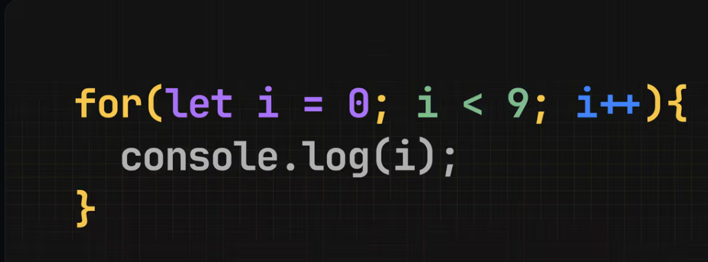

## For



El for (clásico) o simplemente for, es una variante de este bucle que existe (así tal cual la vamos a ver) en varios lenguajes de programación. Es de las primeras estructuras que aprendí en mis acercamientos a la programación y es, todavía, uno de los bucles más usados por muchas personas.

Como sabemos el caso de uso más frecuente de los bucles, es el de recorrer listas (arrays, strings, otros iterables que vamos a ver más adelante) y por eso, los bucles más usados hoy en día van a ser for...of o for...in ya que tienen una sintaxis bastante simple y por eso son fáciles de entender.

El for (clásico) es un bucle que quizás no usemos tanto en el día a día ya que es un poco más tediosa en su sintaxis, aunque tenemos que tener en cuenta técnicamente es más rápido y nos da más control sobre las multiples iteraciones.

## Sintaxis

Antes de meternos en la sintaxis del for y sus casos de uso volvamos un segundo a nuestro querido while.

Cuando usamos un while para recorrer una lista, lo más frecuente es que usemos una variable que comienza siendo 0 y, usando el mecanismo del while, preguntamos si esa variable sigue siendo menor que el array.length. Finalmente, modificamos esa variable sumándole 1 en cada iteración para avanzar y no entrar en un loop infinito.

```javascript
const platos = [
  "Asado",
  "Empanadas",
  "Milanesa",
  "Choripán",
  "Provoleta",
  "Fugazzeta",
  "Dulce de leche",
  "Locro",
  "Helado",
];

// parar recorrer el array usando un while
// incializamos una variable en 0
let i = 0;

// configuramos el while para que pregunta si i
// sigue siendo menor que el largo del array (platos.length)
while (i < platos.length) {
  console.log(platos[i]);

  // y le sumamos 1 en cada iteración para que esto se mueva
  // y no nos quedemos atrapados aquí
  i++;
}
```

Esta forma de recorrer el array se siente muy "manual" considerando que para hacer lo mismo con un for...of la sintaxis es mucho más simple.

```javascript
for (const plato of platos) {
  console.log(plato);
}
```

## Ahora sí, la sintaxis del for

La sintaxis del for "clásico" tiene 3 partes separadas por un punto y coma. Cada parte configura el for para que funcione de una forma determinada.


## Inicialización

```javascript
//----- ⬇️ iterador
for (let i = 0; i < 6; i++) {
  console.log(i);
}
```

En la primera parte del for vamos a inicializar el iterador que es la variable que vamos a ir modificando. La que vamos a usar para acceder a la lista o lo que necesitemos. O sea que, si recorremos un array desde el comienzo, vamos a inicializar esta variable en 0.

```javascript
const nums = [3, 99, 101];

for (let i = 0; i < 3; i++) {
  console.log(nums[i]);
}
```

Como sabemos, existen otros bucles más sencillos para hacer el recorrido de principio a fin. Por eso, un buen caso de uso para el for (clásico) va a ser cuando tengamos que recorrer el array en otro orden, por ejemplo, desde el final hacia el comienzo.

```javascript
const movies = [
  { year: 2015, title: "Mad Max: Fury Road" },
  { year: 2016, title: "La La Land" },
  { year: 2017, title: "Get Out" },
  { year: 2018, title: "Black Panther" },
  { year: 2019, title: "Parasite" },
  { year: 2020, title: "Tenet" },
  { year: 2021, title: "Dune" },
  { year: 2022, title: "Everything Everywhere All at Once" },
  { year: 2023, title: "Oppenheimer" },
];

// necesitamos saber cual es el número
// de la última posición del array
const ultimaPosicionDelArray = movies.length - 1;
// si no entendés lo del -1, preguntale a Lisa

// Por ahora prestemos atención a esta parte
//   ⬇️ ------------------------ ⬇️
for (let i = ultimaPosicionDelArray; i >= 0; i--) {
  console.log(`${movies[i].title}: ${movies[i].year}`);
}
```

En este ejemplo inicializamos el iterador en 8, que es la última posición del array. Con el resto de las partes del for hacemos que vaya hacia atrás. Ya vamos a ver como funcionan las otras dos partes del for.

Otro uso podría ser recorrer solo una sección del array. En el siguiente caso, vamos a recorrer las últimas 3 posiciones del array de películas que están ordenadas por fecha para obtener las últimas.

```javascript
const movies = [
  { year: 2015, title: "Mad Max: Fury Road" },
  { year: 2016, title: "La La Land" },
  { year: 2017, title: "Get Out" },
  { year: 2018, title: "Black Panther" },
  { year: 2019, title: "Parasite" },
  { year: 2020, title: "Tenet" },
  { year: 2021, title: "Dune" },
  { year: 2022, title: "Everything Everywhere All at Once" },
  { year: 2023, title: "Oppenheimer" },
];

// restamos 3 a la logitud para obtener
// el número de posición que buscamos
const antePenUltimaPosicion = movies.length - 3;

// Por ahora prestemos atención a esta parte
//   ⬇️ ------------------------ ⬇️
for (let i = antePenUltimaPosicion; i < movies.length; i++) {
  console.log(`${movies[i].title}: ${movies[i].year}`);
}
```

## Una condición

La segunda parte del for es la condición que el bucle va a chequear para saber si tiene que seguir ejecutando el bloque o no. En el caso de querer recorrer todo el array, vamos a preguntar si el iterador sigue siendo menos que la logitud del array (array.length).

```javascript
const movies = [
  { year: 2015, title: "Mad Max: Fury Road" },
  { year: 2016, title: "La La Land" },
  { year: 2017, title: "Get Out" },
  { year: 2018, title: "Black Panther" },
  { year: 2019, title: "Parasite" },
  { year: 2020, title: "Tenet" },
  { year: 2021, title: "Dune" },
  { year: 2022, title: "Everything Everywhere All at Once" },
  { year: 2023, title: "Oppenheimer" },
];

// Por ahora prestemos atención a esta parte
//             ⬇️ ------------- ⬇️
for (let i = 0; i < movies.length; i++) {
  console.log(`${movies[i].title}: ${movies[i].year}`);
}
```

Un caso donde nos viene mejor usar for es cuando, justamente, no queremos recorrer toda la lista, sino una parte. Entonces si quisiéramos recorrer las primeras 3 posiciones del array, podríamos indicarle que frene en esa posición.

```javascript
const movies = [
  { year: 2015, title: "Mad Max: Fury Road" },
  { year: 2016, title: "La La Land" },
  { year: 2017, title: "Get Out" },
  { year: 2018, title: "Black Panther" },
  { year: 2019, title: "Parasite" },
  { year: 2020, title: "Tenet" },
  { year: 2021, title: "Dune" },
  { year: 2022, title: "Everything Everywhere All at Once" },
  { year: 2023, title: "Oppenheimer" },
];

// Ahora prestemos atención a esta parte
//             ⬇️ - ⬇️
for (let i = 0; i < 3; i++) {
  console.log(`${movies[i].title}: ${movies[i].year}`);
}
```

Aunque, como dijimos, nuestro for debería estar preparado para un array del cual desconocemos su longitud. Por eso la versión mejorada de esta lógica, debería chequear que efectivamente tenemos al menos 3 posiciones en el array para recorrer, y si no, recorrer todo el array.

```javascript
// Preguntamos si el array tiene más de 3 posiciones
// en ese caso el límite va a ser la posición nro 3
// En el caso contrario, el límite será la longitud del array
// que va a ser (0, 1, 2 o 3)

const limite = 3;
const hasta = movies.length > limite ? limite : movies.length;

for (let i = 0; i < hasta; i++) {
  console.log(`${movies[i].title}: ${movies[i].year}`);
}

// Si se te complica entender esta lógica, consultalo con lisa
```

## Un modificador

Finalmente, la tercera parte del for, le indica que debe hacer en cada iteración. Acá podemos hacer lo que queramos, aunque por lo general vamos a modificar el iterador para que avance y en algún momento la condición sea falsa y terminar el bucle. Esta lógica es la misma que cuando hacíamos ++ en el while, y tiene la misma importancia ya que si no hacemos que el for termine caeremos en un loop infinito.

```javascript
const movies = [
  { year: 2015, title: "Mad Max: Fury Road" },
  { year: 2016, title: "La La Land" },
  { year: 2017, title: "Get Out" },
  { year: 2018, title: "Black Panther" },
  { year: 2019, title: "Parasite" },
  { year: 2020, title: "Tenet" },
  { year: 2021, title: "Dune" },
  { year: 2022, title: "Everything Everywhere All at Once" },
  { year: 2023, title: "Oppenheimer" },
];

// Ahora prestemos atención a esta parte
//                                ⬇️⬇️
for (let i = 0; i < movies.length; i++) {
  console.log(`${movies[i].title}: ${movies[i].year}`);
}
```

Si nos equivocamos y no modificamos el iterador, el for nunca avanzaría y caeríamos en un loop infinito.

```javascript
// Probá este código en tu máquina
const movies = [
  { year: 2015, title: "Mad Max: Fury Road" },
  { year: 2016, title: "La La Land" },
  { year: 2017, title: "Get Out" },
  { year: 2018, title: "Black Panther" },
  { year: 2019, title: "Parasite" },
  { year: 2020, title: "Tenet" },
  { year: 2021, title: "Dune" },
  { year: 2022, title: "Everything Everywhere All at Once" },
  { year: 2023, title: "Oppenheimer" },
];

// Este es un error clásico ya que esta instrucción
// asi como está escrita, no modifica la variable i
//                                 ⬇️⬇️
for (let i = 0; i < movies.length; i + 1) {
  console.log(`${movies[i].title}: ${movies[i].year}`);
}
```

Gracias a esto podemos generar bucles que no recorran cada una de las posiciones, sino que modificando el iterador de otras formas, podemos recorrer hacer otro tipo de recorridos.

En el siguiente ejemplo, queremos recorrer solo algunas posiciones del array para sacar una muestra y calcular un promedio. Esto podría ser útil en arrays muy extensos donde no necesitamos los datos de todas las posiciones.

```javascript
const btcPrices = [
  { date: "2024-01-01", price: 43000 },
  { date: "2024-01-02", price: 43200 },
  { date: "2024-01-03", price: 42950 },
  { date: "2024-01-04", price: 43500 },
  { date: "2024-01-05", price: 44000 },
  { date: "2024-01-06", price: 43800 },
  { date: "2024-01-07", price: 44250 },
  { date: "2024-01-08", price: 44500 },
  { date: "2024-01-09", price: 44800 },
  { date: "2024-01-10", price: 45000 },
  { date: "2024-01-11", price: 45250 },
  { date: "2024-01-12", price: 44900 },
  { date: "2024-01-13", price: 45500 },
  { date: "2024-01-14", price: 45750 },
  { date: "2024-01-15", price: 46000 },
  { date: "2024-01-16", price: 46300 },
  { date: "2024-01-17", price: 46550 },
  { date: "2024-01-18", price: 46800 },
  { date: "2024-01-19", price: 47000 },
  { date: "2024-01-20", price: 47250 },
  { date: "2024-01-21", price: 47500 },
  { date: "2024-01-22", price: 47800 },
  { date: "2024-01-23", price: 48050 },
  { date: "2024-01-24", price: 48300 },
  { date: "2024-01-25", price: 48500 },
  { date: "2024-01-26", price: 48800 },
  { date: "2024-01-27", price: 49050 },
  { date: "2024-01-28", price: 49300 },
  { date: "2024-01-29", price: 49550 },
  { date: "2024-01-30", price: 49800 },
];

// Para calcular el promedio
// tenemos que sumar valores y dividirlos
// por la cantidad de valores que sumamos
// asi que vamos a usar una variable para ir sumando y
// otra para ir contando
let suma = 0;
let contador = 0;

// Vamos de a dos porque no necesitamos todos los precios
// solo una muestra
//                                    ⬇️  ⬇️
for (let i = 0; i < btcPrices.length; i += 2) {
  // Solo índices pares
  suma += btcPrices[i].price;
  contador++;
}

const promedio = suma / contador;
console.log("Promedio de precios:", promedio);
```

## Recordá

For (clásico) nos da más control sobre como funciona el bucle en casos donde no queremos recorrer toda el iterable de principio a fin. Como es el conjunto de varios mecanismos super simples (inicia, controla, modifica) se puede llegar a usar en casos que no son recorrer listas ya que es muy parecido a un while compacto.

```javascript
// Generamos 30 usuarios falsos para hacer pruebas
const usuariosFalsos = [];

for (let i = 0; i < 30; i++) {
  let username = `usuario${i + 1}`;
  let email = `usuario${i + 1}@email.com`;

  usuariosFalsos[i] = { username, email };
}

console.log(usuariosFalsos);
```

Además, técnicamente es mucho más rápido que otros bucles para arrays muy extensos, pero vamos a profundizar en esto más adelante cuando sea necesario.
