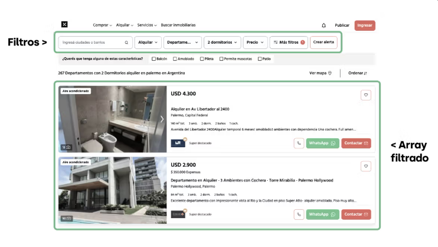

## Filtrando propiedades


En este desafío de cierre del capítulo, pondremos en práctica el uso de bucles para abordar uno de los problemas que más lagrimas de devs principiantes provocan: el filtrado de listas.

Manipular listas
Ya hemos filtrado arrays haciendo preguntas sobre su contenido para generar un nuevo array.

```javascript
const cafeterias = [
  { nombre: "Café Central", distancia: 0.5 },
  { nombre: "Barista Brew", distancia: 1.2 },
  { nombre: "Latte Love", distancia: 0.8 },
  { nombre: "Espresso Express", distancia: 2.3 },
  { nombre: "Cappuccino Corner", distancia: 0.9 },
  { nombre: "Mocha Mood", distancia: 1.5 },
];

const cafeteriasCercanas = [];
let index = 0;

for (const cafeteria of cafeterias) {
  if (cafeteria.distancia < 1) {
    cafeteriasCercanas[index] = cafeteria;
    index++;
  }
}

console.log(cafeteriasCercanas);
```

Vamos a entender con el tiempo y la práctica que gran parte del trabajo de gestionar datos dentro del software es manipular listas. Listas de usuarios, de productos, de lugares, etc. Y que hay patrones como el de filtrado que son lo más común del mundo. De hecho, más adelante, vamos a ver que hay formas mucho más simples de manipular arrays para este tipo de lógicas.

Consigna
En este desafío vamos a tener que filtrar un array de propiedades en base a un objeto que representa los filtros de una búsqueda.


Para esto tenés que copiar el siguiente código base en tu computadora y completar la lógica.

```javascript
const propiedades = [
  {
    barrio: "Palermo",
    tipoOperacion: "alquiler",
    tipoPropiedad: "departamento",
    ambientes: 2,
    precio: 120000,
    metrosCuadrados: 50,
  },
  {
    barrio: "Recoleta",
    tipoOperacion: "alquiler",
    tipoPropiedad: "departamento",
    ambientes: 3,
    precio: 250000,
    metrosCuadrados: 85,
  },
  {
    barrio: "Belgrano",
    tipoOperacion: "alquiler",
    tipoPropiedad: "casa",
    ambientes: 5,
    precio: 350000,
    metrosCuadrados: 120,
  },
  {
    barrio: "Villa Crespo",
    tipoOperacion: "alquiler",
    tipoPropiedad: "departamento",
    ambientes: 2,
    precio: 100000,
    metrosCuadrados: 45,
  },
  {
    barrio: "San Telmo",
    tipoOperacion: "compra",
    tipoPropiedad: "departamento",
    ambientes: 4,
    precio: 300000,
    metrosCuadrados: 90,
  },
  {
    barrio: "Caballito",
    tipoOperacion: "alquiler",
    tipoPropiedad: "casa",
    ambientes: 4,
    precio: 280000,
    metrosCuadrados: 110,
  },
  {
    barrio: "Núñez",
    tipoOperacion: "compra",
    tipoPropiedad: "quinta",
    ambientes: 6,
    precio: 900000,
    metrosCuadrados: 200,
  },
  {
    barrio: "Almagro",
    tipoOperacion: "alquiler",
    tipoPropiedad: "departamento",
    ambientes: 1,
    precio: 80000,
    metrosCuadrados: 35,
  },
  {
    barrio: "Barracas",
    tipoOperacion: "compra",
    tipoPropiedad: "departamento",
    ambientes: 2,
    precio: 150000,
    metrosCuadrados: 60,
  },
  {
    barrio: "La Boca",
    tipoOperacion: "alquiler",
    tipoPropiedad: "departamento",
    ambientes: 3,
    precio: 110000,
    metrosCuadrados: 70,
  },
  {
    barrio: "Flores",
    tipoOperacion: "compra",
    tipoPropiedad: "casa",
    ambientes: 4,
    precio: 400000,
    metrosCuadrados: 130,
  },
  {
    barrio: "Boedo",
    tipoOperacion: "alquiler",
    tipoPropiedad: "departamento",
    ambientes: 2,
    precio: 95000,
    metrosCuadrados: 55,
  },
  {
    barrio: "Villa Devoto",
    tipoOperacion: "compra",
    tipoPropiedad: "quinta",
    ambientes: 5,
    precio: 750000,
    metrosCuadrados: 180,
  },
  {
    barrio: "Liniers",
    tipoOperacion: "alquiler",
    tipoPropiedad: "casa",
    ambientes: 3,
    precio: 200000,
    metrosCuadrados: 100,
  },
  {
    barrio: "Parque Patricios",
    tipoOperacion: "compra",
    tipoPropiedad: "departamento",
    ambientes: 2,
    precio: 220000,
    metrosCuadrados: 65,
  },
];

const filtros = {
  barrio: ["Palermo", "Recoleta"], // Lista de barrios aceptados
  tipoOperacion: "alquiler", // Filtrar por tipo de operación ('alquiler' o 'compra')
  tipoPropiedad: ["departamento", "casa"], // Lista de tipos de propiedad aceptados
  ambientesMin: 2, // Número mínimo de ambientes
  ambientesMax: 4, // Número máximo de ambientes
  precioMin: 100000, // Precio mínimo
  precioMax: 300000, // Precio máximo
  metrosCuadradosMin: 50, // Metros cuadrados mínimos
  metrosCuadradosMax: 100, // Metros cuadrados máximos
};

const propiedadesFiltradas = [];
let indicePropsFiltradas = 0;

// Acá tenés que plantear el for...of que recorre el array de propiedades
// en cada propiedad tenés que hacer las preguntas pertinentes
// y en caso de cumplir los requisitos de los filtros,
// agregar la propiedad al array propiedadesFiltradas
// usando la variable indicePropsFiltradas para "empujar" la propiedad en el array

// en algunos casos como el de tipoDePropiedad o barrio, vas a necesitar usar
// otro bucle para iterar todas las posiciones del array de filtros
// y compararlo con la propiedad

console.log(propiedadesFiltradas);
console.log("Resultados encontrados: " + propiedadesFiltradas.length);
```

## Avanzá en orden

No es el desafío más complejo del mundo, pero tampoco el más sencillo. Así que lo mejor como siempre es respetar las etapas.

Entendé el problema
El primer paso es entender la consigna y el código base. No te apures a pensar soluciones. No vas a llegar a ningún lado, ya que todavía no tenés la práctica suficiente para que se te ocurran soluciones a este tipo de problemas. Recién los estas conociendo. Preguntale a Lisa todo lo que necesites para entender lo que tenés que lograr y alguna parte del código que no entiendas.

Pensá en lo que SI sabés
Es probable que apenas veas la consigna pienses que no sabés como resolver este problema. Cómo dijimos, primero hay que entenderlo y luego pensar en cosas que si conocemos sobre lógica, condicionales, bucles, operadores, etc. Que nos podrían ayudar a resolver este problema. Quizás todavía no sabés como combinar todo, pero empezar a hilar ideas es un buen camino. Contale a Lisa tus ideas y que tipo de cosas se te ocurren.

Proponé soluciones
Finalmente, cuando tengas el problema comprendido y hayas navegado un poco en algunos conceptos conocidos, vas a notar que se te ocurren algunas ideas que sentís que no es lo mejor del mundo. Te voy a contar un secreto, eso me sigue pasando 20 años después de haber aprendido a usar bucles. Nunca estoy seguro del todo sobre mis primeras ideas técnicas. Lo que si sé, es que una mala idea que funciona es el comienzo de un código hermoso.

Si pensás que lo podés resolver de una forma no tan "elegante" ¡hacelo! Consulta con Lisa para entender lo que estás haciendo y vas a ver que una vez que funcione se te van a ocurrir otras formas de resolverlo con menos código o de una forma más prolija. Está perfecto. Ese es el proceso. Armar algo que ande y mejorarlo.

## Entregable

Cuando quieras ir chequeando tu lógica con Lisa, mostrale solo la lógica de filtrado. No hace falta que le muestres todo el array de propiedades. Lisa las conoce.

```javascript
// Compartí con Lisa solo la lógica de filtrado

const propiedadesFiltradas = [];
let indicePropsFiltradas = 0;

for (const propiedad of propiedades) {
  // tu lógica
}

console.log(propiedadesFiltradas);
console.log("Resultados encontrados: " + propiedadesFiltradas.length);
```
