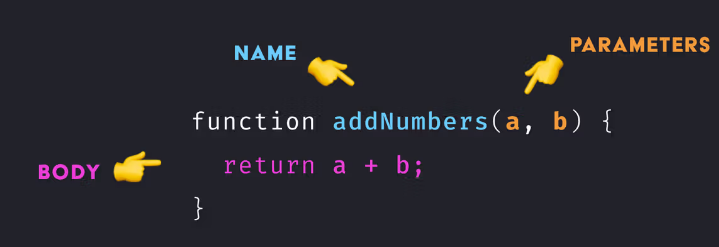
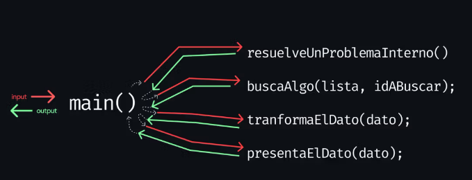
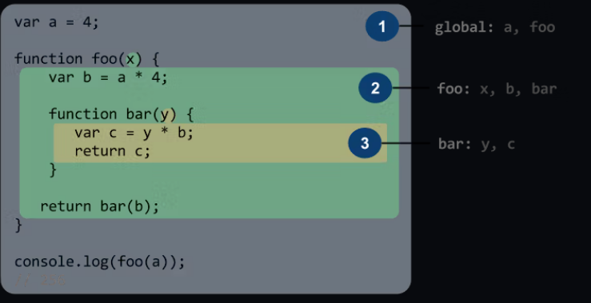

# Introducción

En JavaScript, una función es un bloque de código reutilizable que realiza una tarea específica. Las funciones son muy útiles para organizar el código, mejorar la legibilidad y mantener el código DRY (Don't Repeat Yourself).

Las funciones pueden tomar argumentos, que son valores que se pasan a la función cuando se llama. La función puede utilizar estos argumentos en su código para realizar una tarea específica. Las funciones también pueden devolver un valor cuando se llaman.

Aquí hay un ejemplo simple de una función en JavaScript que toma dos números como argumentos y devuelve su suma:

```javascript
function sumar(a, b) {
  return a + b;
}

// Llamando la función
const resultado = sumar(2, 3);
console.log(resultado); // Imprime 5
```

En este ejemplo, hemos definido una función llamada sumar que toma dos argumentos a y b. Dentro de la función, estamos devolviendo la suma de a y b utilizando el operador +. Finalmente, estamos llamando la función pasando los valores 2 y 3 como argumentos y almacenando el resultado devuelto en la variable resultado. Luego imprimimos resultado en la consola y obtenemos 5, que es la suma de 2 y 3.

Una funcion es un bloque de codigo que se ejecuta cuando se llama. Se puede invocar en cualquier momento del codigo.

```javascript
function main() {
  const numero = 10;
}

function distinto() {
  const numero = 20;
}
```

En este ejemplo, hemos definido dos funciones: main y distinto. Cada una tiene su propia variable numero con un valor diferente. Sin embargo, cuando llamamos a la función main, la variable numero se define dentro de su ámbito local, por lo que no se puede acceder a ella desde la función distinto.

```javascript
const consola = {
  log: function (message) {
    console.log(message);
  },
};

function main() {
  consola.log("main SE EJECUTA");
}

main();
```

La funcion main se ejecuta cuando se llama. Ejecuta el codigo que contiene, el cual invoca a la funcion consola.log("main SE EJECUTA");

```javascript
function main(nombre, apellido) {
  console.log("Hola " + nombre + " " + apellido);
  return true;
}

main("Juan", "Perez");
```

La funcion main se le pasa dos argumentos: nombre y apellido. Al momento de llamar a la funcion, se le pasa los valores "Juan" y "Perez" como argumentos.
Y muestra en la consola "Hola Juan Perez".

## Partes



Supongamos que queremos crear una función que convierta grados Celsius a Fahrenheit. La fórmula para convertir grados Celsius a Fahrenheit es: F = (C \* 9/5) + 32.

Aquí está el código para crear una función en JavaScript que convierte grados Celsius a Fahrenheit:

```javascript
function convertirCelsiusAFahrenheit(celsius) {
  const fahrenheit = (celsius * 9) / 5 + 32;
  return fahrenheit;
}

const temperaturaEnCelsius = 20;
const temperaturaEnFahrenheit =
  convertirCelsiusAFahrenheit(temperaturaEnCelsius);
console.log(temperaturaEnFahrenheit); // Imprime 68
```

hora, analicemos las partes de esta función:

La palabra clave function indica que estamos definiendo una función. Después de la palabra clave function, escribimos el nombre de la función, convertirCelsiusAFahrenheit, seguido de paréntesis que contienen los argumentos que la función toma, en este caso celsius.
Dentro de las llaves {} de la función, definimos el código que la función ejecutará cuando se llame. En este caso, estamos declarando una variable llamada fahrenheit y asignándole el resultado de la fórmula de conversión. Luego, devolvemos fahrenheit utilizando la palabra clave return.
Al llamar la función, pasamos un valor de temperatura en Celsius como argumento, almacenamos el resultado devuelto en una variable llamada temperaturaEnFahrenheit y lo imprimimos en la consola.
Las funciones se utilizan para crear bloques de código reutilizable que pueden tomar argumentos y devolver valores. Una vez que se ha definido una función, se puede llamar varias veces con diferentes argumentos para realizar la misma tarea. Esto hace que el código sea más legible, más fácil de mantener y reduce la cantidad de código que necesita ser escrito y mantenido. En resumen, las funciones son una herramienta muy poderosa para crear código limpio, modular y eficiente en JavaScript.

Ahora, analicemos las partes de esta función:

1. La palabra clave function indica que estamos definiendo una función. Después de la palabra clave function, escribimos el nombre de la función, convertirCelsiusAFahrenheit, seguido de paréntesis que contienen los argumentos que la función toma, en este caso celsius.

2. Dentro de las llaves {} de la función, definimos el código que la función ejecutará cuando se llame. En este caso, estamos declarando una variable llamada fahrenheit y asignándole el resultado de la fórmula de conversión. Luego, devolvemos fahrenheit utilizando la palabra clave return.

3. Al llamar la función, pasamos un valor de temperatura en Celsius como argumento, almacenamos el resultado devuelto en una variable llamada temperaturaEnFahrenheit y lo imprimimos en la consola.

Las funciones se utilizan para crear bloques de código reutilizable que pueden tomar argumentos y devolver valores. Una vez que se ha definido una función, se puede llamar varias veces con diferentes argumentos para realizar la misma tarea. Esto hace que el código sea más legible, más fácil de mantener y reduce la cantidad de código que necesita ser escrito y mantenido. En resumen, las funciones son una herramienta muy poderosa para crear código limpio, modular y eficiente en JavaScript.

## Todo en funciones

El objetivo es que ninguna instrucción quede por fuera de estas estructuras, porque así es más sencillo leer el programa, poder encontrar errores y nos da la posibilidad de que nuestro proyecto crezca o se optimice. Las funciones nos dan orden, poder y complejidad cuando escribimos código.

Un programa está compuesto por muchas funcionalidades. Estas pueden ser hacer una búsqueda, filtrar resultados, loguear usuarios, enviar formularios, etc. La mejor forma de integrar todos estos procesos es a través de pequeñas funciones que se encargan de tareas específicas, a las que podemos invocar desde cualquier lugar del programa.

Como ya adelantamos, desde nuestros primeros proyectos vamos a usar este tipo de arquitectura, donde una función llama a otra, formando una especie de árbol. Para eso, implementaremos una función principal, desde la que se invocará a las demás, en la medida que el programa lo requiera.

Por convención, en el mundo del desarrollo, le llamamos main a la función principal de un programa. Esta subrutina será el punto de entrada (entry point) a la aplicación y en su interior se llamarán a las demás funciones.

Observemos estas dos funciones interactuar entre sí y veamos el orden en que se imprimen los mensajes:

```javascript
// 1. declaro la funcion crearSaludo
function crearSaludo(nombre) {
  console.log("empieza la función crearSaludo con el parámetro", nombre);
  return "Hola" + nombre;
}

// 2. declaro la funcion main
function main() {
  console.log("empieza la función main");

  var saludoAMarce = crearSaludo("Marce");
  var saludoAPau = crearSaludo("Paula");

  console.log("se imprimen los resultados");
  console.log(saludoAMarce);
  console.log(saludoAPau);

  console.log("se termina el programa");
}

// 3. ejecuto la función main
main();
```

## En resumen



- Las funciones, subalgoritmos o subrutinas, son una serie de instrucciones escritas en código que realizan una función concreta dentro del programa donde se las usa.
- Las funciones toman datos de entrada, los procesan y devuelven datos de salida.
- Suelen estar formadas por un nombre, unos parámetros, un bloque de código y un resultado.
- Los subprocesos nos dan orden, poder y complejidad cuando escribimos código.
- En nuestros proyectos vamos a usar una función principal a la que llamamos main.

## Scope

En programación, una función es un conjunto de instrucciones que realizan una tarea específica en un programa. Una gran ventaja de utilizar funciones es que podemos organizar nuestro código y hacer que una función principal llame a otras funciones.

Sin embargo, en JavaScript, las funciones también tienen otro aspecto importante que debemos tener en cuenta: crean un ámbito en el que se pueden declarar variables. Este ámbito es conocido como scope.



Existen dos tipos de scope en JavaScript: el scope global y el scope local. El scope global se refiere a las variables que se declaran fuera de cualquier función, lo que significa que se pueden acceder a ellas desde cualquier parte del programa. Por otro lado, el scope local se refiere a las variables que se declaran dentro de una función, lo que significa que solo se pueden acceder a ellas dentro de esa función.

Esta limitación de acceso a las variables dentro de una función es en realidad una gran ventaja al programar. Por un lado, nos asegura que nadie pueda modificar las variables de una función desde fuera de ella y alterar su funcionamiento. Por otro lado, nos permite utilizar nombres de variables repetidos en diferentes funciones sin preocuparnos de que entren en conflicto.

Además, cuando declaramos variables dentro de una función, JavaScript se encarga de limpiar la memoria RAM y eliminar los datos que ya no se utilizan en nuestro programa. A este proceso se le llama garbage collector y nos ayuda a optimizar nuestro programa.

En resumen, las funciones en JavaScript no solo nos permiten organizar nuestro código y crear bloques de código reutilizable, sino que también nos ayudan a controlar el acceso y alcance de las variables dentro de nuestro programa, lo que puede mejorar la seguridad y el rendimiento de nuestro código.
