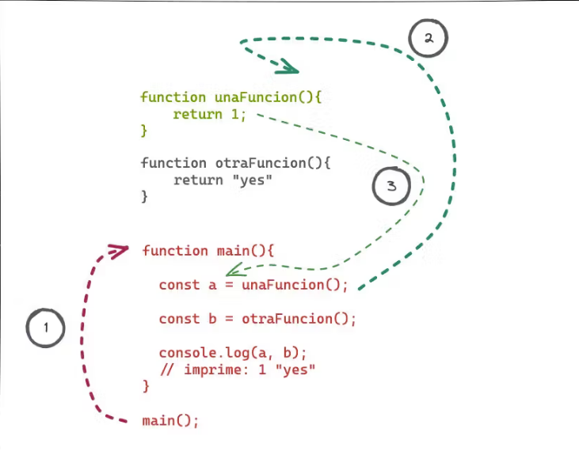

## Organizando mi app

Desafío
Para este desafío, queremos que uses main() como función principal. Luego, tendrás que declarar tres funciones (al mismo nivel que la función main) que reciban números, textos y objetos.

Las funciones deben recibir estos parámetros y devolver valores nuevos. Para eso las funciones los podrán sumar, concatenar o cambiar; para devolver un valor por cada función.

La función main() no recibe parámetros ni retorna ningún valor, simplemente nos sirve como punto de entrada de nuestro programa y tiene como misión invocar a las otras funciones, pasarles valores y recibir sus respuestas para mostrarlas en la terminal.

Finalmente, la función main recibirá los resultados para imprimirlos en la pantalla. Para eso, tendrás que utilizar el método de console más adecuado.

## Importante

La única función que debe usar console.log es main(). De esta forma vamos a concentrar la responsabilidad de mostrar resultados en la función principal y esto nos va a dar orden.
