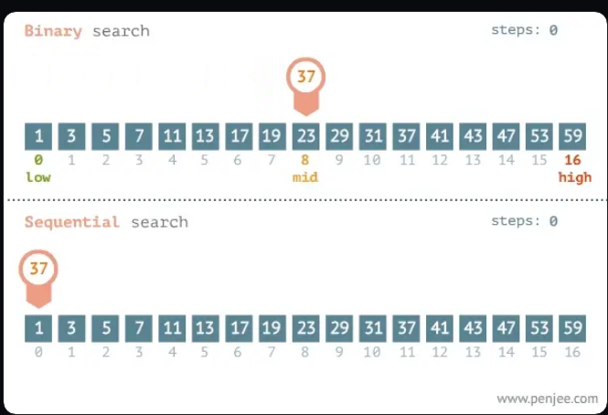

# Introducción

Algoritmo es una palabra que cada vez escuchamos más en la vida cotidiana. Es común que se hable del algoritmo de tal red social o buscador. Muchas veces, la cultura popular lo figura como una gran máquina que se alimenta de la información de los usuarios y es el culpable de todos nuestros males.

Sin embargo, la definición real de algoritmo es mucho más simple de lo que podemos creer. Básicamente, se trata de un conjunto finito y ordenado de acciones con las que podemos resolver un determinado problema.

Cualquiera de las estructuras que vimos en capítulos anteriores (las condiciones que utilizan if o los bucles while y for) son algoritmos. Cuando declaramos unas variables y las sumamos, también se trata de un algoritmo. En definitiva, no importa la complejidad de las instrucciones, si son un conjunto de pasos que resuelven un problema, estamos ante un algoritmo.

En programación, existen tantos algoritmos como posibilidades de combinar código, por eso, la misión de lxs desarrolladorxs no solo es la de implementar uno que funcione, sino que también tiene que ser el más efectivo

Pero, ¿por qué hay algoritmos mejores que otros que hacen lo mismo?

## Eficiencia

Como hemos visto en los capítulos anteriores, cuando resolvemos un problema con código usamos variables, bucles y otros recursos disponibles. Para muchos de los problemas más comunes con los que nos podemos encontrar, hay una forma más eficiente que otra para resolverlos.

Y que sea eficiente quiere decir que hace un uso responsable de los recursos de una computadora, como la memoria RAM o el CPU. Pero este no solo es un beneficio para los usuarios que ejecutan nuestro programa en sus dispositivos y quieren que funcione rápido y bien.

```javascript
function buscarMaximo(array) {
  let maximo = array[0]; // Esta variable consume memoria RAM
  for (let i = 1; i < array.length; i++) {
    // Este ciclo consume CPU
    if (array[i] > maximo) {
      maximo = array[i];
    }
  }
  return maximo;
}
```

También, es importante para hacer un uso efectivo de los recursos que nos ofrecen los servidores, es decir computadoras remotas donde se guarda nuestro programa. En estos casos, las empresas que nos proveen de servidores, nos cobran en función del uso que le demos a los recursos de esos equipos.

Entonces, por razones de rendimiento y económicas, es ideal que elijamos, entre todas las posibilidades, los algoritmos que sean más eficientes.

## Búsqueda lineal

Los algoritmos de búsqueda son de los más estudiados ya que en muchas ocasiones nos encontramos frente a una gran masa de datos y necesitamos encontrar cosas a gran velocidad. De hecho podemos ver la diferencia entre dos algoritmos con un simple array de números. Veamos un ejemplo:

Si quisiéramos buscar la posición de un valor en un array ordenado, seguramente se nos ocurrirían muchas formas de resolverlo. Una de las opciones podría ser usar un for que itere todas las posiciones y encuentre la que le indicamos.

En JavaScript, podemos escribir el algoritmo de esta forma:

```javascript
const listaDeNumeros = [1, 3, 6, 98, 105, 209, 987, 1024];

function buscar(listaDeNumeros, numeroABuscar) {
  for (let i = 0; i < listaDeNumeros.length; i++) {
    if (listaDeNumeros[i] === numeroABuscar) return i;
  }
  return -1;
}

const donde = buscar(listaDeNumeros, 987);

console.log("encontrado en la posición " + donde, listaDeNumeros[donde]);
```

Veamos, a grandes rasgos, qué hace este código.

```javascript
// Se crea una variable llamada listaDeNumeros que contiene un arreglo con una serie de números.
const listaDeNumeros = [1, 3, 6, 98, 105, 209, 987, 1024];

// Se crea una función llamada buscar que recibe dos parámetros: una lista de números y el número a buscar.
function buscar(listaDeNumeros, numeroABuscar) {
  // Se crea un ciclo for que va a iterar por cada elemento del arreglo.
  for (let i = 0; i < listaDeNumeros.length; i++) {
    // Si el elemento actual es igual al número a buscar, se devuelve su posición en el arreglo.
    if (listaDeNumeros[i] === numeroABuscar) return i;
  }
  // Si no se encuentra el número, se devuelve -1.
  return -1;
}

// Se crea una variable llamada donde que almacena el resultado de llamar a la función buscar con la lista de números y el número a buscar.
const donde = buscar(listaDeNumeros, 987);

// Se imprime en consola un mensaje indicando la posición donde se encontró el número y el número mismo.
console.log("encontrado en la posición " + donde, listaDeNumeros[donde]);
```

## Búsqueda binaria

Si bien este es un algoritmo válido, que cumple su objetivo, no es el más eficiente en este tipo de casos. Esto se debe a que recorre todas las posiciones del array secuencialmente para encontrar lo que le pedimos, lo que implica un alto uso de recursos.

En programación, existe un conjunto de instrucciones muy eficaz para este tipo de situaciones. Este algoritmo se llama búsqueda binaria, y en JavaScript se codea así:

```javascript
var listaDeNumeros = [1, 3, 6, 98, 105, 209, 987, 1024];

function busquedaBinaria(numeros, busqueda) {
  var desde = 0;
  var ultimaPosicion = numeros.length - 1;
  var hasta = ultimaPosicion;

  while (desde <= hasta) {
    var laMitad = Math.floor((desde + hasta) / 2);
    var numeroDelMedio = numeros[laMitad];
    if (numeroDelMedio == busqueda) {
      return laMitad;
    }
    if (numeroDelMedio > busqueda) {
      hasta = laMitad - 1;
    } else {
      desde = laMitad + 1;
    }
  }
  return -1;
}

const donde = busquedaBinaria(listaDeNumeros, 987);

console.log("encontrado en la posición " + donde, listaDeNumeros[donde]);
```

Aunque a simple vista este código parezca más largo que el que vimos antes, la búsqueda binaria es un algoritmo más eficiente y veloz que el que podríamos crear usando un ciclo for.

```javascript
// Se crea una variable llamada listaDeNumeros que contiene un arreglo con una serie de números.
var listaDeNumeros = [1, 3, 6, 98, 105, 209, 987, 1024];

// Se crea una función llamada busquedaBinaria que recibe una lista de números y el número a buscar.
function busquedaBinaria(numeros, busqueda) {
  // Se inicializan las variables desde, hasta y ultimaPosicion para representar los índices del arreglo.
  var desde = 0;
  var ultimaPosicion = numeros.length - 1;
  var hasta = ultimaPosicion;

  // Mientras el índice desde sea menor o igual al índice hasta, se sigue buscando el número en la lista.
  while (desde <= hasta) {
    // Se calcula el índice del elemento del medio de la lista.
    var laMitad = Math.floor((desde + hasta) / 2);
    // Se obtiene el valor del elemento del medio.
    var numeroDelMedio = numeros[laMitad];
    // Si el valor del elemento del medio es igual al número buscado, se devuelve su posición en el arreglo.
    if (numeroDelMedio == busqueda) {
      return laMitad;
    }
    // Si el valor del elemento del medio es mayor al número buscado, se busca en la mitad izquierda del arreglo.
    if (numeroDelMedio > busqueda) {
      hasta = laMitad - 1;
    }
    // Si el valor del elemento del medio es menor al número buscado, se busca en la mitad derecha del arreglo.
    else {
      desde = laMitad + 1;
    }
  }
  // Si el número no se encuentra en el arreglo, se devuelve -1.
  return -1;
}

// Se crea una variable llamada donde que almacena el resultado de llamar a la función busquedaBinaria con la lista de números y el número a buscar.
const donde = busquedaBinaria(listaDeNumeros, 987);

// Se imprime en consola un mensaje indicando la posición donde se encontró el número y el número mismo.
console.log("encontrado en la posición " + donde, listaDeNumeros[donde]);
```

En lugar de buscar secuencialmente en la lista, la búsqueda binaria divide la lista por la mitad y compara el valor de búsqueda con el valor del medio. Si el valor de búsqueda es menor que el valor del medio, se realiza la búsqueda en la mitad inferior de la lista; de lo contrario, se busca en la mitad superior de la lista. El proceso se repite hasta que se encuentra el valor de búsqueda o se determina que el valor no está en la lista. La búsqueda binaria tiene una complejidad logarítmica, lo que la hace más eficiente que una búsqueda secuencial para listas grandes.



## Conclusión

El ejemplo que vimos en este capítulo nos demuestra que, si bien existen varias formas de resolver el mismo problema, hay métodos más efectivos y rápidos. Quizás, cuando estamos aprendiendo a programar, priorizamos entender y escribir código que funcione; pero, en este curso intentaremos mostrarles alternativas que optimicen el funcionamiento de nuestros algoritmos.

## En resumen

- Un algoritmo es un conjunto finito y ordenado de acciones con las que podemos resolver un determinado problema.
- Existen algoritmos más eficaces que otros.
- El uso de algoritmos lentos o poco eficaces afecta la experiencia de lxs usuarixs.
- También, nos puede afectar económicamente por el uso de los recursos de los servidores.
- La búsqueda binaria es un buen ejemplo de un algoritmo que optimiza el uso de recursos de una computadora.
