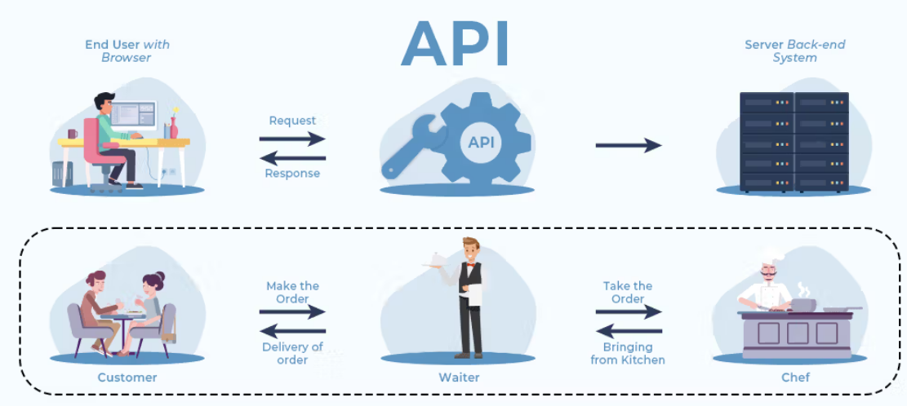

## ¿Qué es una API?

Una API (Application Programming Interface) es un conjunto de definiciones y protocolos que se utilizan para desarrollar software. En términos más simples, una API es una forma en que diferentes aplicaciones y sistemas interactúan entre sí, permitiendo que se compartan datos y funcionalidades.

En el caso de las APIs de sistemas en general, éstas pueden variar dependiendo de su propósito y de los sistemas con los que interactúan. Algunos ejemplos de APIs de sistemas son las APIs de bases de datos, APIs de sistemas operativos, APIs de servicios web y APIs de redes.



## La API de Node.js

Por otro lado, Node.js es una plataforma de software libre para la ejecución de código JavaScript del lado del servidor. Node.js también tiene su propia API que se utiliza para crear aplicaciones web y para interactuar con el sistema operativo.

Una de las funcionalidades más comunes de la API de Node.js es la manipulación de archivos. Un ejemplo de código básico de cómo usar la API de Node.js para leer un archivo sería el siguiente:

```javascript
const fs = require("fs");

fs.readFile("/ruta/al/archivo.txt", (err, data) => {
  if (err) throw err;
  console.log(data.toString());
});
```

## 6 Ejemplos

1. fs (file system): Este módulo proporciona una API para interactuar con el sistema de archivos del sistema operativo. En este ejemplo, leeremos el contenido de un archivo y lo mostraremos por consola.

```javascript
const fs = require("fs");

// Leemos el archivo 'ejemplo.txt'
fs.readFile("ejemplo.txt", "utf8", (err, data) => {
  if (err) throw err;
  // Mostramos el contenido del archivo por consola
  console.log(data);
});
```

2. path: Este módulo proporciona una API para trabajar con rutas de archivos y directorios. En este ejemplo, utilizaremos la función join() para unir dos rutas.

```javascript
const path = require("path");

// Unimos las rutas 'carpeta1' y 'carpeta2' para obtener la ruta completa
const rutaCompleta = path.join("carpeta1", "carpeta2");

// Mostramos la ruta completa por consola
console.log(rutaCompleta);
```

3. os: Este módulo proporciona una API para interactuar con el sistema operativo. En este ejemplo, utilizaremos la función totalmem() para obtener la cantidad total de memoria RAM del sistema.

```javascript
const os = require("os");

// Obtenemos la cantidad total de memoria RAM del sistema
const totalMemoria = os.totalmem();

// Mostramos la cantidad total de memoria RAM por consola
console.log(`La cantidad total de memoria RAM es ${totalMemoria} bytes`);
```

4. events: Este módulo proporciona una API para crear y manejar eventos. En este ejemplo, crearemos un objeto EventEmitter y utilizaremos el evento on() para escuchar un evento personalizado.

```javascript
const EventEmitter = require("events");

// Creamos un objeto EventEmitter
const emisorEventos = new EventEmitter();

// Escuchamos el evento personalizado 'miEvento'
emisorEventos.on("miEvento", () => {
  console.log('El evento "miEvento" ha sido activado');
});

// Emitimos el evento personalizado 'miEvento'
emisorEventos.emit("miEvento");
```

5. crypto: Este módulo proporciona una API para funciones criptográficas. En este ejemplo, utilizaremos la función createHash() para generar un hash MD5 de una cadena de texto.

```javascript
const crypto = require("crypto");

// Creamos un hash MD5 de la cadena de texto 'ejemplo'
const hash = crypto.createHash("md5").update("ejemplo").digest("hex");

// Mostramos el hash por consola
console.log(hash);
```

6. http: Este módulo permite crear servidores web y manejar peticiones HTTP. En este ejemplo, creamos un servidor simple que responde con "Hola, mundo!" cuando se accede a él.

```javascript
const http = require("http");

const server = http.createServer((req, res) => {
  res.writeHead(200, { "Content-Type": "text/plain" });
  res.end("Hola, mundo!\n");
});

server.listen(3000, () => {
  console.log("Servidor corriendo en http://localhost:3000");
  console.log("Ingresá a http://localhost:3000 en tu navegador (Chrome)");
});
```
