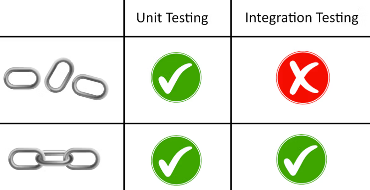

## Introducción

Para asegurarnos de que nuestro código funcione como debería, existen algunas herramientas que nos ayudan a monitorear su comportamiento. En el mundo de la programación, se conoce como testing a las pruebas sobre un programa que se hacen con el fin de obtener información acerca de su calidad.

Si bien hay muchos niveles de testing, en esta ocasión vamos a hablar de dos de los más conocidos y usados. Por un lado, tenemos las pruebas unitarias que, básicamente, testean trozos específicos de software y chequean que funcionen sin errores.

Este tipo de tests se utilizan, por ejemplo, para comprobar el correcto comportamiento de las funciones de un programa. Con ese propósito, podríamos crear un documento que almacene una serie de funciones que prueben que las funciones del código fuente de un programa devuelvan los datos que esperamos.

## Pruebas Unitarias

Las pruebas unitarias son aquellas que se centran en probar el correcto funcionamiento de una unidad del código fuente. Por lo general, estas pruebas se realizan sobre las funciones de un programa.

Testean partes específicas del código fuente, por cada función que se implemente, se debe crear una prueba unitaria (una funcion que testea que la funcion devuelva lo que se espera).

```javascript
function sumar(a, b) {
  return a + b;
}

function testSumar() {
  const result = sumar(2, 3);
  const expected = 5;

  if (result !== expected) {
    console.log("La prueba falló!");
  } else {
    console.log("La prueba pasó!");
  }
}

testSumar();
```

En este ejemplo, la función testSumar() invoca a la función sumar() con los argumentos 2 y 3, y verifica si el resultado es igual al valor esperado (5). Si el resultado es diferente al valor esperado, se muestra un mensaje indicando que la prueba falló. Si el resultado es igual al valor esperado, se muestra un mensaje indicando que la prueba pasó.

## TDD (Test Driven Development)

El TDD es un enfoque de desarrollo de software que se centra en la creación de pruebas antes de la implementación del código fuente. Este enfoque se basa en la idea de que las pruebas deben ser escritas antes de la implementación del código fuente, lo que permite asegurar que el código fuente cumpla con los requisitos de calidad antes de su implementación.

El TDD se divide en tres etapas principales:

1. **Testeo**: Se escriben las pruebas que se van a realizar sobre el código fuente.
2. **Implementación**: Se implementa el código fuente que cumpla con las pruebas escritas.
3. **Refactorización**: Se refactore el código fuente para mejorar su calidad y su mantenimiento.

## Test unitario

Para ilustrarlo, pensemos en un ejemplo sencillo. La siguiente función cuenta las palabras dentro de un string:

```javascript
function contarPalabras(texto) {
  // Dividimos el texto en palabras utilizando espacios en blanco como delimitadores
  const palabras = texto.split(" ");

  // Devolvemos la cantidad de palabras
  return palabras.length;
}
```

Si queremos corroborar que la función esté operando correctamente, podemos crear otra función que invoque a la función que queremos testear y le pase unos parámetros de prueba. Si el resultado que devuelve es el que esperamos, la función de prueba nos va a decir que todo está bien; en el caso contrario, nos va a alertar del error para que revisemos el código.

Siguiendo con el ejemplo anterior, veamos cómo podríamos probar la función con un testeo unitario:

```javascript
function testContarPalabras() {
  const texto = "Esta es una prueba de contar palabras";

  const resultado = contarPalabras(texto);

  // Verificamos los resultados
  if (resultado === 7) {
    console.log("testContarPalabras funciona correctamente");
  } else {
    console.error("testContarPalabras falló en la prueba");
    console.error("Se esperaban 7 palabras y se obtuvo", resultado);
  }
}

testContarPalabras();
```

## TDD

En la industria del software, hay una forma común de desarrollar llamada Test-Driven Development (TDD). En esta práctica, primero se escriben las pruebas (usualmente unitarias) y luego se escribe el código para satisfacer esas pruebas.

Aunque parezca extraño, esta forma de desarrollar software nos ayuda a construir un código más resistente, seguro y fácil de mantener, además de permitir una creación más rápida.

Supongamos que queremos implementar una función que determine si un número es par o impar. En lugar de escribir la función directamente, primero escribiremos el test que valide su correcto funcionamiento.

```javascript
function testEsPar() {
  console.assert(esPar(2) === true, "Falla para números pares");
  console.assert(esPar(3) === false, "Falla para números impares");
  console.assert(esPar(0) === true, "Falla para cero");
}
```

Una vez definido el test podemos crear la función `esPar()` sabiendo que el test está chequeando que funcione correctamente.

```javascript
function esPar(numero) {
  return numero % 2 === 0;
}
```

## Tests de integración

Las pruebas de integración son una forma de probar que todas las partes de un programa funcionan bien juntas. Después de hacer las pruebas unitarias, que son pruebas más pequeñas para cada parte del programa, podemos hacer las pruebas de integración para asegurarnos de que todo sigue funcionando correctamente cuando se juntan las partes.



En la web, las pruebas de integración se automatizan con robots que imitan a las personas para encontrar errores en el programa. Estas pruebas son importantes porque muchos componentes que usamos son creados por otras personas o por nosotros mismos en otro momento. Entonces necesitamos estar seguros de que todo sigue funcionando como se espera.

## Test automáticos

Los tests automáticos en la web son una forma de asegurarse de que una aplicación web funciona correctamente. En lugar de que una persona pruebe manualmente cada función y característica de la aplicación, los tests automatizados pueden ser escritos para simular las acciones de un usuario y verificar si la aplicación se comporta como se espera.


Estos tests pueden ser diseñados para cubrir una amplia variedad de casos de uso y escenarios de error, y se pueden ejecutar con frecuencia para detectar problemas rápidamente. Los tests automáticos en la web pueden incluir pruebas de integración, pruebas de unidades y pruebas de aceptación, que se ejecutan en diferentes etapas del ciclo de vida del desarrollo de software.

Una herramienta comúnmente utilizada para escribir y ejecutar tests automáticos en la web es Selenium, que permite automatizar la interacción del usuario con la aplicación web en un navegador. Otras herramientas populares incluyen Cypress y Puppeteer. Estas herramientas permiten simular la interacción del usuario con la aplicación, como hacer clic en botones, ingresar texto en formularios y navegar por diferentes páginas, y luego verificar si la aplicación responde de manera adecuada y produce los resultados esperados.

## En conclusión

- Se conoce como testing a las pruebas sobre un programa que se hacen con el fin de obtener información acerca de su calidad.
- Las pruebas unitarias testean trozos específicos de software y chequean que funcionen sin errores.
- La metodología Test-Driven Development (TDD) consiste en escribir primero las pruebas, generalmente unitarias, para después escribir el código fuente.
- Las pruebas de integración testean todos los componentes de un programa juntos, para ver cómo interactúan entre ellos y comprobar que todo vaya bien.
