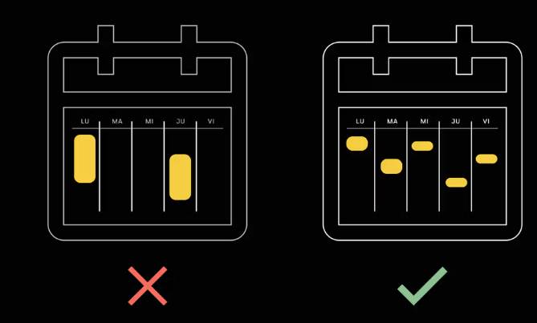

# Nivel 1
¡Que bueno que estás acá! En este nivel vamos a continuar entendiendo los conceptos fundamentales de la programación y vamos a empezar a meternos con problemas cada vez más complejos. Pero no te preocupes, vamos a ir lento y te voy a guiar en cada paso para que entiendas para qué estamos aprendiendo todo esto.

Podemos decir que el Nivel 1 abarca tres temas grandes super importantes.

## Manejo de datos
Ya sabemos que todo lo que vemos en la pantalla de la compu o el teléfono son datos que viven en la memoria RAM. Para manipular estos datos usamos código. Por eso, vamos a terminar de entender los conceptos básicos de JavaScript que nos permitirán manipular datos de muchas formas y de esta manera empezar a darle lógica a nuestros programas.

```javascript
// Ejemplo de lógica de un buscador de películas

const lasMejoresPeliculas = [];

// recorremos las películas y filtramos las mejores
for (const pelicula of todasLasPeliculas) { 
    if (pelicula.puntaje > 3) {
        lasMejoresPeliculas.push(pelicula);
    }
}

console.log(lasMejoresPeliculas);
```
El enfoque, como siempre, será práctico. Resolveremos problemas en principio pequeños, y de a poco cuando empecemos a ganar práctica y tengamos las bases sólidas vamos a ir escalando a problemas más complejos.

## Organización del código
A medida que los problemas que resolvamos sean más complejos vamos a necesitar más lineas de código para resolverlos.


Por eso vamos a aprender a dividir y organizar nuestro código en bloques, para que no sea un caos. Mantener nuestro código ordenado va a ser fundamental para crecer.

## Paradigma orientado a objetos
Además de separar nuestro código en distintas estructuras como funciones, módulos, etc. vamos a aprender que existen formas de programar, como la programación orientada a objetos, que propone usar el lenguaje para describir las partes de un problema y representarlas con objetos.

```javascript
// Ejemplo de código en TypeScript
// Que usa clases para crear objetos

class Pelicula {
  nombre: string;
  puntaje: number;
  elenco: string[];
  esClasico: boolean;
}

const jurassicPark = new Pelicula(
  "Jurassic Park",
  4.8,
  ["Sam Neill", "Laura Dern", "Jeff Goldblum"],
  true
);

console.log(jurassicPark);

```
Para eso vamos a meternos en el mundo de TypeScript y entender como el paradigma orientado a objetos es muy práctico para pensar software. Además, vamos a entender uno de los patrones de arquitectura más usados: MVC.

## Conclusión

Este nivel es la base de todo. Vamos a aprender cosas nuevas que no son fáciles, pero son fundamentales para lo que viene. Por eso vamos a resolver problemas chicos, sin nada visual, todo desde la terminal, para que nos concentremos en entender la lógica. Todo lo que veamos acá te va a servir después en el Nivel 2, donde vamos a llevar todo esto a la web.

En este nivel vamos a aprender a resolver problemas y, sobre todo, a pensar como dev.
No te preocupes si al principio no te salen las cosas. Es lo esperable. Todo esto es nuevo. Lo importante es que entiendas el problema, que te preguntes cómo encararlo, y que busques ayuda. Programar no es saber todo de memoria; es entender el proceso, buscar info y conectar ideas. Cuanto más lo practiques, más fácil va a ser. La clave es acostumbrarse a frustración y seguir aprendiendo.


## Ritmo, constancia y frustración
La carrera está pensada para que puedas hacerla a tu ritmo.

Esta es una característica fundamental en las nuevas formas de estudiar, y no solo se trata de tener clases grabadas para verlas cuando quieras, también significa que todo está pensado para que puedas avanzar cada vez que le dediques unos minutos a estudiar. Los contenidos, ejercicios y la plataforma en general está diseñada para que logres avanzar en cualquier día y horario.

Además de ser algo bastante conveniente, esta flexibilidad nos ayuda a formar algo que vamos a necesitar durante toda nuestra carrera como devs: una rutina personal de estudio.

## Rutina de estudio
Es muy importante saber que vamos a tener que aprender cosas nuevas todos los días durante toda nuestra carrera profesional. Y si bien las empresas facilitan recursos para que podamos actualizarnos, depende exclusivamente de nosotros usar esos recursos y hacernos tiempo para estudiar.

La carrera simula un entorno laboral. Por eso, nuestra propuesta es que no pienses en tu rutina de estudio como una obligación, sino como un desafío.

Si bien vamos a aprender fundamentalmente a través de ejercicios, el aprendizaje profundo sucede cuando utilizamos estos conocimientos en los desafíos integradores que están ubicados en distintos momentos de la carrera. Es ahí donde realmente sentimos lo que es trabajar de dev.

El trabajo se trata de sentarse frente a un problema desconocido y encarar el proceso de resolverlo.

## Frecuencia
La constancia clave para desarrollar cualquier habilidad y dominar temas complejos como la computación y la programación. Nuestro consejo es que priorices la frecuencia por sobre la duración de las sesiones de estudio.


En programación es muy común trabarse con temas o no entender qué está fallando en nuestro código. Por suerte, hoy en día contamos con muchas herramientas avanzadas como ChatGPT que nos ayudan a entender problemas de nuestro código gracias a inteligencia artificial.

Las sesiones cortas de estudio no solo facilitan el aprendizaje, sino que también crean descansos obligados que ayudan a destrabar problemas. Muchas veces, dejar un tema por unas horas o hasta el día siguiente permite que el cerebro lo procese mejor y encuentre soluciones con más facilidad.

## Sesiones cortas

Nuestra propuesta es que busques momentos de tu semana donde vas a poder tener tranquilidad, foco y, sobre todo, apuntar a tener muchas sesiones cortas en la semana. Esto es mejor que tener pocas sesiones extensas.

Intentá evitar que pasen muchos días entre sesiones de estudio ya que es muy costoso retomar. Esto es algo que inclusive quienes llevamos muchos años en la industria tenemos que tener en cuenta para que no se nos haga difícil actualizarnos.

La idea es que se vayamos generando un hábito y que aprender cosas nuevas sea una parte más de nuestra rutina

## Iterativo e incremental


Los ejercicios y desafíos de la carrera están pensados para complicarte lo justo. No te preocupes si después de ver un tema te quedás con la sensación de no dominarlo por completo. A medida que avancemos, iremos entrelazando todos los conceptos.

Crear software se trata de resolver problemas y los conocimientos técnicos están al servicio de esa resolución. Por eso, en principio, es más importante el proceso que la resolución en sí. Es más importante ir entendiendo nuestra forma de resolver distinto tipo de problemas, que acumular conocimiento técnicos porque si.

## Resolvemos problemas


En la carrera vas a entender conceptos que te van a servir para resolver los problemas que plantean los desafíos. Una vez que ingresemos al mercado laboral esto va a ser al revés.

Cuando busquemos un trabajo no va a existir una posición que pida exactamente lo que sabemos. Ni tampoco habrán tareas en el día a día que sepas resolver de antemano. Primero aparece el problema y luego la solución. Hay muchas formas de resolver el mismo problema y es por eso que entrenamos para reaccionar de la forma más ordenada ante un problema que se nos presenta.


Lo más difícil de un camino nuevo es el comienzo, porque todo es desconocido.
Además de aprender distintos conceptos técnicos, tenemos que formar nuestra manera de sentarnos frente a un problema y resolverlo.

Esto es algo que hacemos naturalmente todo el tiempo al resolver problemas de nuestro día a día. Pero cuando todo es nuevo, cada cosa que se nos presenta es una amenaza. Paciencia.

La carrera está diseñada para que sea muy similar a trabajar, por eso uno de los grandes aprendizajes y desafíos es no desesperarnos frente a un problema a resolver sino todo lo contrario: el problema es el comienzo.

Lo que hacemos a partir de que tenemos un problema en frente nuestro, ese es el trabajo.

## Semana a semana

Cuando se trata de aprender algo nuevo, la constancia es clave, y comprometerse a una frecuencia de estudio regular marca la diferencia. En este desafío, la idea es que te enfoques en planificar tu rutina de estudio semana a semana.

Una buena práctica para generar hábitos es pensar a corto plazo de forma constante. En lugar de hacer planes para los próximos meses y arriesgarnos a no poder sostenerlos, lo mejor para empezar es enfocarse en organizar solo esta semana.

Lunes de planning
Todos los lunes en el canal #random de Discord hacemos planning (planificación). Este sencillo ejercicio es muy poderoso, ya que nos obliga a pensar y escribir que objetivos vamos a ponernos para esta semana y esto reduce la ansiedad y nos ordena.

## 1 objetivo alcanza
Siempre recomiendo ponerse de 1 a 3 objetivos por semana. Es un número razonable de objetivos para lograr avances y no pasarnos de expectativas. Planificar de esta forma nos permite ir corrigiendo nuestra forma de medir el tiempo cada semana.


Lo normal al comenzar con esta practica es ponernos objetivos demasiado ambiciosos para una semana y fallar. Con la práctica y la constancia vamos a poder medir mejor nuestro tiempo y a ser más realistas con nuestra planificación. Esta práctica nos ofrece una nueva oportunidad de empezar cada lunes.

## Código desconocido

Cuando empezamos a programar es normal mirar código nuevo y tardar mucho en entenderlo. Después de un tiempo te acostumbrás y empezás entender que hace sin necesidad de probarlo, pero es importante entender que esto lleva tiempo y práctica.

Consejo
Un gran consejo que me dieron cuando empecé a programar, y que a mucha gente le funciona, es probar absolutamente todo el código que necesitemos entender. Absolutamente todo.

Esto parece una obviedad, pero muchas veces vemos videos de gente programando que entiende todo perfectamente y queremos imitar esa fluidez. Y como eso conlleva práctica, lo mejor es practicar.

Probar cualquier fragmento de código que no entendamos, nos va a dar información extra a cualquier explicación. No hay nada como copiar, pegar y probar.

Recordá usar console.log() en todos los lugares donde quieras saber que está pasando y no dejes de consultarle a Lisa para obtener explicaciones más profundas.

Ejercicio
El siguiente fragmento de código utiliza un concepto que todavía no vimos en la carrera. Copia este fragmento en un archivo de pruebas y ejecutalo con Node.

```javascript
const frutas = ['manzana', 'banana', 'pera', 'naranja'];

for (const fruta of frutas) {
  console.log(fruta);
}
```

Jugá con los valores para decifrar lo que hace. No te preocupes, vamos a ver esto en detalle más adelante.

