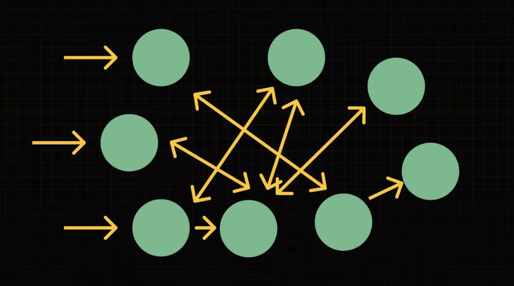

# Escalar

Hasta ahora, venimos escribiendo código con el objetivo de entender las bases de la programación: datos, funciones, estructuras de control.

A medida que avanzamos, nos damos cuenta de que los problemas que resolvemos se vuelven más complejos y ya no estamos simplemente escribiendo algunas funciones en un archivo, ahora empezamos a trabajar con sistemas que tienen varias partes que interactúan entre sí.

Este es un punto clave en el camino de cualquier dev: el momento en el que dejamos de pensar en "escribir código" y empezamos a pensar en "diseñar software".

En esta clase, vamos a hablar sobre qué significa esto y por qué es tan importante organizar nuestro código de una manera que nos permita escalar y mejorar sin que todo se vuelva un caos.

## Arquitectura

Cuando empezamos a programar, nuestros proyectos suelen ser pequeños: algunos archivos con unas pocas funciones. A medida que resolvemos problemas más grandes, estos archivos empiezan a multiplicarse, las dependencias crecen y la cantidad de cosas que tenemos que coordinar se vuelve abrumadora.

Acá es donde muchos programadores se dan cuenta de que necesitan una manera de organizar su código. No se trata solo de "tirar funciones en archivos", sino de pensar en qué hace cada parte del software y cómo se relaciona con el resto.

En otras palabras, nos estamos topando con la necesidad diseñar software.


Esta necesidad de pensar la organización general de nuestro software (arquitectura) va a ser muy relevante cuando comencemos a trabajar, ya que es esta arquitectura la que nos va guiar cuando tengamos que escalar el software en el que estemos trabajando.

De hecho, es muy probable que nuestro primer trabajo sea sumarnos a un proyecto que ya vienen funcionando hace tiempo y necesita cambiar, crecer y adaptarse a nuevos requerimientos.

De eso se trata la escalabilidad, de pensar nuestro software para que crezca sin desarmarse.

## Organización


El término "diseño de software" no tiene que ver con diseño gráfico o la apariencia de una aplicación. Acá, "diseño" significa organización y estructura. Significa pensar cómo dividir el software en partes más manejables y cómo hacer que estas partes trabajen juntas de forma eficiente.

No se trata de memorizar patrones de arquitectura o aprender todas las técnicas de diseño existentes. Se trata de aprender a reconocer cuándo nuestro software necesita una mejor organización y cómo buscar soluciones.

## Escalando una cafetería


Supongamos que me pongo una pequeñísima cafetería atendida solo por mi. Al principio, todo es sencillo: atiendo a los clientes, cobro y preparo el café. Es manejable porque no hay demasiada demanda, así que todo funciona.


La cosa empieza a escalar y la gente me pide que ofrezca cosas dulces y más variedades de café. Rápidamente me doy cuenta que solo no voy a poder y sumo a una persona que me ayude. Con esta persona nos vamos repartiendo tareas a medida que van apareciendo y todo resuelto.


La cafetería sigue creciendo y nos tenemos que mudar a un local. Aparecen nuevos problemas. Ahora además de ofrecer todo tipo de cosas dulces y distintos tipos de café, tenemos un local que mantener ordenado, llega más gente, hay más pedidos al mismo tiempo.


El primer pensamiento es contratar más personas. Pero si simplemente sumo gente sin organizar nada, pronto nos encontraremos con un caos total. Nadie sabría bien qué tarea le toca y empiezan los errores: pedidos equivocados, clientes esperando demasiado, confusión en la cocina.


Esta nueva cafetería ataca un problema más grande, tiene más puntos de entrada y ofrece más productos. Al tener un equipo más grande necesitamos establecer roles y reglas claras: personas que se encarguen de tomar los pedidos, otras de preparar las bebidas y otras de armar y entregar esos pedidos.


Y no solo eso, todos estos posibles caminos que toma el pedido de un cliente desde que es recibido hasta que es entregado tienen que estar pensados dentro de un esquema general donde no solo se aproveche el trabajo de cada persona si no que además podamos entender que partes no funcionan del todo bien y seguir mejorando nuestro esquema de trabajo. Necesitamos diseñar un sistema.

Con el software pasa lo mismo.

## Escalando software


Cuando nuestro software hace más cosas no alcanza solo con separar la lógica en funciones (o clases) necesitamos una estructura y organización que nos guíe para saber que partes de todo nuestro sistema necesita cambiar.

Necesitamos definir cómo esas partes interactúan entre sí y establecer reglas claras sobre qué pueden y qué no pueden hacer.

Esto nos lleva a dos conceptos fundamentales:

Arquitectura de software: Define el "qué", "quién" y "dónde". Es la estructura general del sistema y cómo se dividen sus componentes.
Diseño de software: Se enfoca en el "cómo". Existen muchas formas de resolver un mismo problema, usando funciones, clases, servicios, etc.
El objetivo de tener una arquitectura clara es poder escalar nuestro software sin perder el control. Queremos poder agregar nuevas funcionalidades sin romper lo que ya existe, encontrar y corregir errores rápidamente, y asegurarnos de que el código sea fácil de entender para otros (y para nosotros mismos en el futuro).

## MVC: Un Primer Acercamiento a la Arquitectura


Existen muchas formas de organizar el software, pero un buen punto de partida es el patrón MVC (Modelo-Vista-Controlador). Es una manera simple y probada de estructurar aplicaciones dividiéndolas en tres partes:

- Modelo: Maneja los datos y la lógica del negocio.
- Vista: Se encarga de la interfaz y la presentación al usuario.
- Controlador: Actúa como intermediario entre el modelo y la vista, manejando la lógica de la aplicación.

MVC nos ayuda a separar responsabilidades dentro del software y hace que nuestro código sea más modular y fácil de mantener. No es la única solución, pero es una de las más accesibles para empezar a pensar en arquitectura.

Al igual que en la cafetería, definir roles y estructuras claras hace que todo fluya mejor.

## Conclusión


En un mundo donde la AI puede ayudarnos a escribir el código final, es importante entender que el software es la consecuencia de entender profundamente el problema que estamos resolviendo. Entender el problema y poder diseñar una solución es el 90% del trabajo.

En las próximas clases, vamos a empezar a profundizar en estos conceptos, explorando patrones de arquitectura y aplicándolos en proyectos reales. Como todo en programación, aprender a diseñar software es un proceso que se mejora con la práctica y la experiencia.

Lo importante es recordar que escalar no significa solo "agregar más cosas", sino hacerlo de manera inteligente y organizada. Y ese es el verdadero trabajo de un dev.

# MVC

La pregunta es: ¿por qué?
¿Por qué pensar en tu proyecto como un conjunto de partes separadas, pero interconectadas haría que sea más fácil de entender, mantener y escalar?

En esta clase vamos a explorar el patrón de arquitectura MVC, que se utiliza precisamente para separar responsabilidades en nuestro código.

## ¿Es solo separar código?

MVC es un patrón de diseño que se utiliza para organizar tu código dividiéndolo en tres partes principales: Modelo, Vista y Controlador. Aunque a veces solo lo vemos como una forma de dividir el código, MVC va más allá: es una forma de establecer responsabilidades claras para cada parte de tu proyecto. Esta división de partes no habla directamente de funciones, clases o módulos. O sea, que cada parte puede involucrar uno o muchos módulos/clases/funciones y todo lo necesario para cumplir con la misión de esa parte de la app.


En lugar de tener toda la lógica de tu app mezclada, MVC te permite organizar tu software en partes que se encargan de tareas específicas. Cada parte tiene un rol claro y se conecta con las demás de una forma sencilla. Así, cuando tu proyecto crece, todo está organizado en torno a este planteo y es más fácil de manejar.

# Modelo (M) – Datos y lógica de negocio


El Modelo es el responsable de la lógica de negocio y de manejar los datos. En un e-commerce, por ejemplo, el modelo podría encargarse de gestionar los productos, los precios y las compras. El modelo no se ocupa de chequear la data que viene del usuario ni tampoco de ver la mejor forma de presentar la data.

# Vista (V) – Lo que el usuario ve e interactúa


La Vista se encarga de lo que el usuario puede ver e interactuar. En el caso de la terminal, es la parte que se encarga de formatear los datos para que se vean presentables. En una web es todo lo que está relacionado con la interfaz gráfica que también es la que recibe las señales del usuario (clicks, textos) para comunicarse con la app. La vista toma los datos del Modelo y los presenta de manera que el usuario pueda verlos y usarlos.

# Controlador (C) – El intermediario


El Controlador actúa como el intermediario entre el Modelo y la Vista. Cuando el usuario realiza alguna acción (como enviar un argumento a través de la terminal o hacer clic en un botón en una UI), el Controlador se encarga de recibir esa acción, procesarla y decidir qué debe hacer a continuación. Es quien coordina la interacción entre la vista y el modelo.

## Organizando la cafetería con MVC


Como dijimos, MVC es una idea sobre como separar responsabilidades y organizar un sistema. Por eso, podemos usar este patrón para organizar código escrito en casi cualquier lenguaje de programación y también podríamos aplicar estas ideas para organizar nuestra cafetería.

Para esto, solo haría falta adaptar levemente cada parte, y podríamos llegar a la siguiente conclusión.

## Baristas/Cocina -> Modelo (M)


En una aplicación, el modelo representa los datos y la lógica de negocio. O sea, es la parte que está en contacto con la materia prima de nuestra aplicación: los datos y la lógica.

En este sentido podemos encontrar un paralelismo con los baristas o las personas de la cocina, quienes son los responsables de manipular los productos, los ingredientes, las recetas y preparar el café.

### Runners -> Vista (V)


La vista es quien se encarga de entregar los datos de la mejor forma posible a los usuarios. Si decidimos seguir este patrón en la cafetería, las personas que se encargan de armar y entregar los pedidos (runners) son quienes van a ser la interfaz hacia nuestros usuarios. O sea, la vista.

### La caja -> Controlador (C)


El controlador recibe los pedidos de los usuarios y hace chequeos para poder pedirle al modelo cosas específicas y comunicar esos datos con la vista para ser presentados.

Podemos encontrar estas responsabilidades en la caja de nuestra cafetería. Es la caja quien recibe los pedidos de los clientes, los procesa y decide qué hacer.


Trabajar sobre un esquema basado en MVC (o cualquier patron de arquitectura) siempre tiene sus desafíos. Muchas veces surgen cambios o problemas y hay que volver a analizar qué parte se tiene que ocupar de eso. Muchas veces hay lógica que parece ser del controlador, pero en realidad es mejor que la maneje la vista. Otras veces no lo pensamos mucho y metemos lógica que debería ser del modelo en el controlador y después eso nos trae problemas. Mantener todo ordenado requiere un esfuerzo que tiene sus beneficios, pero hay que estar consciente de esto y dedicarle tiempo.

# El orden garpa


Usar un patrón como MVC tiene muchos beneficios para nuestro software.

Mejor organización: Cada parte tiene una responsabilidad clara, lo que facilita la lectura y el mantenimiento del código.

Escalabilidad: A medida que tu proyecto crece, puedes agregar nuevas funcionalidades sin hacer que el código se vuelva más complicado.

Facilidad de mantenimiento: Si tienes que cambiar la forma en que se muestra algo (Vista) o la lógica de negocio (Modelo), puedes hacerlo sin afectar el resto del sistema.

Trabajo en equipo: Al separar las responsabilidades, diferentes personas pueden trabajar en distintas partes del proyecto sin pisarse unos a otros.

## Es un primer paso

He trabajado en muchos equipos con más y con menos experiencia pero siempre llegué a la misma conclusión. Los equipos, y en consecuencia los devs que trabajan ahí, la pasan mucho mejor cuando invierten tiempo en pensar, organizar y mantener una organización. Sin un orden, la cosa se pone caótica muy rápido.

Por eso, a partir de este momento vamos a empezar a trabajar en diseñar software y cada una de sus partes. Para eso vamos a trabajar en cada una de estas partes por separado para entender bien cuál es su función y al final vamos a juntar todas las partes en el desafío final de este nivel.

## Un controller

Desafío
El objetivo de este desafío es organizar nuestro código utilizando el patrón MVC. Este ejercicio es el primer paso en un proceso gradual donde profundizaremos en cada parte del patrón MVC para integrarlo todo en el desafío final y comprender cómo funciona en conjunto.

## Diseño general

La aplicación en la que vamos a trabajar es un CRUD (Create, Read, Update, Delete), o sea, un sistema básico de gestión de datos para administrar información relacionada con inmuebles de una inmobiliaria. Este será el primer paso hacia un proyecto más complejo que construiremos más adelante

Para esto nuestra aplicación tiene que soportar los comandos básicos de cualquier sistema CRUD.


Más adelante agregaremos un comando especial para hacer búsquedas.

## El controlador

En este ejercicio vamos a enfocarnos en entender el alcance del controlador. Para eso vamos a dividir el controlador en dos grupos.


# Controlador de argumentos


Por un lado, tendremos un controlador encargado de interpretar los comandos de la terminal y convertirlos en un objeto sencillo que pueda ser procesado por otra parte de nuestro sistema. Contar con un controlador específico para adaptar este tipo de input será muy útil cuando llevemos nuestro sistema a un entorno web, donde el input no se reciba mediante comandos de terminal, sino a través de llamadas HTTP con un formato diferente.


Esto hace que nuestro sistema sea más adaptable a otras situaciones y le da sentido a la separación propuesta por el patrón MVC. Ya llegaremos ahí.

# Controlador de comando


Una vez que el controlador de argumentos determine cual es el comando y los parámetros, este va a invocar al controlador del comando correspondiente para que se encargue de llevar adelante la tarea. El controlador correspondiente al comando (create, read, update, delete) es quien interactúa con el modelo y la vista para generar la salida (output) necesaria.

¿Por qué?
¿Por qué además del controller del comando "create" necesitamos el modelo y la vista? ¿Porque no hacemos todo en el controller? De hecho ¿por qué no hacemos todo en el primer controller, el que se encarga de entender los argumentos de la terminal?

La respuesta corta es: es difícil de mantener.



MVC (o cualquier otro patrón de arquitectura) nos ofrece una guía para separar nuestro código en partes y cada parte tiene límites y responsabilidades. Cómo entendimos anteriormente, este orden general nos agrega el problema extra de entender e implementar ese orden, pero nos regala un marco de trabajo mucho más organizado que nos permite crecer.

## Objetivo

Tu misión es leer el código base para entender cómo está planteado el esquema MVC en este ejemplo. Vamos a empezar con algo sencillo y a medida que aprendamos nuevas técnicas, vamos a volver a este código para hacerlo crecer.

Una vez que hagas tu reconocimiento tendrás que completar la lógica del controller de argumentos. Esto es algo similar a lo que ya hicimos en el pasado para parsear los argumentos de la terminal pero con algunas pequeñas diferencias.

En este caso los comandos que debe soportar tu aplicación son los siguientes.

```javascript
# Este es el formato
# node apx-props.js <command> [args]


# Comando: create
node apx-props.js create --title "Departamento" --price 15000
# Este comando debe validar que se le pase al menos un title y un price, de otro modo debe imprimir un error

# Comando: get
node apx-props.js get id-123
# Este comando debe recibir a continuación un id que será utilizado para buscar una propiedad y mostrarla en la terminal

# Comando: update
node apx-props.js update id-123 --precio 300000
# Este comando debe recibir un id y luego una serie de argumento a actualizar.

# Comando: delete
node apx-props.js del id-123
# Este comando debe recibir a continuación el id del inmueble a eliminar. Se usa 'del' en vez de 'delete' porque es una palabra reservada en javascript (una palabra que el lenguaje usa) y usamos 'del' para evitar conflictor.

```
