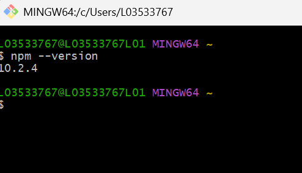
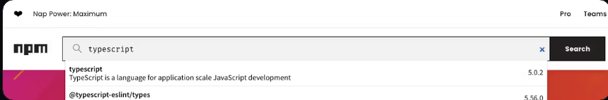
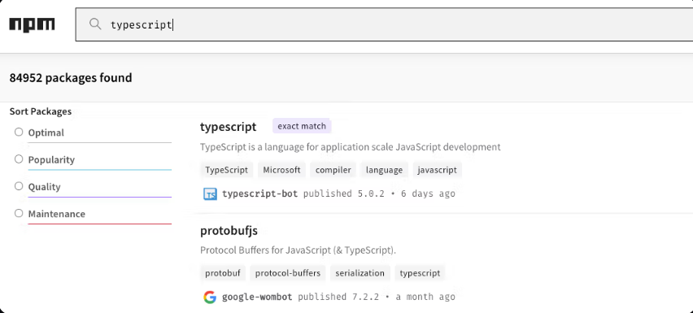
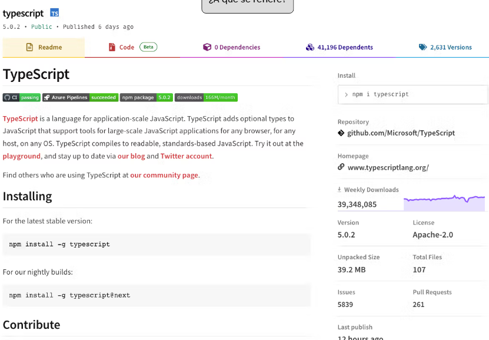
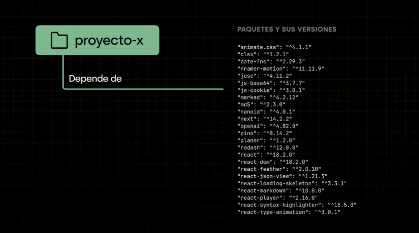
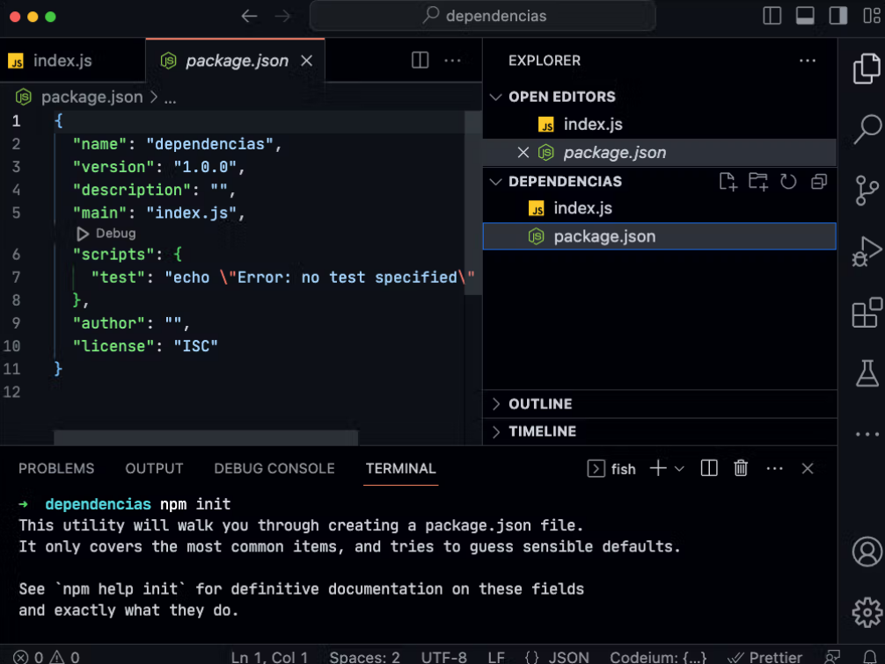
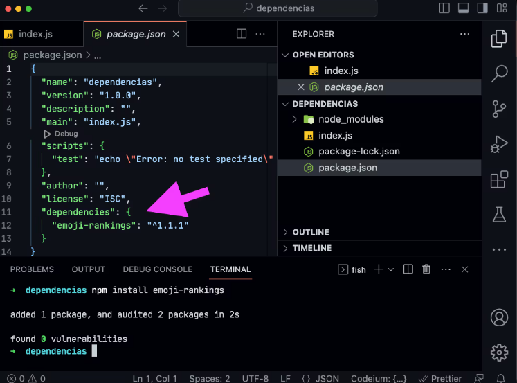
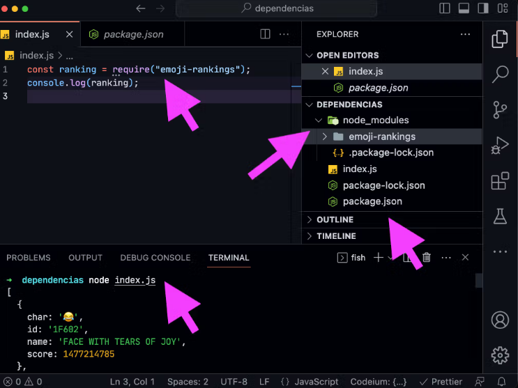
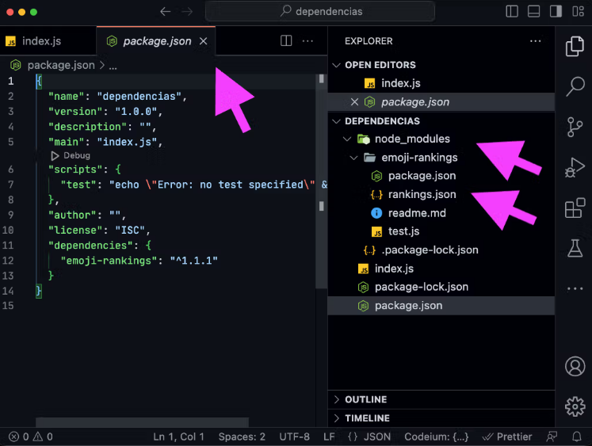

# ¿Qué es NPM?

NPM (Node Package Manager) es un gestor de paquetes de Node.js que permite instalar, compartir, y distribuir paquetes de código reutilizable. Es muy útil para gestionar dependencias de proyectos de JavaScript, ya que permite instalar fácilmente bibliotecas de terceros y mantener las versiones actualizadas.

Los paquetes de NPM son módulos de JavaScript que pueden incluir librerías, frameworks, utilidades, entre otros. Además, NPM también se utiliza para publicar paquetes propios en el registro de NPM para que otros desarrolladores puedan utilizarlos.

Para utilizar NPM, es necesario tener instalado Node.js en tu sistema. Una vez instalado Node.js, NPM se instalará automáticamente junto con él.

Para verificar si tienes instalado NPM en tu sistema y en qué versión, puedes ejecutar el comando npm --version en la línea de comandos. Esto imprimirá la versión de NPM que está instalada en tu sistema.

```bash
npm --version
```

Deberías ver algo similar a esto:


La versión de npm que tengas instalada va a variar dependiendo de la versión de node que hayas instalado. De todas formas vamos a instalar y usar otros manejadores de paquetes que nos ofrecen otras comodidades.

## Navega npmjs.com

Desafío
Para este ejercicio te vamos a proponer practicar la navegación en el sitio oficial de npm.

Ingresa a https://www.npmjs.com/ y busca el paquete `typescript` en la barra de búsqueda.



Accede al primer resultado, es el que estamos buscando



Observa los distintos datos proporcionados en la página, como la descripción del paquete, su versión actual, el número de descargas, la licencia, etc. Examina la documentación proporcionada en la página del paquete, incluyendo su manual, ejemplos y guías. Toma nota de cualquier información que encuentres relevante para utilizar el paquete en un proyecto de TypeScript en el futuro.



## Dependencias

Una dependencia es un módulo, librería o paquete que se utiliza para agregar una funcionalidad específica o resolver un problema en el proyecto. Básicamente son módulos que nos descargamos de internet y que nos ahorran el trabajo de resolver problemas comunes.



## Package.json

El archivo package.json es un archivo de configuración en formato JSON que se utiliza en proyectos de Node.js para especificar las dependencias del proyecto, y otros datos relevantes como la versión, scripts personalizados, metadata, entre otras cosas. Es la configuración principal del proyecto.

Este archivo es importante porque permite que cualquier persona que descargue el código pueda instalar todas las dependencias necesarias de forma fácil y rápida. Para ello, debe ejecutar el comando npm install en la terminal, y Node.js buscará las dependencias especificadas en el archivo package.json e instalará todas las versiones correspondientes.



El archivo package.json es generado automáticamente por npm cuando se ejecutan ciertos comandos, como `npm init` o `npm install`. En este archivo se especifican las dependencias, scripts personalizados, metadata y otras configuraciones del proyecto.

```bash
npm init
```

Cuando se instalan nuevas dependencias a través de `npm install`, el archivo package.json se actualiza automáticamente para incluir la nueva dependencia y su versión. De esta forma, se mantiene un registro de todas las dependencias instaladas y sus versiones específicas, lo que facilita la replicación del proyecto en diferentes entornos.

```bash
npm install {nombreDelPaquete}

# Por ejemplo
npm install emoji-rankings
```




Es importante tener en cuenta que el archivo package.json puede ser editado manualmente si es necesario, pero se recomienda hacerlo con precaución y asegurarse de que los cambios sean coherentes con el estado actual del proyecto.

## node_modules

La carpeta node_modules es donde se almacenan todas las dependencias que se han instalado a través de npm. Cuando se ejecuta el comando "npm install", Node.js buscará en el archivo package.json todas las dependencias necesarias para el proyecto y las instalará en la carpeta node_modules, junto con todas sus dependencias.



Cuando se utiliza require para cargar un módulo propio, se debe proporcionar la ruta del archivo que contiene el módulo, ya sea una ruta absoluta o relativa. Por ejemplo:

```javascript
const miModulo = require("./miModulo.js");
```

Cuando se utiliza require para cargar un módulo instalado a través de npm, se debe proporcionar el nombre del módulo. Node.js buscará el módulo en la carpeta node_modules. Por ejemplo:

```javascript
const _ = require("lodash");
```

En resumen, el archivo package.json es una herramienta vital para la gestión de dependencias en proyectos de Node.js, y la carpeta node_modules es donde se almacenan todas las dependencias instaladas.

## PNPM

Si bien NPM es el manejador de paquetes oficial de Node, existen otras alternativas que pueden mejorar la experiencia de desarrollo. Una de las más populares en los últimos tiempos es pnpm, cuyo nombre sugiere “performant npm” debido a su forma optimizada de manejar los paquetes.

PNPM es especialmente atractivo porque mejora considerablemente la velocidad y el uso de espacio al gestionar las dependencias de los proyectos.

## Instalación de PNPM

Instalar pnpm es muy sencillo. Aunque existen varias formas, la más fácil es hacerlo usando npm con el argumento -g que le indica que lo instale como una dependencia global.

```bash
npm install -g pnpm
```

Con esto ya tendrás pnpm instalado y listo para usarse en cualquier proyecto.

Ejemplos de uso
Los comandos son bastante similares a npm.

## Instalar un paquete

Al igual que en npm, simplemente usa el comando add para instalar un paquete

```bash
pnpm add typescript
```

## Instalar dependencias

Si ya tenés un archivo package.json en tu proyecto, simplemente ejecutá:

```bash
pnpm install
```

Este último comando instalará todas las dependencias especificadas en el archivo package.json de tu proyecto, de manera rápida y eficiente.

## Conclusión

A partir de ahora, te recomiendo que uses pnpm en todos tus proyectos, incluso si en las clases ves que utilizo npm. Con pnpm, el proceso será más rápido y es probable que tengas menos problemas con algunas dependencias.
