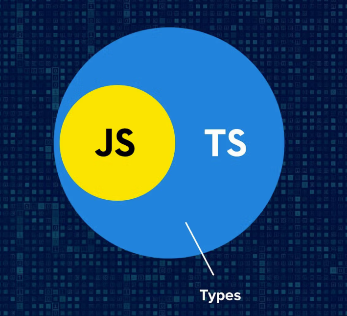
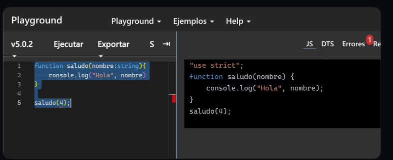
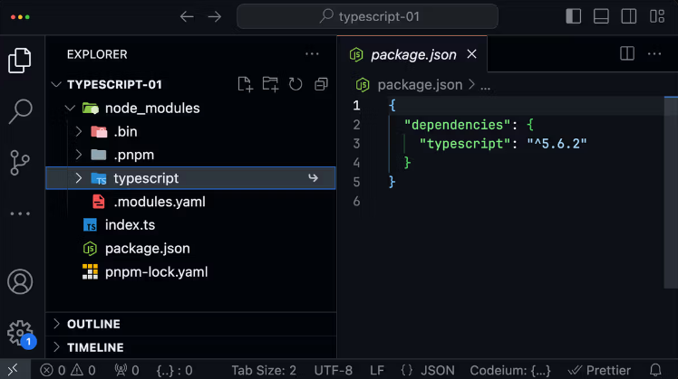
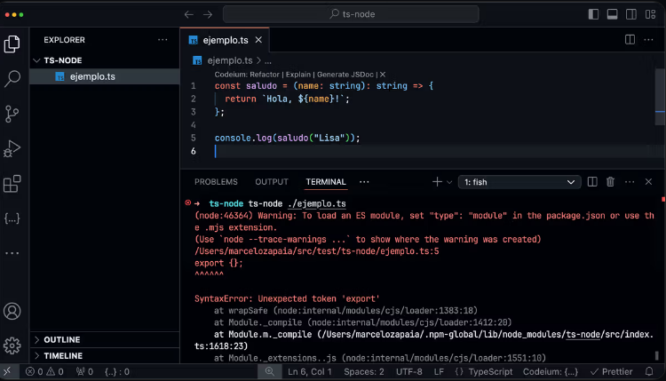
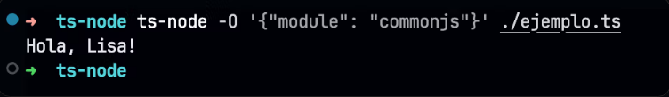
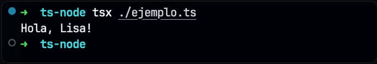
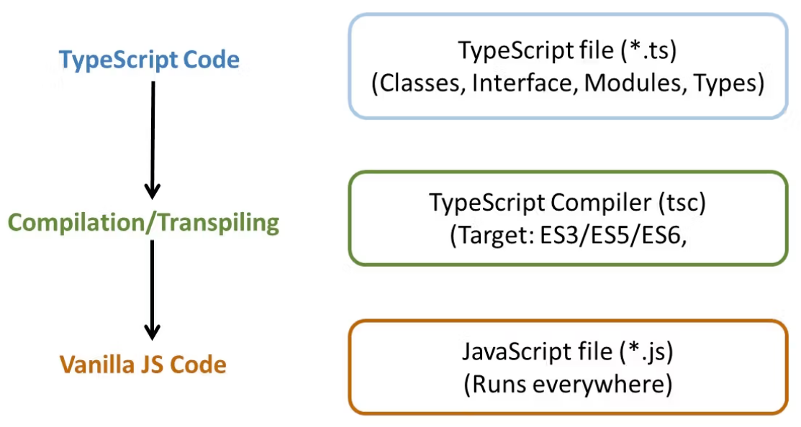
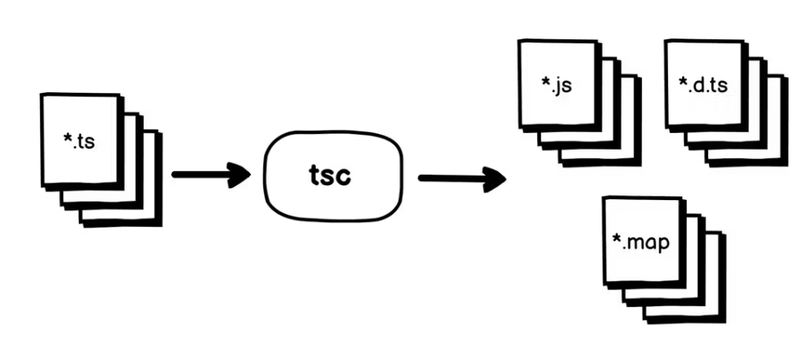

# Introducción a Typescript

La idea principal detrás de TypeScript es agregar tipado estático opcional, lo que significa que puedes definir explícitamente los tipos de datos de tus variables, funciones y otros elementos del código. Esto te permite detectar errores de manera más rápida y prevenir problemas comunes que pueden surgir cuando programas en JavaScript sin tipado.



Además del tipado estático opcional, TypeScript también ofrece algunas características adicionales que no están presentes en JavaScript, como clases, interfaces, enumeraciones y un sistema de módulos más estructurado. Estas características hacen que sea más fácil escribir y mantener código en proyectos grandes y complejos.

Typescript es super popular en el mercado y en la comunidad por varias razones. En primer lugar, muchas empresas y organizaciones están adoptando TypeScript porque les permite escribir código más seguro y escalable. También es compatible con herramientas y frameworks populares como Angular, React y Node.js, lo que lo hace ideal para proyectos web y de aplicaciones.

Un ejemplo

```javascript
function sum(a, b) {
  return a + b;
}

console.log(sum(1, 2)); // Resultado: 3
console.log(sum("1", "2")); // Resultado: '12'
```

Este código funcionará bien en la mayoría de los casos, pero hay un problema: no se están definiendo explícitamente los tipos de datos para las variables a y b. Esto significa que el código puede aceptar cualquier tipo de dato, lo que puede llevar a resultados inesperados, como el segundo ejemplo que concatena dos cadenas en lugar de sumar dos números.

Ahora veamos cómo se vería este mismo código en TypeScript:

```typescript
function sum(a: number, b: number): number {
  return a + b;
}

console.log(sum(1, 2)); // Resultado: 3
console.log(sum("1", "2")); // Error: Argument of type '"1"' is not assignable to parameter of type 'number'.
```

En este ejemplo, estamos definiendo explícitamente que a y b son números y que la función sum devuelve un número. Esto significa que TypeScript puede detectar errores de tipos de datos antes de que el código se ejecute y nos muestra un mensaje de error útil si intentamos pasar cadenas en lugar de números.

Este es solo un ejemplo simple, pero a medida que los proyectos se vuelven más grandes y complejos, el uso de TypeScript puede ayudar a prevenir errores costosos y hacer que el código sea más fácil de mantener y escalar.

## Chequea el sitio de Typescript

Navega el sitio oficial de typescript, examina el contenido y utiliza el playground para intentar ejecutar el siguiente código:

```typescript
function saludo(nombre: string) {
  console.log("Hola", nombre);
}

saludo(4);
```

Analiza la respuesta del playground, ¿qué está sucediendo?



## Instalando typescript

En Node.js, un paquete local es aquel que se instala dentro de un directorio específico de un proyecto, mientras que un paquete global se instala en todo el sistema operativo, por lo que se puede utilizar en cualquier proyecto.



Los paquetes locales se instalan en una carpeta llamada `node_modules` dentro del directorio del proyecto y solo están disponibles para ese proyecto específico. Esto significa que si se quiere utilizar el mismo paquete en otro proyecto, se debe instalar de nuevo en ese proyecto específico.

## Paquetes globales

Los paquetes globales, por otra parte, son paquetes que se instalan en tu sistema de manera que pueden ser accesibles desde cualquier parte, no solo desde un proyecto específico. Esto significa que puedes usar el comando o la funcionalidad que ofrecen desde la línea de comandos sin estar dentro de un directorio específico.

```bash
npm install -g typescript
```

Esto instala el compilador de TypeScript globalmente, por lo que podrás usar el comando tsc desde cualquier carpeta.

ts-node
ts-node es un paquete de Node.js que te permite ejecutar archivos TypeScript directamente en Node.js sin tener que compilar primero el código a JavaScript. En otras palabras, te permite ejecutar archivos TypeScript en Node.js de la misma manera que ejecutarías archivos JavaScript. Esto es util principalmente cuando estamos escribiendo código y necesitamos probar lo que vamos escribiendo.

Podemos instalar ts-node en cada proyecto en donde lo vayamos a utilizar, o de manera global para tenerlo a mano en nuestra computadora y poder usarlo desde cualquier carpeta.

```bash

Copiar
// instalación global
npm install -g ts-node
```

Una vez instalado (local o globalmente) simplemente le indicamos que ejecute el archivo que necesitamos.

```typescript
const saludo = (name: string): string => {
  return `Hola, ${name}!`;
};

console.log(saludo("Lisa"));
```

```bash
ts-node ./ejemplo.ts
```

## Warning: To load an ES module

Existe un problema en las últimas versiones de ts-node que nos indica que estamos usando una sintaxis que algo llamado EcmaScript Modules (algo que vamos a ver más adelante)



Para evitar este problema, podemos indicarle a ts-node que no queremos usar ESM sino que queremos usar CommonJS, que es la sintaxis que usamos cuando hacemos require("paquete").

```bash
ts-node -O '{"module": "commonjs"}' ./ejemplo.ts
```



## Alternativa a ts-node

La otra alternativa es utilizar tsx que es un paquete muy similar a ts-node y no tiene este problema ya viene configurado para funcionar sin problemas de fábrica.

```bash
npm install -g tsx
```

```bash
ts-node ./ejemplo.ts
```



## Instalando typescript

Instala TypeScript de forma global en tu sistema usando el comando:

```bash
npm install -g typescript
```

En sistemas operativos Linux o macOS, es posible que sea necesario ejecutar el comando con `sudo` para obtener permisos de administrador: `sudo npm install -g typescript`.

Instala `tsx` de forma global usando el comando:

```bash
npm install -g tsx
```

```ts
function saludar(nombre: string) {
  return `Hola, ${nombre}!`;
}

console.log(saludar("Lisa"));
```

Ejecuta el archivo usando el comando

```bash
tsx ./index.ts
```

## tsx

A veces, trabajar con ts-node puede presentar ciertos problemas en algunos escenarios, especialmente cuando nos enfrentamos a configuraciones complejas o específicas. Aunque es una herramienta útil para ejecutar archivos TypeScript directamente, existe una alternativa más sencilla y eficiente llamada tsx. Aunque ambas son buenas opciones, tsx es un poco más sencillo. No dudes en usar tsx en vez de ts-node.

### ¿Qué es tsx?

tsx es un ejecutor de archivos TypeScript que se destaca por ser más ligero y simple en comparación con ts-node. Con tsx, puedes correr tus archivos TypeScript directamente, sin necesidad de compilar previamente o lidiar con configuraciones complicadas.

### Instalación de tsx

La instalación de tsx es bastante sencilla. Solo necesitas tener Node.js instalado en tu máquina y seguir los siguientes pasos para agregar tsx a tu proyecto:

```bash
npm install tsx

# o
# yarn add tsx
```

Ejecutar archivos TypeScript con tsx
Una vez instalado, ejecutar archivos TypeScript es tan simple como utilizar el siguiente comando:

```bash
npx tsx codigo.ts
```

Este comando ejecutará directamente tu archivo .ts sin necesidad de compilarlo previamente a JavaScript. También podés usarlo desde un script de tu package.json

```json
{
  "name": "mi-proyecto",
  "version": "1.0.0",
  "description": "Un proyecto que utiliza tsx para ejecutar TypeScript.",
  "scripts": {
    "dev": "tsx ./src/index.ts"
  },
  "dependencies": {},
  "devDependencies": {
    "tsx": "^3.12.7"
  },
  "author": "Tu Nombre",
  "license": "MIT"
}
```

Cuando lo haces desde el package.json no es necesario usar npx antes.
Ejemplo práctico
Supongamos que tienes un archivo index.ts con el siguiente contenido:

```ts
const saludo = (nombre: string): string => {
  return `Hola, ${nombre}!`;
};

console.log(saludo("Mundo"));
```

Ejecutar el archivo con el siguiente comando:

```bash
npx tsx index.ts
```

### tsc - Typescript Compiler

El compilador de TypeScript es un programa que convierte el código TypeScript en código JavaScript. Es necesario porque los navegadores web y Node.js solo pueden ejecutar código JavaScript, y TypeScript es un lenguaje de programación que se basa en JavaScript pero agrega características adicionales.

El compilador de TypeScript toma tu código TypeScript y lo convierte en código JavaScript que puede ser ejecutado por cualquier ambiente JavaScript. Durante la compilación, el compilador de TypeScript también realiza varias comprobaciones de sintaxis y semántica, como verificar la coherencia de los tipos y la corrección de los errores. Esto ayuda a detectar posibles errores en el código antes de que se ejecute.

```bash
tsc index.ts
```

Además, el compilador de TypeScript te permite utilizar las características de TypeScript, como el tipado estático, las interfaces, las clases y los módulos, en tu código. Estas características pueden ayudar a mejorar la calidad del código y facilitar el trabajo en equipo en proyectos grandes.



En resumen, el compilador de TypeScript es necesario para convertir el código TypeScript en código JavaScript que pueda ser ejecutado en navegadores web y Node.js. También realiza comprobaciones de sintaxis y semántica para ayudar a detectar errores antes de la ejecución del código y permite utilizar las características adicionales de TypeScript en tu código.

## Archivos .ts y .js



La convención de nombrar archivos con la extensión .ts para archivos TypeScript y .js para archivos JavaScript es importante para que los programas se ejecuten correctamente y sean más fáciles de mantener.

La extensión .ts indica que el archivo contiene código TypeScript y necesita ser compilado antes de poder ser ejecutado. La compilación convierte el código TypeScript en código JavaScript, que es lo que se puede ejecutar en un navegador o en un servidor.

Por otro lado, la extensión .js indica que el archivo contiene código JavaScript y puede ser ejecutado directamente en un navegador o servidor que tenga un motor JavaScript compatible.

Es importante seguir esta convención porque ayuda a mantener la claridad y la consistencia en el proyecto. Si los archivos TypeScript y JavaScript se mezclan en el mismo directorio, puede ser difícil distinguir entre ellos y asegurarse de que el código se esté compilando correctamente. Al usar la convención de nomenclatura .ts y .js, se hace más fácil para los desarrolladores identificar rápidamente qué archivos necesitan ser compilados antes de ser ejecutados.

Además, algunos editores de texto y entornos de desarrollo utilizan la extensión del archivo para proporcionar funciones específicas para cada lenguaje de programación. Por ejemplo, un editor de texto puede proporcionar resaltado de sintaxis y autocompletado para código TypeScript, mientras que otro editor puede proporcionar funciones similares para código JavaScript. Si se siguen las convenciones de nomenclatura adecuadas, el editor de texto puede identificar automáticamente qué tipo de archivo estás editando y proporcionar las funciones apropiadas.

## Interfaces

En TypeScript, una interfaz es una forma de definir la forma de un objeto. Es como un contrato que especifica qué propiedades y métodos debe tener un objeto para cumplir con esa interfaz.

Para definir una interfaz en TypeScript, puedes utilizar la palabra clave interface, seguida del nombre de la interfaz y la lista de propiedades que debe tener el objeto. Por ejemplo:

```typescript
interface Person {
  name: string;
  age: number;
  email?: string;
}
```

En este ejemplo, hemos definido una interfaz llamada Person que especifica que un objeto debe tener una propiedad name de tipo string, una propiedad age de tipo number y una propiedad opcional email de tipo string.

Para utilizar una interfaz en tu código, simplemente debes definir un objeto que cumpla con los requisitos de esa interfaz. Aquí te dejo un ejemplo:

```ts
function printPersonInfo(person: Person) {
  console.log(`Name: ${person.name}`);
  console.log(`Age: ${person.age}`);
  if (person.email) {
    console.log(`Email: ${person.email}`);
  }
}

const person: Person = {
  name: "John Doe",
  age: 30,
  email: "john.doe@example.com",
};

printPersonInfo(person);
```

En este ejemplo, hemos definido una función printPersonInfo que espera recibir un objeto que cumpla con la interfaz Person. Esta función imprime en la consola el nombre y la edad de la persona, y si existe la propiedad email, también imprime su valor.

## tsconfig.json

En TypeScript, el archivo tsconfig.json es el archivo de configuración que le dice al compilador de TypeScript cómo debe compilar tu código. Este archivo te permite especificar varias opciones de configuración que afectan la forma en que TypeScript transforma tu código TypeScript (.ts) en JavaScript (.js).

Este archivo se hace necesario cuando empezamos a compilar código que requiere configuraciones específicas, por ejemplo, decirle con que versión de JavaScript queremos que sea compatible el código resultante.

```json
{
  "compilerOptions": {
    "target": "es5"
    // Define a qué versión de JavaScript se compilará el código TypeScript. 'es5' es una versión antigua que es compatible con muchos entornos.
  }
}
```

### Inicializar un archivo tsconfig.json

El archivo tsconfig.json se ubica en la raíz de tu proyecto. Es decir, en el mismo directorio donde se encuentran tus carpetas de código y otros archivos importantes. Para comenzar ejecuta el siguiente comando.

```bash
tsc --init
```

## Ejemplo Básico

{
"compilerOptions": {
"target": "es5",
"module": "commonjs",
"outDir": "./dist",
"rootDir": "./src"
},
"include": ["src/**/*.ts"],
"exclude": ["node_modules"]
}

### compilerOptions.target

Indica a qué versión de JavaScript se debe convertir el código TypeScript. es5 es una versión más antigua que asegura una mayor compatibilidad con diferentes entornos.

### compilerOptions.module

Define el sistema de módulos que se usará. commonjs es el sistema de módulos estándar en Node.js.

### compilerOptions.outDir

Especifica dónde se guardarán los archivos JavaScript compilados. ./dist es una carpeta común para colocar archivos compilados.

### compilerOptions.rootDir

Define dónde están tus archivos TypeScript. ./src es el directorio donde colocas tus archivos .ts.

### include

Lista los archivos o directorios que deben ser incluidos en la compilación. Aquí, se incluyen todos los archivos .ts en el directorio src.

### exclude

Lista los archivos o directorios que deben ser excluidos de la compilación. node_modules se excluye para evitar compilar dependencias.

### Más Opciones

Este ejemplo cubre las opciones básicas, pero tsconfig.json tiene muchas más configuraciones avanzadas que puedes usar. Puedes consultar la documentación oficial para ver todas las opciones disponibles: Documentación de TypeScript. A medida que avances, exploraremos más opciones y cómo pueden ayudarte a configurar TypeScript para tus necesidades específicas.

## Import / Export

Hasta ahora, en Node.js, venimos usado la sintaxis de CommonJS para importar y exportar módulos. Esto se hace con require para importar y module.exports para exportar.

```js
module.exports = function greet(name) {
  return `Hello, ${name}`;
};
```

```js
const greet = require("./archivo1");
console.log(greet("World")); // Imprime: Hello, World
```

TypeScript nos ofrece una forma más moderna y estandarizada de trabajar con módulos llamada ESM (ECMAScript Modules). Utiliza import para traer funcionalidades y export para compartirlas entre archivos.

```ts
export function greet(name: string): string {
  return `Hello, ${name}`;
}
```

```ts
import { greet } from "./archivo1";
console.log(greet("World")); // Imprime: Hello, World
```

## Configuración en TypeScript

Para usar la sintaxis ESM y asegurarte de que tu código funcione bien con Node.js, debes configurar tu archivo tsconfig.json asegurandote que la opción module tenga el valor CommonJS.

```json
{
  "compilerOptions": {
    "module": "CommonJS", // Compila el código a la sintaxis de módulos CommonJS para que funcione en Node.js.
    "target": "ES6", // Convierte el código a ES6 (también conocido como ES2015), que es moderno y compatible.
    "outDir": "./dist", // Guarda el código compilado en la carpeta 'dist'.
    "rootDir": "./src" // Encuentra los archivos TypeScript en la carpeta 'src'
  },
  "include": [
    "src/**/*.ts" // Incluye todos los archivos .ts dentro de la carpeta 'src'.
  ],
  "exclude": [
    "node_modules" // Excluye la carpeta 'node_modules' de la compilación.
  ]
}
```

Esta configuración nos permite usar la sintaxis moderna de import / export en tu código TypeScript, haciéndolo más limpio y fácil de mantener.

Y además nos asegura que el código TypeScript se compile a una forma que Node.js pueda entender (CommonJS), evitando errores de ejecución.

## Conclusión

Por el momento no es necesario profundizar mucho en esto ya que lo vamos a usar en casos muy puntuales. Más adelante cuando veamos ECMAScript Modules en el contexto de la web vamos a profundizar en esto. Por ahora solo es necesario saber que existe.
