# ¿Qué es Github?

Github es una plataforma de alojamiento y colaboración para proyectos de software utilizando el sistema de control de versiones Git. En otras palabras, es un lugar en línea donde los desarrolladores pueden alojar y compartir su código, colaborar con otros desarrolladores y realizar un seguimiento de los cambios en el código a lo largo del tiempo.

En el contexto laboral, Github se utiliza en equipo para trabajar en proyectos de software. Por ejemplo, un equipo de desarrolladores puede trabajar en un proyecto de software en conjunto. Cada miembro del equipo puede crear su propio "branch" o rama del proyecto, trabajar en ella y luego fusionarla con la rama principal una vez que se hayan realizado y revisado los cambios. Además, Github ofrece herramientas para llevar un registro de errores o "issues" en el software y para realizar comentarios y revisiones en el código.

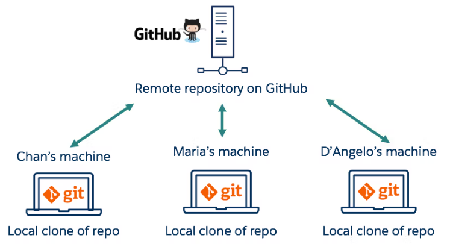

En resumen, Github es una plataforma esencial para cualquier equipo de desarrollo de software que busque colaborar de manera efectiva en un proyecto y mantener un seguimiento del código a lo largo del tiempo.

## Configurando Github

Antes de realizar cualquier acción de subida o bajada de archivos en el repositorio, es necesario configurar nuestro usuario y contraseña de GitHub en nuestra computadora para que GitHub pueda identificarnos como el usuario responsable de los cambios en el repositorio.

La forma más segura de hacerlo es creando un par de llaves (pública y privada) en nuestra computadora y subir la llave pública a nuestra cuenta de GitHub. De esta manera, cada vez que realicemos una acción en el servidor de GitHub, el servidor sabrá quiénes somos. En caso de cambiar de computadora o no usar esa máquina nuevamente, simplemente se puede eliminar la llave de nuestra cuenta de GitHub.

Si no estás familiarizado con el concepto de llaves, no te preocupes. Sigue los pasos que te indicaremos para configurar tu cuenta de GitHub.

## Crear un par de llaves

En la terminal, creás las llaves ejecutando el comando ssh-keygen y dándole enter a todas las preguntas:

```
ssh-keygen
```

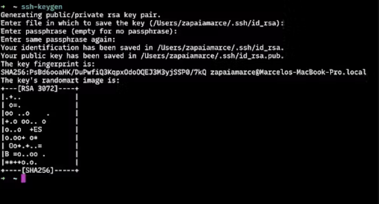

## Agrega tu nueva identidad

Esto crea dos archivos en la carpeta .ssh que está en tu carpeta home. En mi caso, la carpeta donde se encuentra todo esto es /Users/zapaiamarce/.ssh.

Una vez que salió todo bien agregá esta identidad con el comando: ssh-add ~/.ssh/id_rsa

```bash
ssh-add ~/.ssh/id_rsa
```

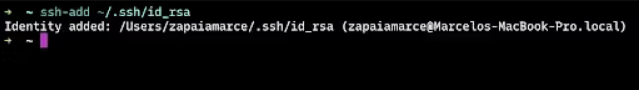

## Si este paso falla

Intenta inicializar el ssh-agent de esta forma

```bash
eval `ssh-agent -s`
# Y luego agregar la nuevo llave
ssh-add ~/.ssh/id_rsa
```

Si esto tampoco funciona, te dejo algunos links de ayuda al final del artículo con posibles soluciones. A veces no hace falta este paso, así que también podés probar continuar con los siguiente pasos.

## Agrega tu llave publica en Github

Por último, tenés que copiar la llave pública y pegarla en tu cuenta de Github, en la sección correspondiente de tu perfil.

Con el comando cat imprimí el contenido de la clave pública y la copiala.

```bash
cat ~/.ssh/id_rsa.pub
```

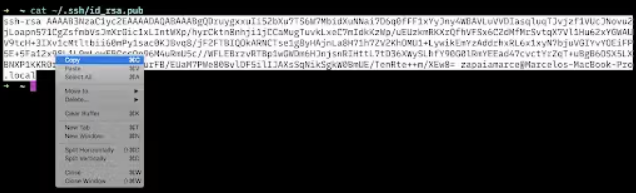

Después, en GitHub, entrá a los settings de tu perfil:
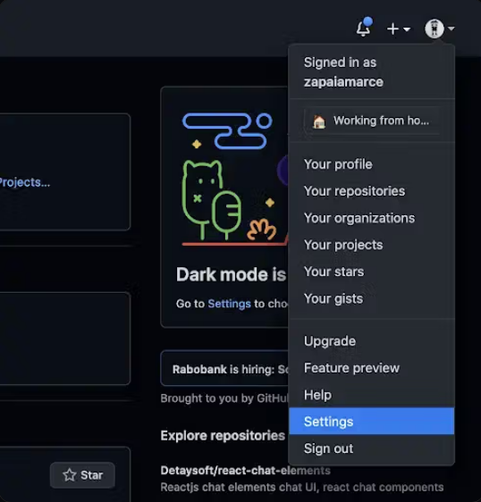

Y a la sección de claves:
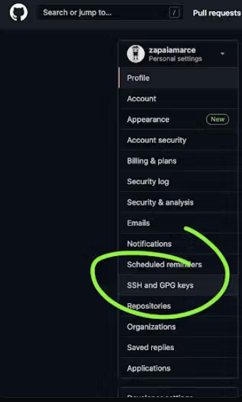

Agregá una nueva clave SSH:
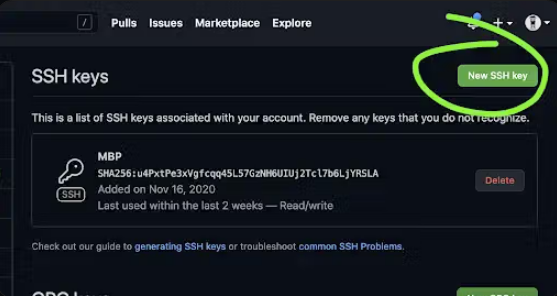

Elegí un nombre que haga referencia a la computadora a la que se está identificando con esa llave pública y pegá el contenido de lo que copiaste antes.

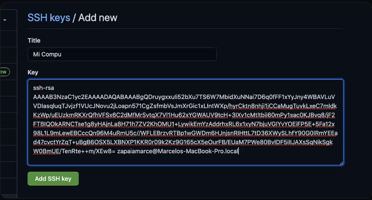

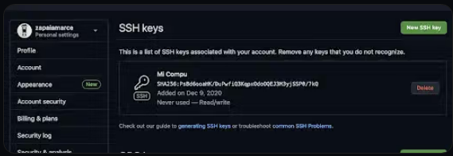

Al subir nuestra llave SSH a GitHub, podemos conectarnos de manera segura y el servidor sabe quiénes somos. Esto nos permite no solo bajar contenido de repositorios públicos, sino también acceder y subir cambios a repositorios privados. Es importante usar las direcciones SSH de los repositorios para que todo funcione bien.

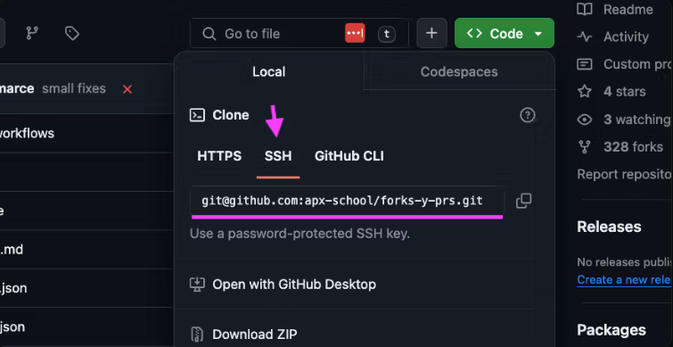

## La primera vez

Una vez que tengas registrada tu llave vas a poder interactuar con el servidor de github.com y este sabrá quien sos. Hay que menciona que la primera vez que interactúes usando un comando git pull o git push vas a recibir una advertencia ya que el servidor es desconocido para tu computadora. Lo único que debes hacer es responderle yes y de ahora en más tu computadora confiará en el servidor de Github.

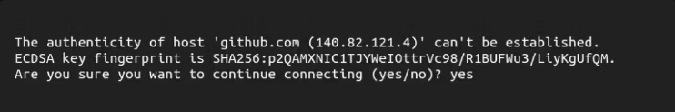

https://stackoverflow.com/questions/17846529/could-not-open-a-connection-to-your-authentication-agent

## Nota windows

Inicia el ssh-agent con el siguiente comando en una ventana de powershell con permisos de administrador:

```bash
sc.exe config ssh-agent start=auto
net start ssh-agent
```

Añadimos la llave a ssh-agent con el siguiente comando:

```bash
ssh-add ./.ssh/id_ed25519
```

Copiamos la llave publica con el siguiente comando:

```bash
cat ~/.ssh/id_ed25519.pub
```

## Repo privado

Desafío
Por lo general, vamos a trabajar con repositorios públicos para poder compartir código entre nosotros. Para este ejercicio te proponemos que solo por esta vez crees un repositorio privado para corroborar que tus llaves están bien configuradas.

Para esto ingresa a tu cuenta en https://github.com y elige la opción "Nuevo repositorio" del menú de usuario.
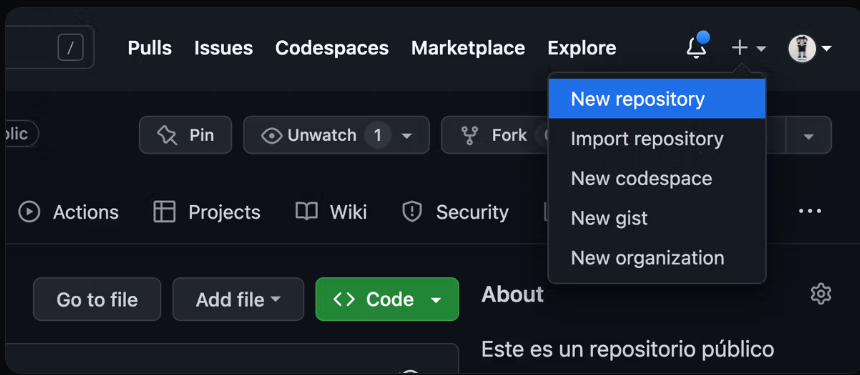

A continuación crea un repositorio privado
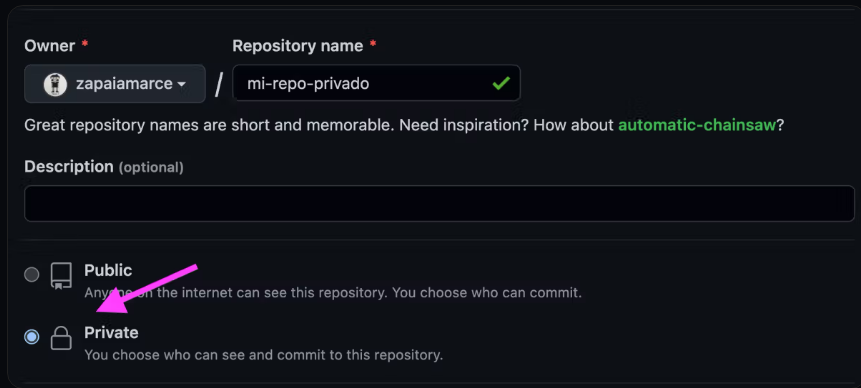

Finalmente clona tu repo en tu máquina. Si tus llaves fueron configuradas correctamente vas a poder clonar tu repo. Si por alguna razón no se configuraron tus llaves correctamente el servidor de Github no va a poder validar tu identidad (la identidad de tu computadora).
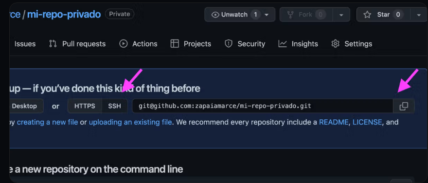

```bash
git clone git@github.com:zapaiamarce/mi-repo-privado.git
```

Si no puedes clonar el repo, intenta repasar los pasos o reiniciar la terminal.

## Repos remotos

Para trabajar con repositorios remotos en Git, necesitamos utilizar un conjunto especial de comandos que nos permiten interactuar con el repositorio remoto y mantener la sincronización de los cambios realizados localmente y en el repositorio remoto.

## Clone

Este comando se utiliza para clonar un repositorio remoto existente en tu computadora local. La sintaxis básica es la siguiente:

```bash
git clone <URL del repositorio>
```

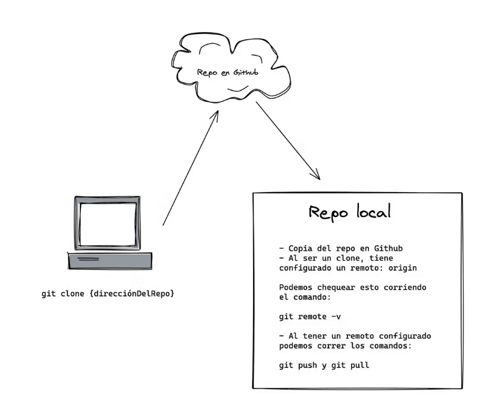

## Remote

Este comando se utiliza para ver y gestionar los repositorios remotos que están asociados a nuestro repositorio local. Por ejemplo, si queremos ver los repositorios remotos asociados a nuestro repositorio local, podemos utilizar el comando git remote -v. Si queremos agregar un nuevo repositorio remoto, podemos utilizar el comando:

```bash
git remote add [nombre del repositorio] [url del repositorio]


# por ejemplo
git remote add origin git@github.com:zapaiamarce/mi-primer-repo.git
```

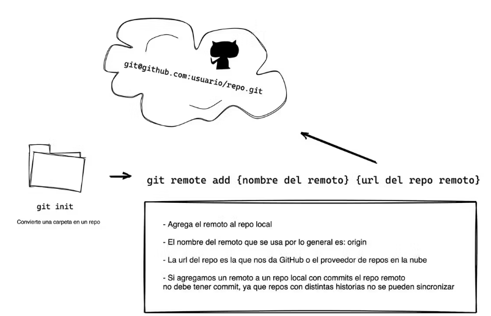

## Push

Este comando se utiliza para subir los cambios que hemos realizado en nuestro repositorio local al repositorio remoto. La sintaxis básica es git push [nombre del repositorio remoto] [nombre de la rama].

```bash
git push origin main
```

## Pull

Este comando se utiliza para traer los cambios que se han realizado en el repositorio remoto y actualizar nuestro repositorio local. La sintaxis básica es

```bash
git pull [nombre del repositorio remoto] [nombre de la rama]

# por ejemplo
git pull origin main
```

## Un repo remoto

Desafío
Para completar este desafío, primero deberás crear un repositorio vacío en GitHub y luego sincronizarlo con una carpeta local que hayas utilizado en el desafío del capítulo anterior. Estos son los pasos a seguir:

1. Crea un repositorio en GitHub vacío.
2. En la carpeta que utilizaste para el desafío anterior, inicializa un repositorio local con el comando git init.
3. Agrega y haz commit de todos los archivos con los comandos git add y git commit.
4. Agrega el repositorio de GitHub como remoto con el comando git remote add origin <URL_del_repositorio_de_GitHub>.
5. Haz push de los cambios a GitHub con el comando git push -u origin master.
6. Edita el archivo en GitHub.
   Por último, haz pull con el comando git pull para actualizar tu repositorio local con los cambios realizados en el repositorio remoto en GitHub.

## git remote

Este comando se utiliza para ver y gestionar los repositorios remotos que están asociados a nuestro repositorio local. Por ejemplo, si queremos ver los repositorios remotos asociados a nuestro repositorio local, podemos utilizar el comando git remote -v. Si queremos agregar un nuevo repositorio remoto, podemos utilizar el comando:

```bash
git remote add [nombre del repositorio] [url del repositorio]

# por ejemplo
git remote add origin git@github.com:zapaiamarce/mi-primer-repo.git
```

## git push

Puchear es subir los cambios que hemos realizado en nuestro repositorio local al repositorio remoto. La sintaxis básica es git push [nombre del repositorio remoto] [nombre de la rama].

```bash
git push origin main
git push --set-upstream origin main
```

## git pull

Este comando se utiliza para traer los cambios que se han realizado en el repositorio remoto y actualizar nuestro repositorio local. La sintaxis básica es

```bash
git pull [nombre del repositorio remoto] [nombre de la rama]

# por ejemplo
git pull origin main
```

```bash
git pull
```

## Clona, modifica, commitea y pushea

Desafío
Crea un nuevo repositorio público. Dale un nombre descriptivo al repositorio, por ejemplo "mi-nuevo-repo". También puedes agregar una descripción si lo deseas.

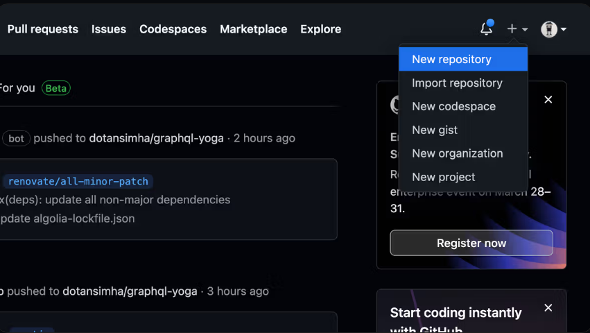

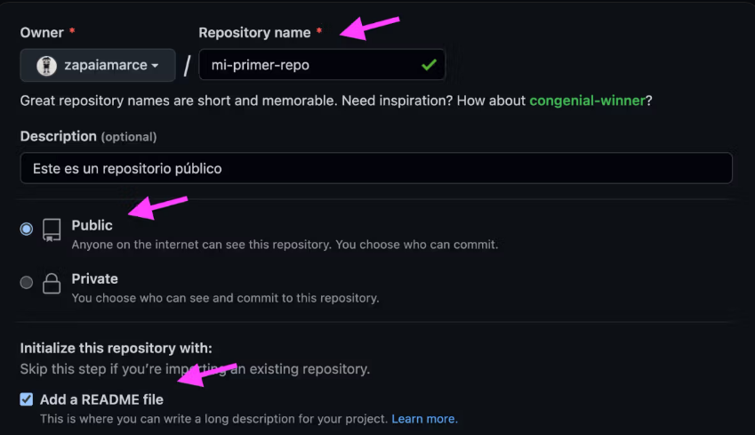

Ahora, para clonar el repositorio en tu computadora, debes copiar el enlace que aparece en la sección "Clone or download". Luego, abre la terminal en tu computadora y escribe el siguiente comando:

```bash
git clone [enlace del repositorio]
```

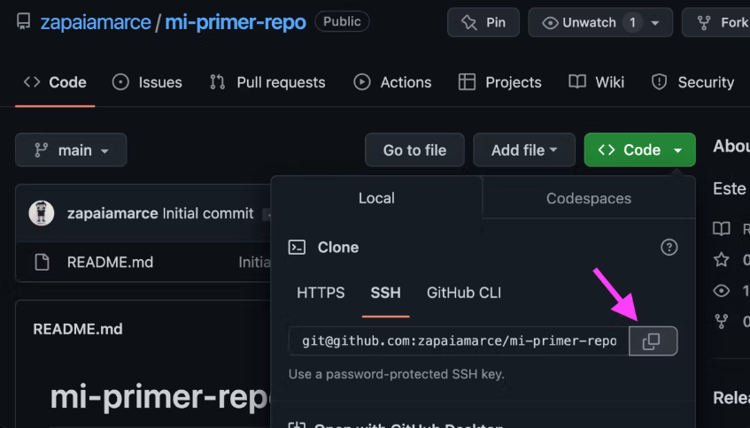

¡Listo! Ya tienes tu repositorio en tu computadora. Ahora, haz un cambio en el archivo README.md (puedes agregar una línea de texto, por ejemplo "Este es mi primer repositorio en Github") y guarda los cambios.

Para commitear los cambios, en la terminal escribe:

```bash
git commit -am "Agregué una línea de texto al archivo README.md"
```

Es importante que el mensaje del commit describa los cambios que hiciste.

Finalmente, para pushear los cambios al repositorio en Github, escribe:

```bash
git push origin main
```

Esto enviará tus cambios al repositorio en Github. Si visitas tu repositorio en Github, deberías poder ver la línea de texto que agregaste.

## Forks y Pull Requests

En este capítulo hemos visto que GitHub es una herramienta muy útil para guardar repositorios en la nube y trabajar de forma remota y colaborativa. Para trabajar con repositorios remotos en GitHub, hay un conjunto especial de comandos que debemos utilizar.

## Fork

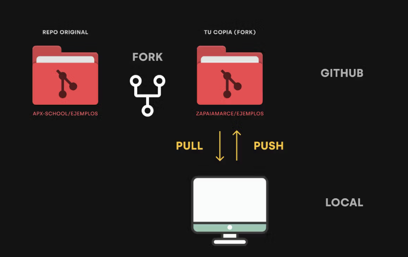

Una de las funciones que nos ofrece GitHub es la posibilidad de clonar un repositorio remoto en nuestra cuenta. Esto se conoce como fork, que puede traducirse como bifurcación.

Hacer un fork de un repositorio nos permite hacer una copia exacta de un repo cualquier en nuestra cuenta de GitHub. Todo esta en la nube. A partir de que forkeamos un repo, podemos clonar esa copia (ese fork) y seguir el proyecto en una dirección distinta de la del original. Una vez que forkeamos, lo que suceda en el repo original es otra historia y no nos va a afectar en nada. Si necesitéramos traernos algo de ese repo tendríamos que ejecutar toda una maniobra.

Veamos un ejemplo práctico de cómo hacer un fork de un repositorio en GitHub:

1. Ingresar a la página del repositorio que queremos bifurcar. Ejemplo: https://github.com/apx-school/ejemplos
2. Hacer clic en el botón "Fork" en la esquina superior derecha de la página.
3. Elegir la cuenta en la que queremos hacer el fork.
4. Esperar a que GitHub termine de hacer la copia.

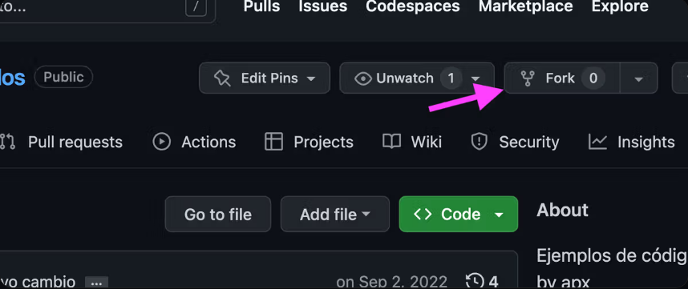

## Pull request

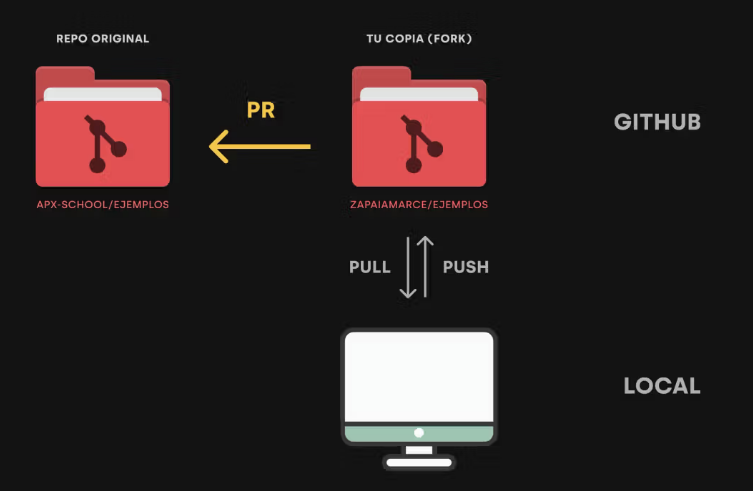

Un pull request es una herramienta que nos permite proponer cambios o mejoras en un proyecto. Es que hacemos desde nuestro fork hacia el repositorio original para que este evalúe los cambios que le enviamos y los incorpore en su repo.

Los PRs son esenciales para el espíritu colaborativo de GitHub y son fundamentales para proyectos open source. Los pasos clásicos para crear un pull request en GitHub son:

1. Hacer un fork del repositorio original.
2. Clonar nuestro fork (copia del repo origina) a nuestra máquina.
3. Hacer los cambios que queremos proponer y pushear a nuestro fork.
4. Crear un pull request en GitHub desde la página de nuestro fork.
5. Escribir una descripción clara de los cambios propuestos.
6. Esperar a que el propietario del repositorio original revise y apruebe los cambios.

## Open source

Los proyectos open source o de código abierto son sistemas de software creados por la comunidad y para la comunidad. Estos proyectos se construyen a partir de la colaboración de diferentes personas, que disponen del código fuente de un programa y proponen cambios o nuevas funcionalidades al proyecto.

Cualquier persona puede contribuir a un proyecto open source. La forma de acceder al código fuente es mediante su repositorio en GitHub, donde se alojan este tipo de iniciativas. Además, cada proyecto tiene manuales que nos presentan la forma adecuada para proponer cambios.

No todos los proyectos de código abierto tienen las mismas licencias de uso. Si bien podemos acceder al código fuente, tenemos que revisar cuáles son los permisos que nos dan antes de tomar ese código y usarlo con otro fin.

Todas las modificaciones que propongamos, mediante pull requests, tienen que ser aceptadas por las personas que se encargan de moderar el proyecto. Para que los cambios sean tenidos en cuenta, es fundamental leer la documentación y respetar las formas definidas en ella.

Veamos los repositorios de algunos proyectos open source populares:

Linux https://github.com/torvalds/linux

VSCode https://github.com/microsoft/vscode

Lodash https://github.com/lodash/lodash
