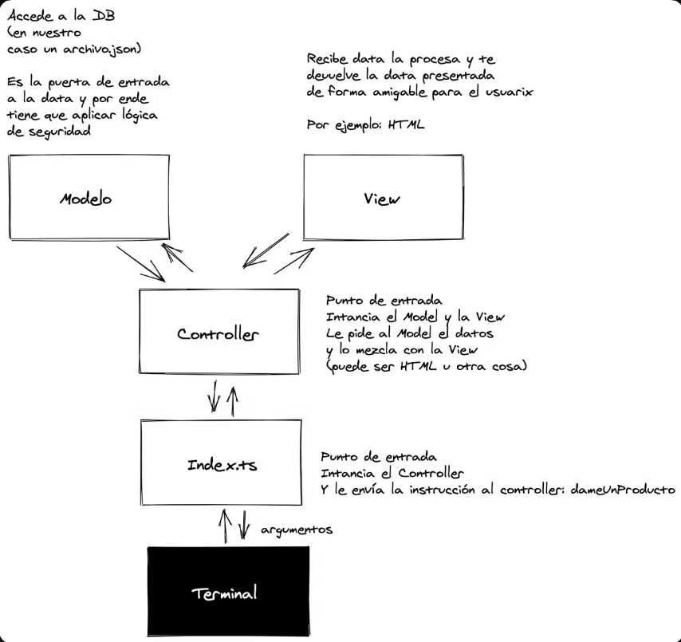

## MVC orientado a objetos

MVC es una forma de organizar el código que se caracteriza por separar los componentes de una aplicación en tres grupos o capas: el modelo, la vista y el controlador. Además, esta propuesta de arquitectura describe cómo se relacionarán entre ellos estos elementos.

- Model o modelo: es la parte del código que maneja los datos. Se trata de la representación de la información con la cual el programa opera. Las peticiones de acceso o manipulación de información llegan al modelo a través del 'controlador'.
- Controller o controlador: es el punto de entrada de las peticiones que el usuario le hace al programa. También, se encarga de validar las peticiones y de derivarlas al modelo correspondiente.
- View o vista: es la forma en la que se representa la información.

El espíritu de MVC viene de la noción de separación de intereses (separation of concerns). Este concepto, que es muy conocido en informática, remite a un principio de diseño para dividir un programa informático en secciones distintas, de forma tal que cada sección enfoque un interés delimitado.

Una forma de implementar la separación de intereses es mediante el uso de módulos. La modularización nos permite encapsular el código, y, de esta forma, podemos ocultar información para que cada capa del software no conozca el estado de las demás. Así, podemos mantener separados los datos de la lógica de negocio de un programa.

## Orientado a objetos

Entonces, ¿cómo podemos aplicar MVC orientado a objetos? Lo podemos hacer utilizando clases. Es decir, podemos declarar el modelo, la vista y el controlador como clases en diferentes archivos.

Esta es la relación que podemos establecer entre los diferentes módulos que componen al patrón MVC:

