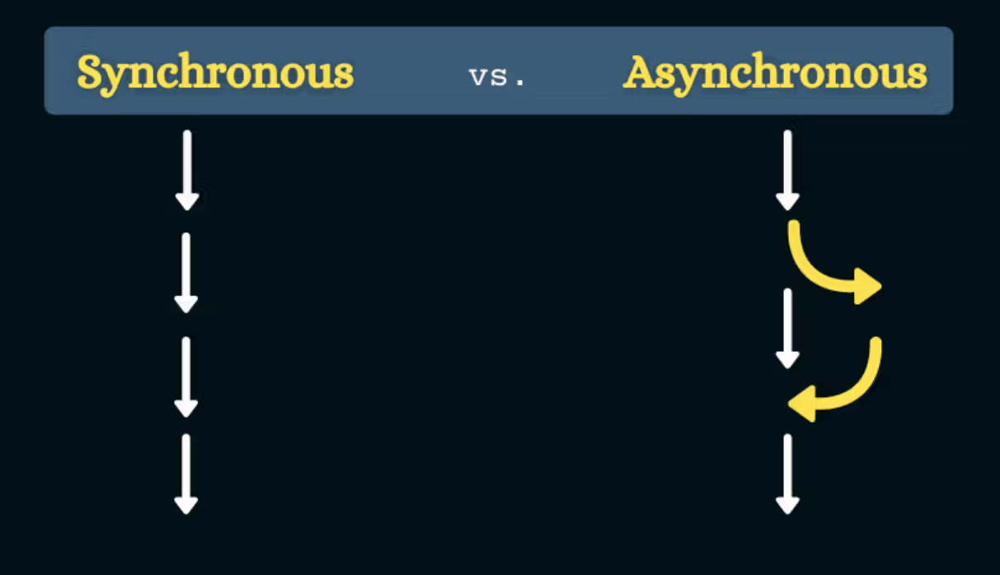

Sync y Async



Hasta ahora casi todo el código que vimos es sincrónico (sync). Esto quiere decir que cada linea se ejecuta después de la otra en el orden en que se lo ordenamos a la máquina.

El código síncrono en JavaScript es aquel que se ejecuta de forma secuencial, es decir, una línea de código se ejecuta después de la anterior y así sucesivamente. En otras palabras, el código espera a que se complete una tarea antes de pasar a la siguiente.

```js
function suma(a, b) {
  console.log("Antes de la suma");
  const resultado = a + b;
  console.log("Después de la suma");
  return resultado;
}

console.log(suma(2, 3));
console.log("Fin del programa");
```

Por otro lado, el código asíncrono/asincrónico (async) en JavaScript no se ejecuta de forma secuencial, sino que se realiza en segundo plano. Cuando una tarea asíncrona se inicia, el código no espera a que se complete antes de pasar a la siguiente tarea. En su lugar, se continúa con la ejecución del código mientras se espera que la tarea asíncrona se complete.

```js
function mostrarMensaje() {
  console.log("Hola, soy un mensaje asíncrono");
}

console.log("Antes del mensaje");
setTimeout(mostrarMensaje, 3000);
console.log("Después del mensaje");
```

En este caso, la función setTimeout no bloquea la ejecución del código, sino que se ejecuta en segundo plano durante 3 segundos y luego se muestra el mensaje.

## Callbacks

Son funciones que se pasan por parámetro a otras funciones. Veamos un ejemplo de cómo podemos usarlas para realizar tareas asincrónicas:

```js
setTimeout(function () {
  console.log("Soy una función callback");
}, 100);
```

En el ejemplo, le decimos a setTimeout() que ejecute la función callback que le hemos pasado como primer parámetro cuando transcurran 100 milisegundos.

El mismo código se puede entender asi:

```js
function elCallback() {
  console.log("Soy una función callback");
}

const tresSegundos = 3000;
setTimeout(elCallback, tresSegundos);
```

De esta forma, estamos usando una función callback para pasársela a setTimeout(), que es otra función. En este caso, se trata de proyectar un suceso que ocurrirá en un momento conocido del futuro, pero muchas veces desconoceremos cuándo se producirá (incluso puede no suceder nunca).

Si bien las funciones callbacks son muy útiles para trabajar de forma asíncrona, tienen algunas desventajas. La principal es que pueden derivar en un código un poco caótico y difícil de leer, en especial cuando usamos la asincronía varias veces en una misma función, creando una estructura anidada que es conocida como Callback Hell o Pyramid of Doom, debido a su poca legibilidad.

Ejemplo de callback hell (http://callbackhell.com/)

```js
fs.readdir(source, function (err, files) {
  if (err) {
    console.log("Error finding files: " + err);
  } else {
    files.forEach(function (filename, fileIndex) {
      console.log(filename);
      gm(source + filename).size(function (err, values) {
        if (err) {
          console.log("Error identifying file size: " + err);
        } else {
          console.log(filename + " : " + values);
          aspect = values.width / values.height;
          widths.forEach(
            function (width, widthIndex) {
              height = Math.round(width / aspect);
              console.log("resizing ");
              const destFile = dest + "w" + width + "_" + filename;
              this.resize(width, height).write(destFile, function (err) {
                if (err) {
                  console.log("Error writing file: " + err);
                }
              });
            }.bind(this)
          );
        }
      });
    });
  }
});
```

## Promesas

Una solución al caos que pueden provocar las funciones callbacks son las promesas. Estas son objetos que resultan de una operación asíncrona. Este resultado podría estar disponible ahora o en el futuro. Veamos un ejemplo:

```js
const API = "https://api.github.com/users/zapaiamarce/repos";
const unaPromesa = fetch(API);

unaPromesa.then(function (res) {
  // la promesa se resolvió
  console.log(res);
});
unaPromesa.catch(function (err) {
  // la promesa disparó un error
  console.log(err);
});
```

En este ejemplo usamos fetch del paquete node-fetch. Esta función retorna una promesa que tiene una función que se va a ejecutar cuando fetch devuelva la data de la url.

Si todo sale bien, se va a ejecutar la función que declaramos luego de then. Si hubo un error, se ejecutará la función que le sigue a catch.
