# Formateá tu código

Formatear el código es mucho muy importante.
Cuando empezamos a programar, escribimos algunas líneas de código y las probamos para ver qué sucede. Al principio, el código no es mucho, pero a medida que avanzamos, la cantidad de líneas de código crece, y también lo hace la necesidad de ser más organizados.

Entender rápidamente lo que está pasando en el código que estamos viendo es clave y por eso, va a ser fundamental usar técnicas y herramientas que nos ayuden a ordenar el código visualmente.

## Formateo de código

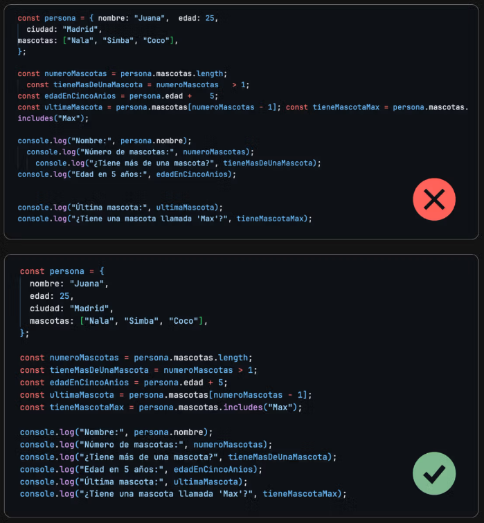

La forma en que organizamos el código visualmente afecta cuán fácil es entenderlo.
Pensemos en un ejemplo sencillo donde tenemos un objeto que representa a una persona. Técnicamente lo podríamos escribir de la siguiente manera y va a funcionar sin problemas.

```javascript
const persona = {
  nombre: "Juana",
  edad: 25,
  ciudad: "Madrid",
  mascotas: ["Nala", "Simba", "Coco"],
};

console.log(persona);
```

Esto es porque el interprete de JavaScript que vive dentro de Node.js no necesita el código ordenado para entenderlo. Solo necesita que respetemos los símbolos como las llaves, puntos y comas que le indican donde empiezan y terminan las cosas.

Los que si necesitamos el código ordenado de forma visual somos los devs. El código es la forma de comunicarnos con el hardware y es importante que podamos entender rápidamente que tenemos delante de nuestros ojos.

```javascript
const persona = {
  nombre: "Juana",
  edad: 25,
  ciudad: "Madrid",
  mascotas: ["Nala", "Simba", "Coco"],
};

console.log(persona);
```

¡Ahora si! El uso de espacios y de lineas separadas para cada cosa, le da un orden visual al código que ayuda a entender las jerarquías. O sea, que código está dentro de que otro código.

## Formateadores

Existen muchas buenas prácticas a la hora de formatear código para que sea legible pero por suerte los editores de código vienen muy preparados para esto.

Visual Studio Code está pensado para extender sus poderes a través de las extensiones.

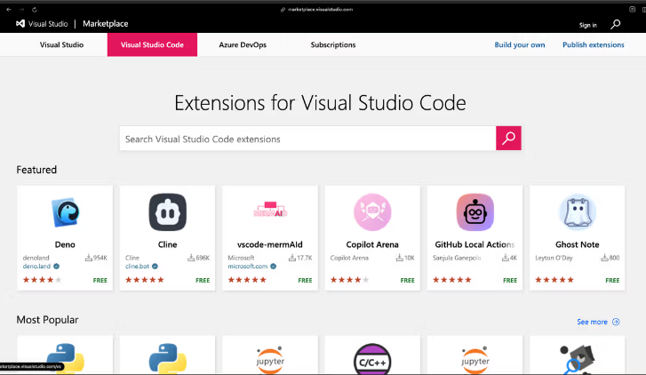

Estas extensiones le dan capacidades extra al editor de código y son muy útiles para automatizar distintas tareas.

Ya vamos a meternos en varias de estas extensiones. Por ahora nos interesan los formateadores. En particular uno.

## Prettier

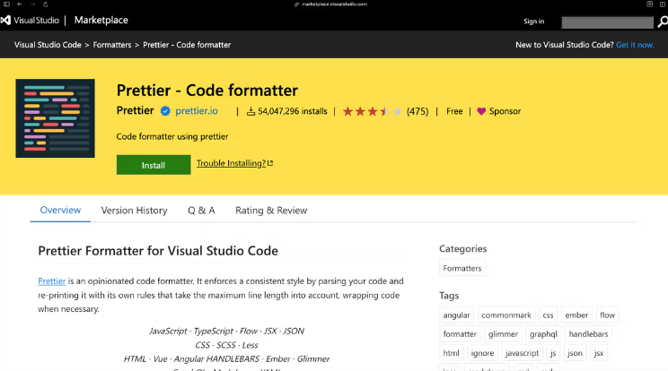
Prettier es un formateador de código que viene listo para instalar y usar sin mucha configuración extra. Para instalarlo en nuestro editor podemos ir al sitio de la extension y presionar en el botón de instalar o también podemos buscarlo desde el mismo editor de código.

Para esto debemos abrir la paleta de comando de VSC presionando la combinación: Ctrl + Shift + P.

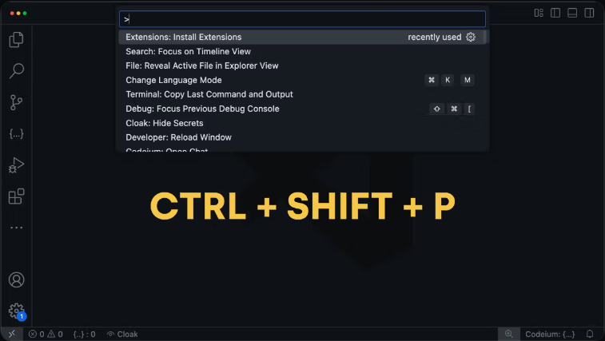

Dentro de esta paleta de comandos vamos a encontrar un montón de comandos útiles que vamos a usar. Uno de esos comandos es "Install Extensions" que podemos encontrar si empezamos a escribir en el campo de texto.


Esto nos llevará al buscador de extensiones de VSC donde podremos buscar Prettier.

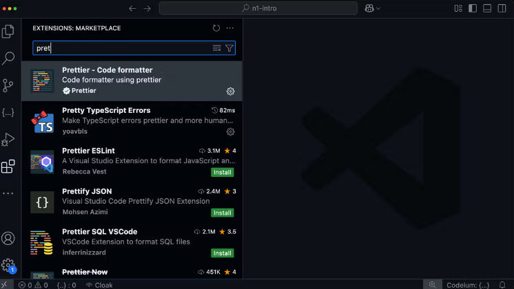

Y lo instalamos presionando el botón "Install".

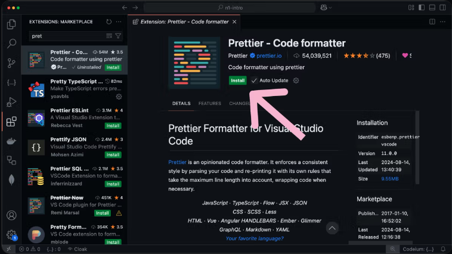

Una vez instalado.

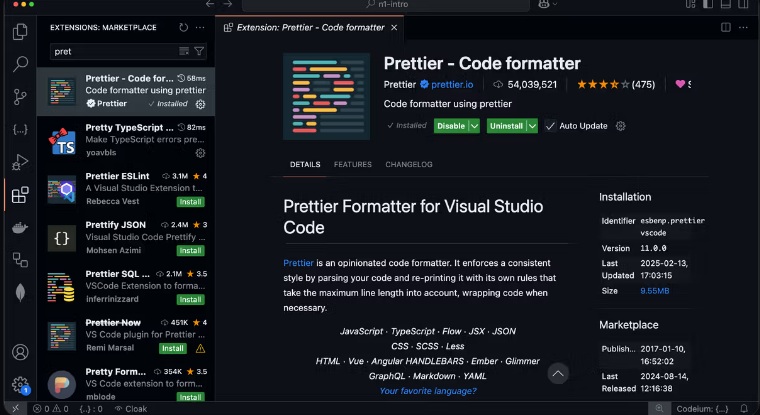

Nos tenemos que asegurar que VS Code va a usar Prettier como nuestro formateador por defecto. Para esto vamos a abrir a los Settings presionando CTRL + , (Control y coma) o buscando Open User Settings (la que no es JSON) en la paleta de comandos.
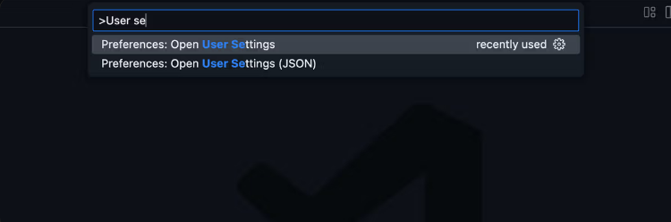

Dentro de los settings vamos a buscar la opción Default Formatter y a elegir Prettier.

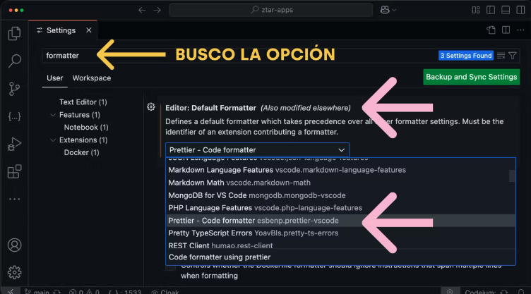

Finalmente vamos a buscar la opción "Format on Save" y la vamos a habilitar para que nuestros archivos se formateen automáticamente cada vez que los guardemos. Esto es muy importante para mantener todo en orden y prolijo.
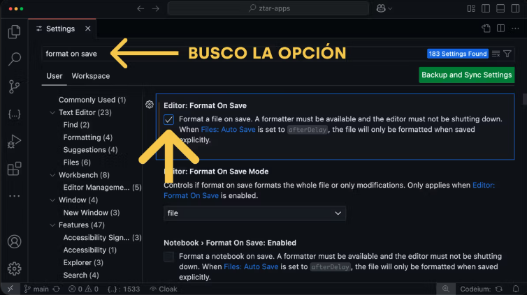

Shortcuts
Los shortcuts, o atajos de teclado, no son imprescindibles desde el principio, pero te hacen la vida mucho más fácil cuando los empezás a usar. Estos atajos son combinaciones de teclas que te permiten realizar acciones rápidamente sin tener que usar el mouse. Por ejemplo, puedes moverte entre líneas de código, mover bloques de código o buscar algo sin tener que navegar por todo el archivo.
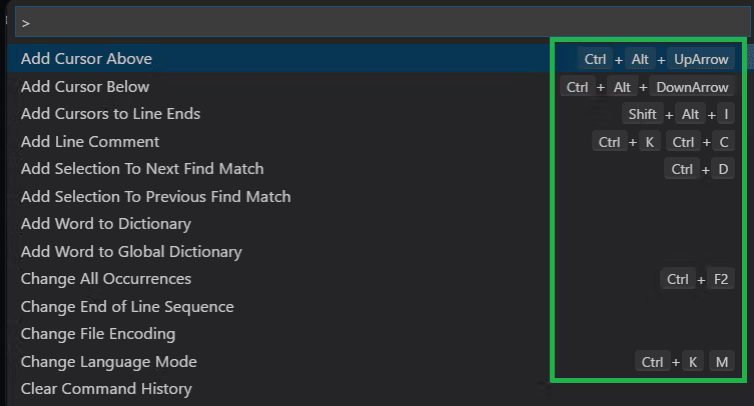

Mi consejo es que no te obsesiones con aprender todos los atajos desde el principio, pero sí que estés atento a los momentos en los que repetís la misma acción una y otra vez, como buscar algo o mover una línea. En esos momentos, seguro hay un atajo para hacerlo más rápido. A medida que lo vayas necesitando, empezarás a integrar atajos en tu flujo de trabajo. Lo importante es saber que existen y sumarlos a medida que los vayas utilizando.

## Encontrar respuestas

Estás desarrollando una aplicación y de repente te encontrás con un error que nunca antes habías visto. O quizás estás intentando implementar una nueva funcionalidad, pero no tenés idea de cómo empezar. Estas situaciones son absolutamente cotidianas en el mundo del desarrollo de software. Sin importar si recién arrancás o si ya tenés experiencia, enfrentarte a dudas y problemas es parte del proceso de desarrollo de cualquier software.

Dedicarte a programar es dedicarte a aprender y resolver problemas. A medida que avanzamos, nos damos cuenta de que no se trata de conocer un lenguaje de programación de memoria, sino de cómo aplicar ese conocimiento para solucionar desafíos específicos.

## Resolver problemas es nuestro trabajo

Trabajar en un equipo de desarrollo implica repartirse tareas. Los sitios web o las apps de nuestro teléfono son piezas de software complejas y necesitan de muchas personas que los construyan y mantengan. Puede que te toque implementar una funcionalidad que permita a los usuarios recibir notificaciones cuando un hecho puntual ocurra en la aplicación. O tal vez, alguien detecte un error que impide que los usuarios utilicen tu aplicación bajo ciertas circunstancias y tengas que trabajar en resolverlo.

Estos problemas no suelen tener soluciones directas o inmediatas. Es nuestra responsabilidad como desarrolladores entender el problema en profundidad, buscar la información necesaria, proponer una solución viable, discutirla con el equipo y, finalmente, llevar a cabo la implementación.

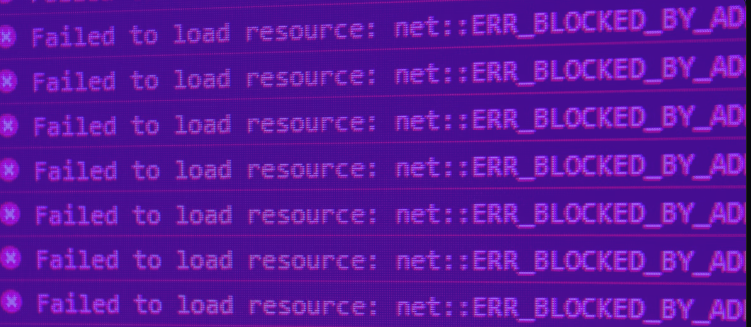

Durante este proceso, es completamente normal encontrarse con preguntas y obstáculos. Puede que no sepamos cómo utilizar una herramienta específica, cómo manejar ciertos datos de manera eficiente, cómo realizar una tarea en un lenguaje de programación particular, cómo configurar una herramienta o, lo más común, enfrentarnos a un error y no tener claro qué está sucediendo.

La constante aparición de dudas y obstáculos que no sabemos cómo resolver puede generar frustración y, en algunos casos, desmotivación.

La buena noticia es que existe una habilidad crucial que podemos desarrollar para superar estos desafíos: aprender a buscar respuestas de manera efectiva.

## Problemas frecuentes

Como estudiante de programación, probablemente ya te hayas dado cuenta de que el camino del aprendizaje está lleno de desafíos. Sabés que no todo es tan simple como seguir un tutorial o leer un libro de texto. La programación es práctica. Es prueba y error. Es enfrentarse a problemas reales y buscar soluciones. Dentro de la rutina de cualquier dev existen cierto tipo de problemas que aparecen a diario.

## Errores y bugs

Te has encontrado con mensajes de error que no entendés o comportamientos inesperados en tu código. A veces, incluso un pequeño error de sintaxis puede causar un gran dolor de cabeza.
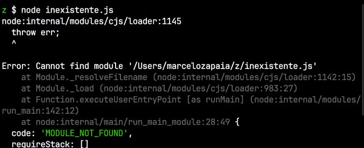

## Nuevas funcionalidades

Se te ha pedido que agregues algo nuevo a tu proyecto, pero no sabés bien de por dónde empezar. Quizás no estás familiarizado con las mejores prácticas para implementar esta funcionalidad o no sabés qué herramientas serían las más adecuadas.

## Uso de herramientas

A medida que explorás nuevas tecnologías, te encontrás con herramientas que no sabés cómo configurar o utilizar correctamente. Cada herramienta tiene su propia curva de aprendizaje y documentación para navegar.

En todas estas situaciones la clave para avanzar no solo está en acumular más información, sino en aprender a navegar y filtrar la vasta cantidad de recursos disponibles en internet de manera más efectiva.

## Buscar Respuestas

El arte de buscar respuestas efectivamente es una habilidad crucial para cualquier dev. No se trata solo de teclear una pregunta en Google; es sobre saber cómo y dónde buscar, cómo formular tus preguntas para obtener resultados útiles y cómo aplicar las soluciones que encuentres a tu problema específico. Vamos a desglosar este proceso en pasos prácticos y a darte ejemplos concretos de cómo aplicarlos.

## Entender el problema

Antes de empezar a buscar, es esencial que entiendas el problema que estás enfrentando. Esto significa leer los mensajes de error cuidadosamente, revisar tu código para identificar posibles fuentes del problema y, en algunos casos, intentar replicar el error para entender mejor qué lo está causando.

Por ejemplo, si por error intentaremos acceder a la propiedad de un objeto a partir del número de índice:

```javascript
const user = {
  id: 1,
  nombre: "Juli",
  estudios: {
    dev: {
      school: "apx",
      titulo: "Software Developer",
      fecha: 2024,
    },
  },
};

const fechaDePrimerEstudio = user.estudios[0].fecha;
console.log(fechaDePrimerEstudio);
```

Obtendríamos un error que dice:

```javascript
"Uncaught TypeError: Cannot read properties of undefined (reading 'fecha')";
```

Este tipo de errores son graves ya que JavaScript no sabe qué hacer ante un caso así, entonces detiene el programa ahí y se deja de ejecutar.

El primer paso en estos casos es entender qué significa. Este es un TypeError, que específicamente indica que se está intentando leer la propiedad fecha de algo que resultó ser undefined ya que user.estudios[0] es undefined.

## Googlear bien

Una vez que entiendes el problema, el siguiente paso es entender como formular tu pregunta de manera que sea más probable que encuentres respuestas útiles en Google. Esto incluye mencionar en tu búsqueda cualquier detalle relevante como el lenguaje de programación, la versión, el framework o la librería que estás usando.

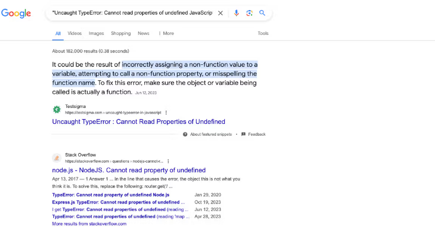

En lugar de buscar "Uncaught TypeError", lo mejor sería buscar "Uncaught TypeError: Cannot read properties of undefined JavaScript Node.js" ya que al agregar el lenguaje y el runtime (Node.js) Google podrá encontrar resultados más relevantes para tu situación.

Es importante evitar incluir información muy particulares de tu código para que encuentres respuestas más generales. Si incluyes el nombre de tu objeto o tu archivo probablemente no encuentres coincidencias salvo que alguien más haya tenido el mismo problema, con un nombre de objeto y archivo similar. Esto es poco probable.

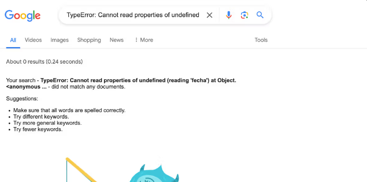

## ¿Dónde buscar?

No todas las fuentes de información son iguales y cada una será mejor en diferentes circunstancias.

### Documentación oficial

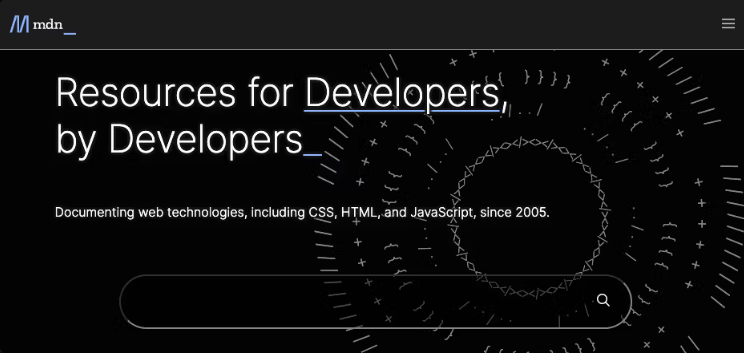

Siempre es un buen punto de partida. La documentación de las tecnologías que estás usando puede ofrecer respuestas claras y precisas. Sitios como MDN tienen documentación super completa sobre JavaScript y otras tecnologías relacionadas. Además, mucha de su documentación está disponible en varios idiomas incluyendo español: https://developer.mozilla.org/en-US/docs/Web/JavaScript

## Foros y comunidades

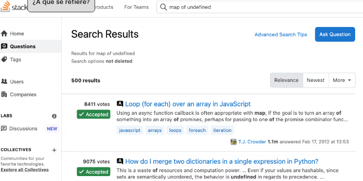
Sitios como Stack Overflow, Reddit, o el Discord de estudiantes de apx son excelentes lugares para buscar preguntas similares o hacer las tuyas. El problema que estás teniendo lo tuvieron antes muchas personas y han escrito sobre cómo lo resolvieron.

## Inteligencia artificial

Por suerte la tecnología avanza y hoy contamos con herramientas basadas en inteligencia artificial para formular preguntas muy específicas y que sean entendidas más allá de que sean muy particulares.
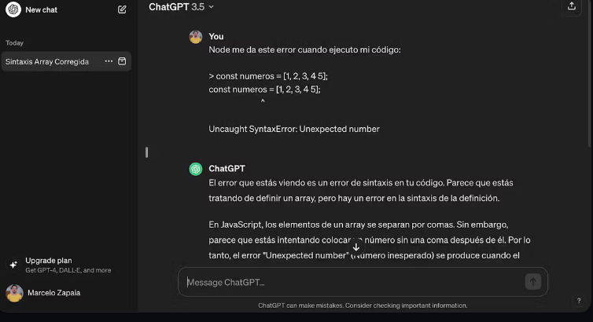

Tecnologías como ChatGPT o perplexity.ai, para buscar respuestas a problemas ofrece una serie de ventajas significativas y cambia la forma en la que los desarrolladores abordan los desafíos del código y el software. Al interactuar con una IA, podés especificar el contexto y los requisitos exactos de tu problema, lo que te permite obtener soluciones más precisas y adaptadas a tus necesidades específicas. Al analizar las soluciones y explicaciones proporcionadas por la IA, podemos descubrir nuevos enfoques y técnicas que quizás no hubiéramos considerado anteriormente.

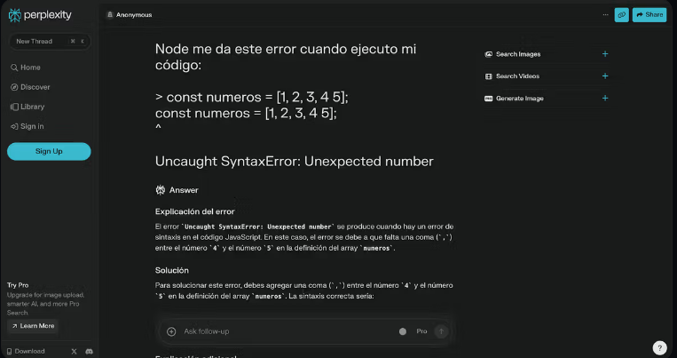

Una vez que encuentres una respuesta que parece prometedora, evalúa si se aplica a tu situación específica y pruébala cuidadosamente. Si no funciona, trata de entender por qué y ajusta tu búsqueda basándote en lo que aprendiste. Solo vos conocés la totalidad del proyecto y contexto donde el problema se está dando.

## Los problemas son aprendizaje

Cada problema que resolvés no solo soluciona el problema inmediato, sino que también te enseña algo nuevo que puedes aplicar en el futuro. Con el tiempo, desarrollarás una intuición sobre dónde buscar, cómo formular tus preguntas y cómo aplicar lo que aprendes.

## Conclusión

Aprender a buscar respuestas efectivamente es una habilidad invaluable en el desarrollo de software. Te permite trabajar de manera más autónoma, resolver problemas más rápidamente y continuar aprendiendo y creciendo como dev. Con práctica, paciencia y curiosidad, desarrollarás esta habilidad de encontrar la información que necesitas para superar cualquier desafío que se te presente.

## Pair programming

El pair programming (programación en pareja) es una práctica super usada en el mundo de la programación.

### ¿Cómo se hace PP?

En PP hay dos roles.

El conductor: es quien tiene el teclado y se enfoca en escribir el código. Su misión principal es plasmar las ideas en la pantalla.

El navegador: es quien observa, revisa, y da sugerencias para mejorar el código o resolver problemas. También está pensando en los pasos futuros y en cómo encaja la solución en el proyecto general.

La idea es turnarse e ir cambiando de rol cada 30 o 60 minutos.
El truco está en la comunicación constante. El conductor no escribe a ciegas; explica lo que está haciendo, y el navegador no solo observa, sino que aporta ideas o señala posibles errores.
