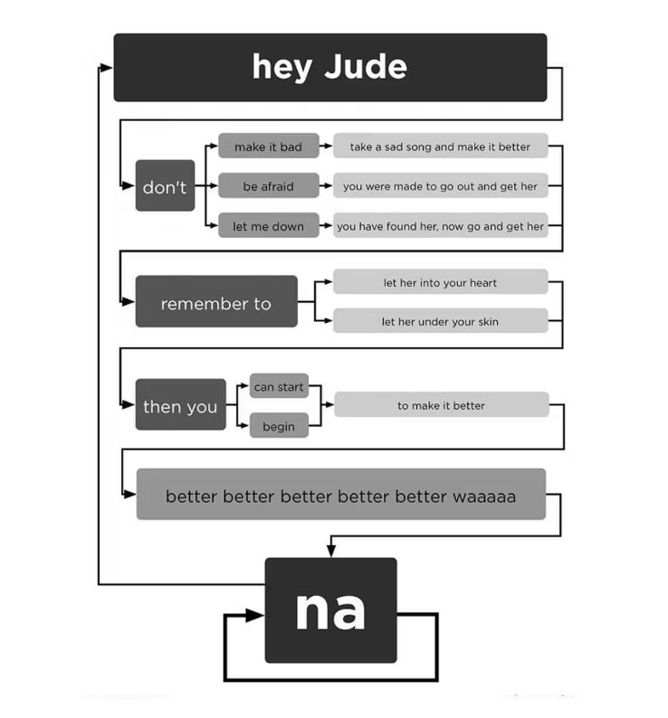
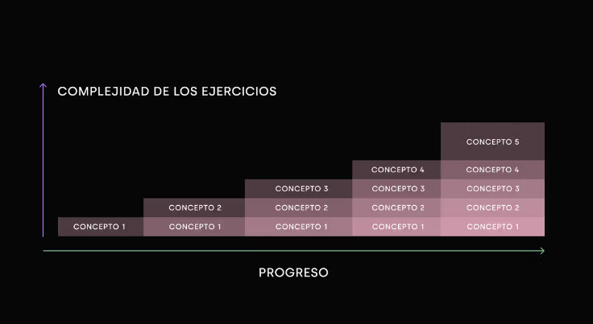

## Introducción

En este capítulo vamos a explorar los fundamentos de la lógica en programación usando JavaScript. A lo largo de varias clases, trabajaremos con los datos que ya sabemos crear —constantes, variables, objetos, arrays, strings— para empezar a hacer preguntas y tomar decisiones en tu código.

### Decisiones

Resolver problemas en programación implica tomar decisiones: “Si ocurre esto, haz esto otro; si el número es mayor a X, actúa de esta forma; si el usuario hace clic aquí, responde de esta manera”. Estas instrucciones son la base de la lógica, y dominarla es esencial para avanzar en proyectos más grandes y complejos.

### De menos a más

En esta etapa, trabajaremos con problemas pequeños, prácticos y bien enfocados. Esto te ayudará a fortalecer tu base lógica mientras practicas con ejemplos concretos y preparas el terreno para retos más avanzados que se vienen.
