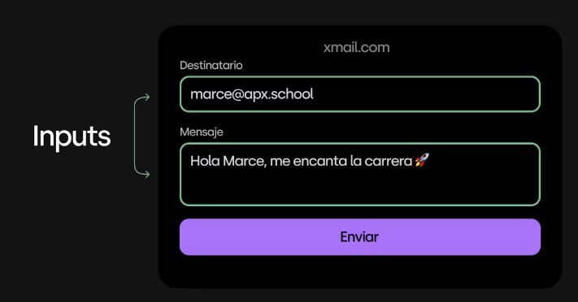
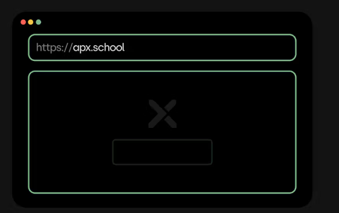
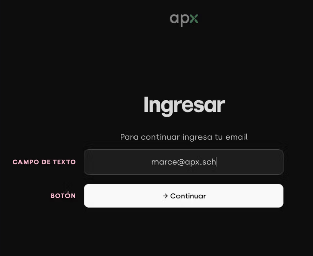
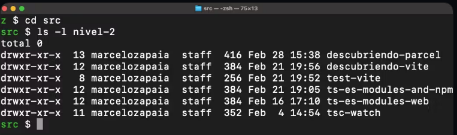
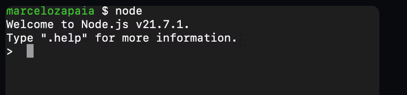
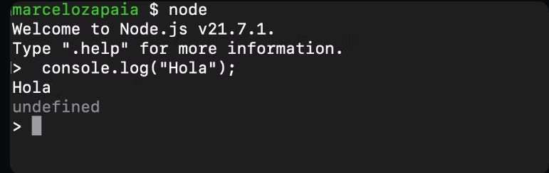
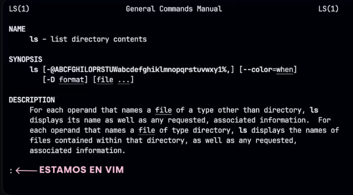
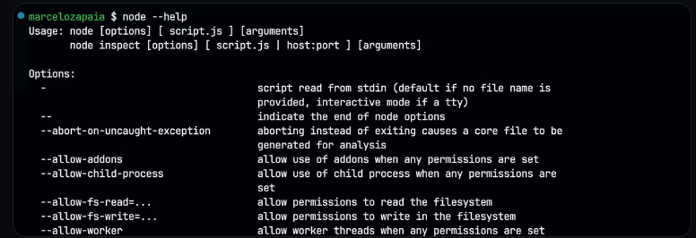

## Inputs

Como sabemos, el propósito de una aplicación (o cualquier pieza de software) es resolver problemas: enviar un email, mostrar el clima de hoy, guardar una lista de tus películas favoritas. Estos problemas técnicos y concretos son en realidad parte de un problema más amplio y cercano a la persona que lo tiene. Alguien que quiere mandar un mail en realidad quiere resolver el problema de comunicarse.

Sabemos que una aplicación necesita recibir datos del mundo exterior para procesarlos y generar nuevos datos resultantes: output.


Estos datos de entrada (inputs) les permitan adaptarse y realizar las tareas de manera personalizada



Para enviar un email, necesitás introducir el destinatario y el mensaje. Para ver el clima, tenés que especificar de qué ciudad querés ver el clima. Para guardar tus películas favoritas, necesitás indicar cuáles son esas películas y qué puntaje les das.

Por ejemplo, cuando ingresás a una página como https://apx.school/ le están indicando al navegador que querés ingresar a esa página específicamente. No a google.com ni a apple.com. Esa dirección web (el input) es fundamental para toda la experiencia. Cuando ingresas a https://apx.school/students, esa variante de la dirección que tiene un /students al final, le indica al navegador que querés acceder a la sección de estudiantes y no a la página principal.



Esto es evidente cuanto vemos una app con interfaz gráfica, pero ¿qué pasa cuando estamos trabajando directamente en la terminal, sin una interfaz gráfica que nos permita introducir estos datos de manera tan visual y amigable?

## Interacción Gráfica

Cuando hablamos de interactuar con programas, la mayoría de nosotros lo hacemos desde una interfaz gráfica, ya sea una página web o una aplicación móvil. Esto nos permite introducir datos a través de campos de texto, seleccionar opciones mediante botones y navegar entre diferentes secciones de la aplicación de manera intuitiva. Un ejemplo claro es el proceso de login en la plataforma de apx, donde introducís tu usuario y contraseña en campos específicos y hacés click en un botón para ingresar.



## La terminal

Si bien las interfaces gráficas son lo más común en nuestro día a día, hoy vamos a enfocarnos en la terminal. Esta herramienta que empezamos a conocer puede parecer desafiante al principio, pero es fundamental para trabajar en el mundo del desarrollo de software.



Así como en las aplicaciones con interfaz gráfica, las aplicaciones que invocamos desde la terminal necesitan recibir datos desde el exterior.

```bash
node --version
```

Para eso utilizamos lo que llamamos "argumentos de la línea de comandos". Estos argumentos son información que proporcionamos al programa en el momento de su ejecución, lo cual puede influir en su comportamiento o las tareas específicas que realiza.

### Argumentos

Un argumento es un dato extra que le das al programa cuando lo inicias para decirle cómo debe funcionar.
Todos los programas que invocamos desde la terminal pueden ser invocados con argumentos que modifican su comportamiento. Por ejemplo Node.js, el motor de JavaScript que instalamos en nuestra computadora puede ser usado con distintos argumentos y lograr distintos resultados.

Si invocamos a Node junto al nombre de un archivo JavaScript, esto le indicara que lo ejecute.

```javascript
console.log("Hola!");
```

```bash
node index.js
#######👆🏼 esto es el argumento
```

Con cat en la terminal se puede ver el contenido de un archivo.

```bash
cat index.js
```

En este caso lo que escribimos a continuación del nombre del comando "node" es el argumento.

También podemos invocar a Node sin ningún argumento y esto nos abrirá una consola interactiva donde podemos escribir JavaScript y ejecutarlo linea por linea como si fuera una terminal.


En esta consola interactiva podemos escribir y ejecutar código JavaScript.


Para salir de este modo interactivo debemos presionar CTRL + D y volveremos a la terminal bash de siempre.

## cd

Otro ejemplo que conocemos es el comando cd (change directory) que nos permite navegar carpetas de nuestra computadora. En este caso lo que escribimos luego del comando cd es el argumento y le dice a cd que debe hacer.

```bash
# Cambiar a un directorio específico por su ruta absoluta
cd /Users/marce

# Subir un nivel en la jerarquía de directorios (regresar al directorio padre) si estas en /User/marce irias a /Users
cd ..

# Cambiar a un directorio específico por su ruta relativa
# Suponiendo que estás en /Users, cambia a /Users/marce
cd marce

# Subir dos niveles en la jerarquía de directorios
cd ../..

# Cambiar a un directorio cuyo nombre contiene espacios
# Supongamos un directorio llamado "Mis Documentos"
cd "Mis Documentos"
```

## ls

Algo similar sucede con el comando ls que lista los archivos y carpetas de la ubicación señalada y puede ser customizado (personalizado) utilizando argumentos

```bash
# Listar los archivos y directorios en el directorio actual
ls

# Listar los archivos y directorios en el directorio actual con detalles
# Muestra permisos, número de enlaces, propietario, grupo, tamaño, fecha de última modificación y nombre
ls -l

# Listar todos los archivos y directorios, incluidos los ocultos (aquellos cuyos nombres comienzan con .)
ls -a

# Combinar opciones: listar con detalles todos los archivos, incluidos los ocultos
ls -la

# Listar archivos y directorios en un directorio específico por su ruta absoluta
ls /Users/marce

# Listar archivos y directorios utilizando una ruta relativa
# Por ejemplo, si quieres listar el contenido del directorio "Documents" que está en el directorio de inicio del usuario
ls ~/Documents

# Listar archivos y directorios y ordenarlos por fecha de modificación, del más reciente al más antiguo
ls -lt

# Listar archivos y directorios y ordenarlos por tamaño, del más grande al más pequeño
ls -lS

# Listar solo los directorios en el directorio actual
ls -d */

# Listar archivos y directorios, mostrando los tamaños de archivo en un formato legible por humanos (K, M, G)
ls -lh

# Listar archivos y directorios recursivamente, mostrando el contenido de todos los subdirectorios
ls -R

# Usar patrones para listar archivos específicos, por ejemplo, todos los archivos .txt
ls *.txt

# Listar archivos y usar el color para diferenciar los tipos de archivo (por defecto en muchas configuraciones)
ls --color
```

## Man

El comando man (abreviatura de "manual") proporciona una forma de acceder a las páginas del manual de software instalado en el sistema. Este comando solo está disponible en sistemas operativos basados en Unix como lo son Linux y MacOS, por o cual si estás en windows no vas a poder utilizarlo.

Estas páginas de manual contienen información detallada sobre el uso de comandos y programas, incluyendo descripciones de todos los argumentos y opciones disponibles, así como ejemplos de uso y a veces enlaces a recursos relacionados.

Por ejemplo si queremos saber más sobre el comando ls podemos invocar:

```bash
man ls
```

Esto nos abrirá el manual del comando ls


Importante
Si vemos esos dos puntos en la esquina inferior izquierda es que estamos dentro de vim, uno de los editores de texto más utilizados dentro de la terminal. Estos dos puntos nos indican que vim está esperando que le indiquemos un comando. Por ahora lo único que tenemos que saber es que presionando la letra q le decimos a vim que queremos salir.

## Help

El argumento --help se utiliza al ejecutar un comando en la terminal para mostrar una ayuda breve directamente en la línea de comandos. Proporciona una descripción general rápida del comando, incluyendo su propósito y una lista de los argumentos y opciones más comunes que acepta, así como ejemplos de uso en algunos casos. No todos los comandos pueden soportar el argumento --help, pero es bastante común entre las herramientas de línea de comandos.

```bash
node --help
```

Node.js soporta el argumento --help y nos muestra todas las opciones de uso.


