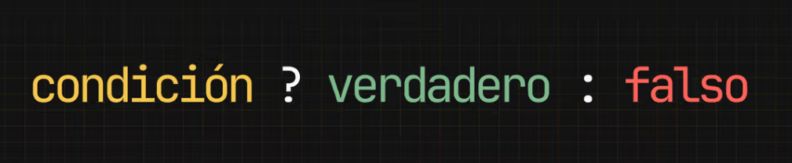

# Control de flujo

Cuando aprendemos a programar, una de las primeras cosas que entendemos es que las líneas de código se ejecutan de manera secuencial: una tras otra.

```javascript
// Input
const precioInicial = 150; // Precio inicial del producto
const descuento = 0.1; // Descuento general del 10%

// Lógica: Calculando el descuento general
const montoDescuento = precioInicial * descuento;
const precioFinal = precioInicial - montoDescuento;

// Output
console.log(`El precio final es: ${precioFinal}`);
```

En un principio, esto parece suficiente para resolver tareas simples, como realizar cálculos o manipular datos básicos. Pero, ¿qué pasa cuando enfrentamos situaciones que requieren tomar decisiones basadas en condiciones específicas o realizar operaciones repetitivas sobre un conjunto de datos?

# Preguntar con código

Imagina que estás construyendo una aplicación para gestionar un carrito de compras. Tenés un objeto que representa un producto con propiedades como nombre y precio. En un momento dado, necesitas aplicar un descuento a este producto, pero solo si cumple con ciertas condiciones, por ejemplo, si es Black Friday.

```javascript
const producto = {
  nombre: "Libro de JavaScript",
  precio: 100,
  esBlackFriday: true
};

// ¿cómo decido que número asignarle
// en base a product.esBlackFriday?
const precioFinal = /* ?? */
```

¿Cómo decides aplicar el descuento solo si esBlackFriday es true?

¿Qué pasa si tengo un array de objetos, cada uno representando un producto en el carrito de compras, y necesitas calcular el total a pagar?

```javascript
const carrito = [
  { producto: "Libro de JavaScript", precio: 100 },
  { producto: "Cuaderno", precio: 50 },
  { producto: "Lápiz", precio: 20 }
];

// ¿Cómo sumo todos los precios del array?
const totalCarrito = /* ?? */;
```

# Control de Flujo

Estos casos nos muestran que para resolver el objetivo de nuestro programa, no es suficiente solo con datos y operadores. Nos encontramos con la necesidad de ejecutar código de manera condicional o reiterativa


La solución a este problema radica en el concepto de control de flujo, que permite que nuestro programa tome decisiones y ejecute código de manera no lineal, es decir, no siempre queremos que después de la línea 1 se ejecute la 2 y después la 3.

Para resolver algunos problemas, necesitamos que este orden cambie y que, por ejemplo, una línea se ejecute solo cuando una condición se cumple, o que podamos reutilizar líneas de código en distintas partes de nuestro programa.


Hagamos un vistazo por arriba de como funcionan estos mecanismos de control para entender de que se trata y más adelante vamos a analizar uno por uno en profundidad para entenderlo por completo. Por ahora concentrémonos en la idea básica,

# Condicionales

Los condicionales son parte de estos mecanismos de control de flujo y nos permiten ejecutar diferentes bloques de código dependiendo de si una condición específica es verdadera o falsa.


# if

La estructura if es una de las más utilizadas para este propósito. Considera el objeto producto del ejemplo anterior. Si queremos aplicar un descuento solo si es Black Friday, podríamos hacerlo de la siguiente manera:

```javascript
const producto = {
  nombre: "Libro de JavaScript",
  precio: 100,
  esBlackFriday: true,
};

let precioFinal;

if (producto.esBlackFriday) {
  // Aplicamos un 20% de descuento
  const montoDescuento = producto.precio * 0.2;
  precioFinal = producto.precio - montoDescuento;
} else {
  precioFinal = producto.precio;
}

console.log(`El precio con descuento es: ${precioFinal}`);
```

En este bloque de código, la lógica dentro del if se ejecuta solo si producto.esBlackFriday es true. De lo contrario, se ejecuta el bloque de código dentro del else.

# Bucles

Los bucles nos permiten repetir un bloque de código mientras se cumpla una condición específica.


## while

El bucle while es un ejemplo sencillo y poderoso. Para sumar todos los valores de "precio" en el array carrito, podemos utilizar un bucle while de la siguiente manera:

```javascript
const carrito = [
  { producto: "Libro de JavaScript", precio: 100 },
  { producto: "Cuaderno", precio: 50 },
  { producto: "Lápiz", precio: 20 },
];

let total = 0;
let contador = 0;

while (contador < carrito.length) {
  total += carrito[contador].precio;
  contador++;
}

console.log(`El total a pagar es: ${total}`);
```

Este bucle se ejecuta mientras contador sea menor que la longitud del array carrito, sumando el precio de cada producto al total.

Cuidado con los bucles infinitos
Es importante asegurarse de que la condición del bucle eventualmente se vuelva falsa; de lo contrario, el bucle se ejecutará indefinidamente, creando un bucle infinito.

```javascript
let j = 0;

while (j < 5) {
  console.log(j);
  // Olvidamos incrementar j, lo que causa
  // un bucle infinito ya que j nunca cambia
  // y siempre es < 5, el programa se queda
  // en este bucle y no avanza. Se cuelga.
}
```

Este ejemplo falla en incrementar j, por lo que la condición j < 5 siempre será verdadera, resultando en un bucle infinito.

## Conclusión

El control de flujo es un concepto fundamental en la programación que nos permite escribir programas más dinámicos y flexibles. A través de los condicionales y los bucles, podemos controlar qué código se ejecuta y cuántas veces, basándonos en condiciones específicas. Esto es solo una introducción a las estructuras de control de flujo en JavaScript. A medida que avances, descubrirás y profundizarás en cada una de estas instrucciones y otras más avanzadas, ampliando enormemente tu capacidad para resolver problemas complejos y construir aplicaciones robustas.

# ¿Qué es el control de flujo?

Desafío
Explica con tus palabras porque es necesario controlar el flujo de ejecución de nuestro código. Además, explica brevemente que es un condicional y un bucle.

No hace falta que tengas la respuesta super correcta ahora, este es un ejercicio para empezar a charlar sobre estos conceptos.

- Answere
  El control de flujo es necesario en la programación por las siguientes razones:
  Decisiones dinámicas: No siempre queremos que nuestro código se ejecute de manera secuencial. Necesitamos poder tomar decisiones basadas en condiciones específicas.

Flexibilidad: Permite que nuestro programa sea más dinámico y pueda adaptarse a diferentes situaciones.
Eficiencia: Nos permite reutilizar código y evitar la repetición innecesaria.

Un condicional es una estructura que nos permite ejecutar diferentes bloques de código dependiendo de si una condición específica es verdadera o falsa. Por ejemplo, en el caso del producto con descuento en Black Friday, solo aplicamos el descuento si la condición esBlackFriday es verdadera.

Un bucle es una estructura que nos permite repetir un bloque de código mientras se cumpla una condición específica. Por ejemplo, cuando necesitamos sumar todos los precios de los productos en un carrito de compras, usamos un bucle para iterar sobre cada producto y acumular su precio.
Es importante tener cuidado con los bucles para evitar bucles infinitos, asegurándonos de que la condición eventualmente se vuelva falsa.

# If

Para empezar a entender de que se trata esto de las estructuras de control y empezar a darle poder de decisión a nuestro programa vamos a empezar por una de las sentencias más usadas en el día a día de cualquier dev: el if.

# Si

El término if se traduce como si y se utiliza en programación para introducir condiciones. Se llama if porque refleja la idea de una pregunta hipotética o condicional en la lógica del programa: **si se cumple una condición específica, entonces se ejecuta un determinado bloque de código**.

La frase:

```
Si el precio es mayor a 1000, me parece caro
```

```
If the price is over 1000, it seems expensive to me.
```

Esto en un lenguaje de programación se va a estructurar de esta manera:

```
si (precio es mayor a 1000) entonces
    muestra en la terminal "es caro"
[fin del si]
```

if es una estructura que usamos para tomar decisiones en un programa. Podemos decirle al programa: "si esto es verdadero, haz esto; si no es verdadero, haz esto otro". Así, podemos controlar qué sucede en nuestro programa en función de ciertas condiciones.


En JavaScript, usamos la siguiente sintaxis para escribir una sentencia if:

```javascript
//cambia esta variable para ver como se evalua la condicion
const num = 15;
const condicion = num > 3;

if (condicion) {
  console.log("La condición es verdadera");
}

console.log("esto se ejecuta siempre porque está fuera del if");
```

Una condición es una expresión que puede ser verdadera o falsa. Si una condición es verdadera, el programa hace una cosa. Si la condición es falsa, el programa hace otra cosa. Las cosas que el programa hace se escriben entre llaves {}.

## Else

Se utiliza para indicar un bloque de código qué debe ejecutarse si la condición que se ha establecido en el if no se cumple.

```javascript
//cambia esta variable para ver como se evalua la condicion
const invitados = ["Fache", "Luchito", "Carlitos"];
const condicion = invitados.length > 2;

if (condicion === true) {
  console.log("La condición es verdadera");
} else {
  console.log("La condición es falsa");
}
```

Las condiciones se escriben después de la palabra if, entre los paréntesis. Si no se cumple la condición, el programa hace lo que está escrito después de la palabra else.

## Else if

Es una estructura que se usa para agregar más condiciones a una estructura de control de flujo if. Se utiliza para especificar una nueva condición que debe evaluarse si la condición del if es falsa.

```javascript
const fruta = "manzana";

if (fruta === "manzana") {
  console.log("La fruta es una manzana");
} else if (fruta === "pera") {
  console.log("La fruta es una pera");
} else {
  console.log("La fruta es otra cosa");
}
```

Es importante tener en cuenta que puedes agregar tantos else if como desees a una estructura de control de flujo if, y que cada uno de ellos debe ir acompañado de una condición y de un bloque de código a ejecutar si se cumple la condición. Además, el else if siempre va después del if y antes del else, si lo hay.

## Truthy / Falsy

JavaScript es un lenguaje de tipado débil, lo que significa que las variables pueden cambiar de tipo durante la ejecución del programa. Esto es distinto en cada lenguaje de programación.

```javascript
let nombre = "Marce";
// Cambiar un dato de string a otro number
// es posible en JavaScript
nombre = 34863;
```

# Coerción de tipos

Esto también se manifiesta en la coerción de tipos, una característica de JavaScript que convierte implicitamente un valor a un booleano para poder evaluarlo.

```javascript
const nombre = "Marce";

if (nombre) {
  console.log("el nombre existe");
}

// En un if (y otros condicionales)
// el valor es tomado como true (boolean)
// aunque sea un string

// Los valores que se interpretan como un true
// pero que no son booleans se denominan
// "truthy" (vale como true)
```

La regla es: todos los valores son truthy, excepto los definidos como falsy: false, 0, -0, 0n, "", null, undefined y NaN.

```javascript
const nombre = "";
// al inciar una variable con un texto ""
// aunque es string, en una condición
// es tomado como false

console.log(typeof nombre);

if (nombre) {
  console.log("El nombre es", nombre);
} else {
  console.log("No  hay nombre");
}
```

Esto puede ser útil para evaluar si una propiedad en un objeto existe, por ejemplo, sin tener que modificar explícitamente el valor de la variable.

# Switch

La declaración switch es una forma de controlar el flujo del código basándose en el valor de una variable. Usamos switch para tomar decisiones en nuestro código dependiendo del valor de un dato. Por ejemplo:

```javascript
const fruit = "banana";

switch (fruit) {
  case "apple":
    console.log("Es una manzana");
    break;
  case "banana":
    console.log("Es una banana");
    break;
  case "orange":
    console.log("Es una naranja");
    break;
  default:
    console.log("No es una fruta conocida");
}
```

En este ejemplo, estamos utilizando la declaración switch para comparar el valor de la variable fruit con diferentes casos. Si el valor de fruit es "apple", se ejecutará el código que imprime "Es una manzana". Y así sucesivamente.

Si ninguno de los casos coincide con el valor de fruit, se ejecutará el código del caso por defecto, que imprime "No es una fruta conocida".

SINTAXIS

```javascript
switch (variable) {
  case valor1:
    // código a ejecutar si variable es valor1
    break;
  case valor2:
    // código a ejecutar si variable es valor2
    break;
  default:
  // código a ejecutar si variable no coincide con ningún caso
}
```

La declaración switch comienza con la palabra clave switch seguida de una expresión entre paréntesis. Esta expresión puede ser cualquier valor, como una variable, una constante, una expresión, etc.

Luego, después de la expresión, se escriben los casos que se van a evaluar. Cada caso comienza con la palabra clave case seguida del valor que se va a comparar con la expresión. Si el valor de la expresión coincide con el valor del case, entonces se ejecutará el código que está debajo del case.

Cada case debe terminar con la palabra clave break, que indica al navegador que debe salir de la declaración switch una vez que se ha ejecutado el código correspondiente. Si no se incluye break, el código de los siguientes cases también se ejecutará.

Por último, se puede incluir un caso por defecto (default) que se ejecutará si ningún otro case coincide con el valor de la expresión. Este caso es opcional, pero es recomendable incluirlo para manejar los casos en los que la expresión tenga un valor que no coincide con ningún case.

## Aclaración

Si bien la sentencia switch es una herramienta útil en programación para tomar decisiones basadas en el valor de una expresión, es importante destacar que su uso se ha vuelto menos común en comparación con otros métodos de control de flujo. La razón detrás de esta disminución de su uso radica en sus limitaciones y contraindicaciones

# Ternarios



Cuando escribimos lógica con código, existen casos que son tan comunes que el mismo lenguaje (JavaScript en nuestro caso) nos ofrece atajos para que escribamos menos código y sea más legible. Uno de los casos más conocidos es el del operador ++, que es la forma corta de modificar una variable y sumarle 1.

```javascript
let counter = 0;

// forma larga
counter = counter + 1;
// 1

// forma corta
counter++;
// 2
```

Existen un montón de estas formas cortas que vamos a ir conociendo a medida que sean necesarias e ideales.

Otro escenario muy frecuente cuando manipulando datos, es el de asignarle un valor a un dato dependiendo de un una condición.

```javascript
const carrito = ["pan", "queso"];

let mensaje;

if (carrito.length == 0) {
  mensaje = "Todavía no agregaste productos a tu carrito";
} else {
  mensaje = `Tenés ${carrito.length} productos en tu carrito`;
}
```

En particular, el caso donde tenemos dos posibles valores que queremos asignarle al identificador, es tan frecuente que el lenguaje también nos ofrecer una forma corta para escribir esta asignación.

## Operador ternario

Los operadores ternarios son un tipo de operador en JavaScript (aunque existe en muchísimo lenguajes) que se utiliza para evaluar una expresión y devolver un valor específico según el resultado de la evaluación. La sintaxis general de un operador ternario es la siguiente:

```javascript
const color = numero > 0 ? "verde" : "rojo";

// si el numero es mayor a cero, color será "verde",
// si no va ser "rojo"
console.log(color);
```

En esta sintaxis, la "condición" es una expresión que se evalúa como verdadera o falsa. Si la condición es verdadera, el operador ternario devuelve el "verde"; de lo contrario, devuelve el "rojo".

Aquí hay algunos ejemplos de cómo se pueden usar los operadores ternarios en JavaScript:

```javascript
const x = 10;
const y = 20;

const resultado = x > y ? "x es mayor" : "y es mayor";

console.log(resultado); // "y es mayor"
```

```javascript
const edad = 18;

const resultado = edad >= 18 ? "mayor de edad" : "menor de edad";

console.log(resultado); // "mayor de edad"
```

```javascript
const longitudSegura = 8;
const login = {
  usuario: "admin",
  password: "abc12345",
};

const output = {};

// usando if
if (login.password.length >= longitudSegura) {
  output.mensaje = "El login es válido.";
  output.esValido = true;
} else {
  output.mensaje =
    "El login es inválido. Asegúrate de que el usuario y el password sean correctos.";
  output.esValido = false;
}

// usando ternarios
output.esValido = login.password.length >= longitudSegura ? true : false;
output.mensaje = output.esValido
  ? "El login es válido."
  : "El login es inválido. Asegúrate de que el usuario y el password sean correctos.";
```

Inclusive se pueden combinar, pero esto ya es un poco más avanzado y difícil de leer. Ya vamos a llegar acá.

```javascript
const x = 10;
const y = 20;

// primero pregunto si sin iguales
// si no son iguales en vez de devolver
// un valor, uso otro ternario para seguir
// preguntando
const resultado =
  x === y ? "x e y son iguales" : x > y ? "x es mayor" : "y es mayor";

console.log(resultado);
```

¿Para qué sirven los bucles?
Ya vimos que una collection (array de objetos) es una estructura muy poderosa ya que nos permite organizar en una lista ordenada, un montón de objetos que representan entidades como usuarios, productos, lugares.
