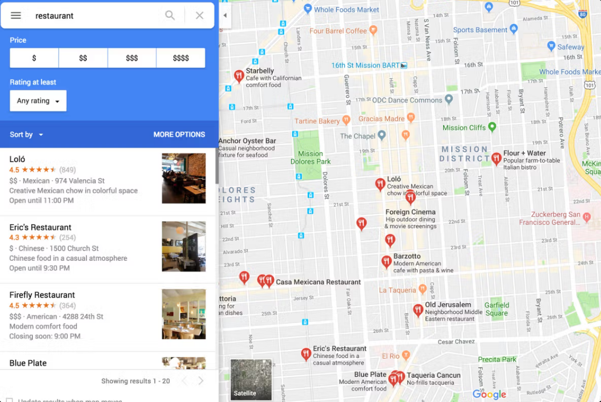
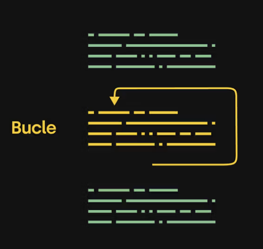
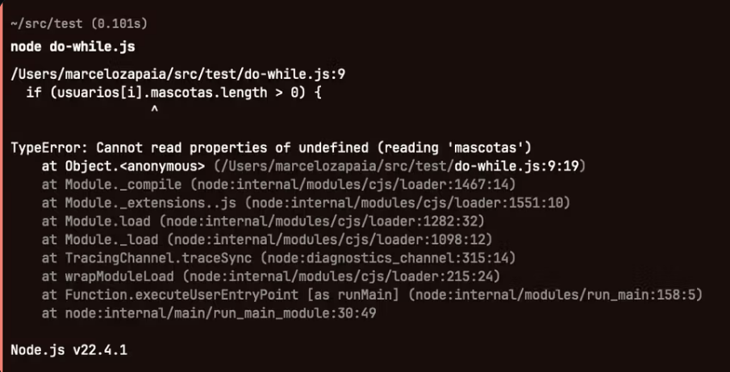
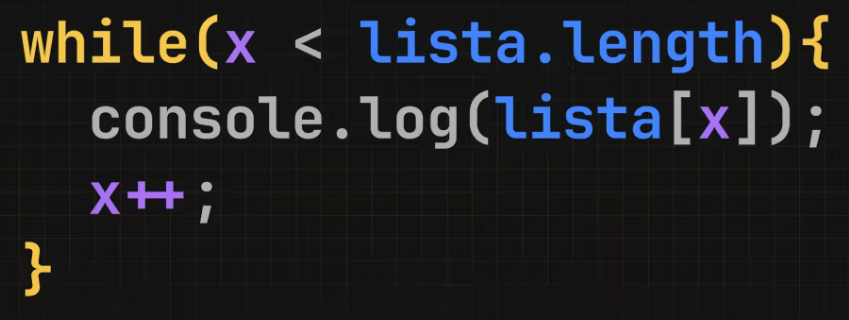

# ¿Para qué sirven los bucles?

Ya vimos que una collection (array de objetos) es una estructura muy poderosa ya que nos permite organizar en una lista ordenada, un montón de objetos que representan entidades como usuarios, productos, lugares.


Cuando hacemos búsquedas en Google Maps, lo que estamos viendo es un array de lugares que se dibujan en la pantalla.

```javascript
const restaurantes = [
  {
    name: "Loló",
    rating: 4.5,
    reviews: 849,
    price: "$$",
    cuisine: "Mexican",
    address: "974 Valencia St",
    description: "Creative Mexican chow in colorful space",
    openUntil: "11:00 PM",
    coordinates: { lat: 37.7569, lng: -122.4211 },
  },
  {
    name: "Eric's Restaurant",
    rating: 4.3,
    reviews: 254,
    price: "$",
    cuisine: "Chinese",
    address: "1500 Church St",
    description: "Chinese food in a casual atmosphere",
    openUntil: "9:30 PM",
    coordinates: { lat: 37.7451, lng: -122.4264 },
  },
  {
    name: "Firefly Restaurant",
    rating: 4.5,
    reviews: 364,
    price: "$$$",
    cuisine: "American",
    address: "4288 24th St",
    description: "Modern comfort food",
    openUntil: "9:00 PM",
    coordinates: { lat: 37.7511, lng: -122.4333 },
  },
];
```

## Lógica en listas

Cuando manipulamos listas nos encontramos con el problema de que en muchas ocasiones queremos aplicar cierta lógica a cada ítem de nuestra lista.

Por ejemplo, si tenemos una lista de usuarios de nuestro sistema y queremos saber cuales tienen mascotas para ofrecerles un producto, ¿cómo podemos preguntar en cada objeto cuantas mascotas tiene cada usuario?

```javascript
const usuarios = [
  {
    id: "hj12ds92j",
    nombreCompleto: "Juan Pérez",
    ciudad: "Buenos Aires",
    mascotas: ["Firulais", "Michi"],
    email: "juan.perez@gmail.com",
  },
  {
    id: "kf98as71p",
    nombreCompleto: "Ana Gómez",
    ciudad: "Bogotá",
    mascotas: [],
    email: "ana.gomez@gmail.com",
  },
  {
    id: "mn63tr45q",
    nombreCompleto: "Carlos Ramírez",
    ciudad: "Ciudad de México",
    mascotas: ["Max", "Luna"],
    email: "carlos.ramirez@gmail.com",
  },
  {
    id: "zx75lg29v",
    nombreCompleto: "María Torres",
    ciudad: "Oaxaca",
    mascotas: ["Bobby"],
    email: "maria.torres@gmail.com",
  },
  {
    id: "qw82hj64k",
    nombreCompleto: "Pedro Fernández",
    ciudad: "Lima",
    mascotas: [],
    email: "pedro.fernandez@gmail.com",
  },
  {
    id: "ab39kl72f",
    nombreCompleto: "Lucía Martínez",
    ciudad: "Buenos Aires",
    mascotas: ["Simba"],
    email: "lucia.martinez@gmail.com",
  },
  {
    id: "yt48mn90z",
    nombreCompleto: "Jorge Rojas",
    ciudad: "Bogotá",
    mascotas: ["Nina", "Rocky"],
    email: "jorge.rojas@gmail.com",
  },
  {
    id: "uv91pq64w",
    nombreCompleto: "Sofía Herrera",
    ciudad: "Ciudad de México",
    mascotas: [],
    email: "sofia.herrera@gmail.com",
  },
  {
    id: "op54xs31c",
    nombreCompleto: "Diego López",
    ciudad: "Oaxaca",
    mascotas: ["Kira", "Tom"],
    email: "diego.lopez@gmail.com",
  },
  {
    id: "gh76bn83d",
    nombreCompleto: "Valentina Castro",
    ciudad: "Lima",
    mascotas: ["Coco"],
    email: "valentina.castro@gmail.com",
  },
];
```

Lo que conocemos hasta ahora nos indica que podemos usar un if para preguntar por cada objeto y saber si tiene mascotas o no.

```javascript
if (usuarios[0].mascotas.length > 0) {
  console.log(`El usuario ${usuarios[0].nombreCompleto} tiene mascotas.`);
}

if (usuarios[1].mascotas.length > 0) {
  console.log(`El usuario ${usuarios[1].nombreCompleto} tiene mascotas.`);
}

if (usuarios[2].mascotas.length > 0) {
  console.log(`El usuario ${usuarios[2].nombreCompleto} tiene mascotas.`);
}

if (usuarios[3].mascotas.length > 0) {
  console.log(`El usuario ${usuarios[3].nombreCompleto} tiene mascotas.`);
}

if (usuarios[4].mascotas.length > 0) {
  console.log(`El usuario ${usuarios[4].nombreCompleto} tiene mascotas.`);
}

if (usuarios[5].mascotas.length > 0) {
  console.log(`El usuario ${usuarios[5].nombreCompleto} tiene mascotas.`);
}

if (usuarios[6].mascotas.length > 0) {
  console.log(`El usuario ${usuarios[6].nombreCompleto} tiene mascotas.`);
}

if (usuarios[7].mascotas.length > 0) {
  console.log(`El usuario ${usuarios[7].nombreCompleto} tiene mascotas.`);
}

if (usuarios[8].mascotas.length > 0) {
  console.log(`El usuario ${usuarios[8].nombreCompleto} tiene mascotas.`);
}

if (usuarios[9].mascotas.length > 0) {
  console.log(`El usuario ${usuarios[9].nombreCompleto} tiene mascotas.`);
}
```

Este código, aunque funciona, no parece muy escalable ¿no? Pensemos que pasa si tenemos 10.000 usuarios. O si, directamente, no sabemos cuantos usuarios tenemos en nuestro array.

```javascript
// esta linea la vamos a entender más adelante
// pero básicamente lo que sucede es que el array
// viene de otro lugar (una base de datos)
// y no sabemos cuantas posiciones tiene.

// Lo único que sabemos es que es un array y tiene
// objetos como los que esperamos.
const usuarios = baseDeDatos.dameTodosLosUsuarios();

if (usuarios[0].mascotas.length > 0) {
  console.log(`El usuario ${usuarios[0].nombreCompleto} tiene mascotas.`);
}

if (usuarios[1].mascotas.length > 0) {
  console.log(`El usuario ${usuarios[1].nombreCompleto} tiene mascotas.`);
}

// etc...

// acá esta lógica no sirve porque no sabemos si el array
// de usuario tiene 10 o tiene 1 millon de usuarios.
```

Necesitamos otra forma de hacer esto y por suerte JavaScript nos provee de una estructura que podemos usar para hacer esta pregunta sobre las mascotas en cada posición del array y sin repetir código: los bucles.

## Bucles



Los bucles o loops (en ingles) son estructuras que nos permiten repetir un bloque de código y por eso van a ser especialmente útiles para resolver problemas como el de las listas que vimos anteriormente.

A continuación vamos a darle un vistazo a todos los bucles que existen en JavaScript para entender que función cumplen, pero ¡tranqui! No te desesperes todavía por entender como y cuando se usa cada uno. En las próximas clases vamos a meternos en cada uno de los bucles y a practicar mucho. Por ahora mirá los ejemplos y tratá de entender la idea general.

## While

Para entender el propósito de los bucles, volvamos al ejemplo de las mascotas un momento.

```javascript
if (usuarios[0].mascotas.length > 0) {
  console.log(`El usuario ${usuarios[0].nombreCompleto} tiene mascotas.`);
}

if (usuarios[1].mascotas.length > 0) {
  console.log(`El usuario ${usuarios[1].nombreCompleto} tiene mascotas.`);
}

if (usuarios[2].mascotas.length > 0) {
  console.log(`El usuario ${usuarios[2].nombreCompleto} tiene mascotas.`);
}

// etc
```

Este código repite exactamente la misma lógica para cada posición del array. Lo único que cambia en cada if es el número de posición del array que revisa para saber si tiene mascotas o no. Si tan solo pudiéramos repetir esas lineas usando una variable para revisar cada posición del array... momento! Podemos.

El bucle while repite el código dentro del bloque mientras la condición sea verdadera.

```javascript
while(/* condicion */){
  // Lo que esta acá se va a ejecutar una y otra vez
  // mientras la condición sea cierta
}
```

Entonces, si escribimos un while como este:

```javascript
const num = 3;

while (num < 6) {
  // esto se va a trabar acá
  console.log("El valor de num es", num);
}

console.log("Esto nunca se va a ejecutar");
```

Nuestro programa va a quedarse dentro del while y no va a continuar. Esto sucede porque la condición (num < 6) siempre va a ser true, ya que num es una constante que nació siendo 3 y nunca va a cambiar de valor. Entonces, num siempre va a ser menor que 6 y eso le dice al while que siga repitiéndose infinitamente.

Si bien existen casos (avanzados) donde queremos que el bucle se ejecute para siempre y nunca salga de ahí (bucles infinitos), por lo general vamos a querer que un bucle se ejecute una x cantidad de veces y luego concluya para que nuestro código siga su recorrido.

Para aprovechar este mecanismo para el bien, necesitamos usar una variable que cambie de valor, para que en algún momento la condición que evalúa el while sea falsa, y así deje de ejecutarse una y otra vez.

```javascript
// arranca siendo 3
let num = 3;

// esto va a repetirse mientras sea menor que 6
while (num < 6) {
  // acá lo mostramos
  console.log("El valor de num es", num);
  // y acá lo modificamos para que num avance
  // y en algún momento sea mayor a 6
  num++;
}

console.log(
  "Ahora si, esto va a ejecutarse luego de que el while termine de hacer lo suyo"
);
```

Usando una variable podemos hacer que la condición comience siendo verdadera y en algún momento pase a ser falsa. Que es justamente lo que necesitamos para recorrer nuestro array.

```javascript
// iniciamos esto en 0
let i = 0;

while (i < usuarios.length) {
  // cada vez que esto se ejecuta
  // el while va a chequear si i es menor
  // a la cantidad de posiciones de nuestro array
  // si es menor, va a ejecutar todo el bloque
  // una vez más

  // acá usamos la misma lógica pero en vez
  // de escribir el número de posición
  // usamos i para que ir recorriendo
  // una a una cada posición
  console.log("i vale", i);
  if (usuarios[i].mascotas.length > 0) {
    console.log(`El usuario ${usuarios[i].nombreCompleto} tiene mascotas.`);
  }
  // modificamos i para que sea igual a si mismo +1
  i++;
}
```

De esta forma la primera vez i va a valer 0, la segunda va a valer 1, y así va a ir cambiando mientras sea menor a la cantidad de posiciones del array (usuarios.length).

Si nuestro array tiene 30 posiciones, la variable i va a cambiar hasta que llegue a 29 y esa va a ser la última vez que el while se va a ejecutar. En un array de 30 elementos el último va a ser array[29] porque arrancan desde el 0.

## Do...While

Es una variante de while que primero ejecuta y después pregunta.

```javascript
// arranca siendo 3
let num = 3;

do {
  console.log("El valor de num es", num);
  num++;
} while (num < 6);

console.log("Terminó!");
```

Este bucle se usa en casos muy específicos, donde tenemos que repetir una acción al menos una vez y no sabemos cuantas veces. El caso clásico es pedirle al usuario que ingrese un dato y no continuar con el resto del programa hasta que lo haga. El siguiente ejemplo es un poco avanzado pero es para que se entienda el uso y para que vean que solo se usa en casos muy particulares.

```javascript
let modoEspera;

do {
  console.log("Las entradas todavía no están disponibles");
  modoEsperar = sigueElModoEsperaParaLasEntradas();
  // esto va a chequear una vez y va a repetirse
  // este chequeo hasta que la variable cambie;
} while (modoEspera);

console.log("Las entradas están disponibles");
```

Si quisiera implementar la lógica de nuestros usuarios con mascotas podríamos sin problemas, pero van a notar que el código ya de entrada es un poco más difícil de entender.

```javascript
let i = 0;

do {
  if (usuarios[i].mascotas.length > 0) {
    console.log(`El usuario ${usuarios[i].nombreCompleto} tiene mascotas.`);
  }
  i++;
} while (i < usuarios.length);
```

Además que tener el while al final, lo hace más difícil de leer, esto puede generarnos un error si el array que evaluamos no tiene ninguna posición. Como el chequeo es al final, la primera ejecución fallaría.

Intentá ejecutar el siguiente ejemplo:

```javascript
// ¿Por qué el array estaría vació? te preguntarás.
// El array puede venir de otro lugar, por ejemplo:
// una base de datos. Y quizás viene vacío.
const usuarios = [];

let i = 0;

do {
  if (usuarios[i].mascotas.length > 0) {
    console.log(`El usuario ${usuarios[i].nombreCompleto} tiene mascotas.`);
  }
  i++;
} while (i < usuarios.length);
```

Esto arroja un error, que si usáramos el tradicional while, no ocurriría porque primero chequea la condición y después ejecuta el bloque.



Igual no te preocupes por el do...while, solo lo estamos repasando para que veas que hay varios tipos de bucles y todos sirven para cosas parecidas.

## For...of

Este es mi favorito. Es el más fácil de leer, de escribir, es cortito y además está pensado para el caso más común de todo: recorrer listas.

```javascript
const numeros = [3, 90, 12, 6, 42, 21, 54, 15];

for (const n of numeros) {
  console.log(n);
}
```

Simple y elegante. Recorre el array de principio a fin (si está vacío no hace nada) y te asigna la posición en la variable que le digas (el iterador). Podemos usar const o let para el iterador porque en realidad no modifica la misma variable, crea una nueva variable (n en este caso) una y otra vez.

Este es el bucle que más uso y es porque la mayoría de las veces uso un bucle para recorrer un array de principio a fin y el for...of es ideal.

```javascript
for (const user of usuarios) {
  if (user.mascotas.length > 0) {
    console.log(`El usuario ${user.nombreCompleto} tiene mascotas.`);
  }
}
```

## For...in

For...in es parecido a for...of pero no te asigna el item del array directamente. Te asigna el índice.

```javascript
const numeros = [3, 8, 12, 5, 9, 20, 7, 15];

for (const pos in numeros) {
  console.log(pos);
}
// Si hacemos esto vamos a ver:
// 0
// 1
// 2
// 3
// 4
// 5
// 6
// 7
```

Entonces si quisiera acceder a cada número tendríamos que hacer.

```javascript
const numeros = [3, 8, 12, 5, 9, 20, 7, 15];

for (const pos in numeros) {
  console.log(numeros[pos]);
}
// ahora si vamos a ver los números del array
// 3
// 8
// 12
// 5
// 9
// 20
// 7
// 15
```

Si, es confuso, veamos el ejemplo de nuestro array de usuarios.

```javascript
for (const indice in usuarios) {
  const user = usuarios[indice];
  // Obtenemos el objeto usuario usando el índice
  if (user.mascotas.length > 0) {
    console.log(`El usuario ${user.nombreCompleto} tiene mascotas.`);
  }
}
```

Este bucle se usa para recorrer listas donde necesitamos saber en que posición del array estamos. Vamos a ver más casos útiles luego, pero la verdad es que donde se luce for...in es: recorriendo objetos.

¿queeee? ¿se puede recorrer un objeto? En realidad podemos recorrer sus keys (claves) y de nuevo, sirve para casos específicos donde en vez de un array tenemos un objeto y queremos hacer algo con todas sus propiedades.

Este ejemplo un poquitín avanzado pero muestra un buen caso de uso de for..in.

```javascript
// Tenemos un objeto que tiene una propiedad
// por cada usuario. Este uso de los objetos se
// suele llamar: mapa

// En este caso es un mapa id de: usuario -> número de mascotas
const mascotasPorUsuario = {
  hj12ds92j: 2,
  kd49fs27a: 1,
  lk34mc92z: 3,
  mn73gb45d: 0,
  qw84kp12x: 4,
  pr12mc97v: 1,
  xb49wd28y: 2,
  pd20zy98r: 0,
  cn59hd21s: 5,
  vd28ka34o: 3,
};

// Esto se usa para lógicas donde necesitamos la data
// organizada de esta forma para no andar
// iterando arrays enormes una y otra vez.

// Igual, tranqui que vamos a ver más adelante
// en que casos van a aparecer estos mapas.
// Pero si queremos saber que usuario tiene más mascotas
// en base a este objeto podemos iterarlo con for...in

let idConMasMascotas = null;
let maxMascotas = 0;

for (const id in mascotasPorUsuario) {
  if (mascotasPorUsuario[id] > maxMascotas) {
    maxMascotas = mascotasPorUsuario[id];
    idConMasMascotas = id;
  }
}

console.log(
  `El ID con más mascotas es ${idConMasMascotas}, con ${maxMascotas} mascotas.`
);
```

For (clásico)
Este se llama simplemente: for. Es el más conocido ya que existe, así tal cual, en muchos lenguajes y es el que te enseñaban cuando aprendías programación antes. Es un poco más enroscado porque tiene varias partes y la verdad es que se usa en casos muy, muy, muy específicos donde no te alcanza con for...of, for...in o un simple while. Vamos a profundizar más en este for en otra clase para terminar de entenderlo. Por ahora veamos como sería recorrer el array de usuarios con mascotas.

```javascript
for (let i = 0; i < usuarios.length; i++) {
  const u = usuarios[i];

  if (u.mascotas.length > 0) {
    console.log(`El usuario ${u.nombre} tiene mascotas.`);
  }
}
```

De todas formas hace lo mismo que los otros bucles.

## Conclusión

Los bucles (o loops) hacen todos mas o menos lo mismo. Repiten un bloque una cantidad de veces determinada y se pueden manejar de distintas formas. La mayoría de las veces los vamos a usar para recorrer arrays. No te desesperes por entender todos los casos donde podría usar bucles porque es tan básico como el if. Llegado el caso, no vas a tener otra opción y la decisión va a ser si usar un while o un for. A medida que vayas viendo más y más código vas a ver en que casos se usan y te vas a acostumbrar rápidamente.

# While



Cómo vimos, esta estructura de control evalúa una condición y, mientras esta sea verdadera, ejecuta el bloque (las líneas de código entre llaves {}).

Podemos leer esta sentencia como: mientras se cumpla esta condición, hacé esto.

```javascript
let counter = 0;

// mientras counter sea menor a 10...
while (counter < 10) {
  // esto se va a ejecutar
  console.log("Contador", counter);

  // a continuación le sumamos 1 a counter para que en algún
  // momento llegue a 10 y el while termine
  // sino hacemos este ++ el while se convierte
  // en un bucle infinito y nuestro programa se "cuelga"
  counter++;
}

console.log("Terminó de contar");
```

También sabemos que los bucles son especialmente útiles para recorrer listas (arrays) y hacer operaciones en cada ítem de la lista.

Por ejemplo, si tenemos un carrito de compras de un usuario, podríamos recorrer el carrito para extraer los precios de los productos en otro array y sumarlos.

```javascript
const carrito = [
  {
    name: "Laptop Gamer X100",
    price: 1500,
    description:
      "Laptop de alto rendimiento con tarjeta gráfica dedicada y 16GB de RAM, ideal para juegos y edición de video.",
  },
  {
    name: "Teclado Mecánico RGB",
    price: 120,
    description:
      "Teclado mecánico con retroiluminación RGB y switches personalizables para una experiencia de escritura fluida.",
  },
  {
    name: "Mouse Inalámbrico Pro",
    price: 60,
    description:
      "Mouse ergonómico con sensor de alta precisión y conectividad inalámbrica de baja latencia.",
  },
  {
    name: "Disco Duro SSD 1TB",
    price: 150,
    description:
      "Unidad SSD de 1TB con velocidades de lectura y escritura ultrarrápidas para mejorar el rendimiento del sistema.",
  },
  {
    name: "Memoria RAM 16GB DDR4",
    price: 80,
    description:
      "Módulo de memoria RAM DDR4 de 16GB con alto rendimiento para multitarea y aplicaciones exigentes.",
  },
  {
    name: "Tarjeta Gráfica RTX 3060",
    price: 450,
    description:
      "Tarjeta gráfica con arquitectura Ampere, 12GB de memoria GDDR6 y soporte para trazado de rayos en tiempo real.",
  },
];
```

Con esta collection podemos crear un nuevo array solo con los precios.

```javascript
let precios = [];
let index = 0;

// ahora el límite es la cantidad de items del carrito
while (index < carrito.length) {
  precios[index] = carrito[index].price;
  index++;
}

console.log(precios);
```

Una vez que tenemos este array podemos usar otro while para recorrer nuestro array de precios y hacer otras operaciones como calcular el total del carrito.

```javascript
// Sumar todos los precios
let suma = 0;
let index = 0;

while (index < precios.length) {
  suma += precios[index];
  index++;
}

console.log("Suma total: ", suma);
```

O recorrer todos los precios para sacar un promedio.

```javascript
let promedio = 0;
let contador = 0;

while (contador < precios.length) {
  promedio += precios[contador];
  contador++;
}

promedio /= precios.length;
console.log("Promedio: ", promedio);
```

### Uso realista de while

Cómo vimos en la introducción, existen otros bucles que son más directos y simples a la hora de recorrer arrays. Entonces ¿en qué casos se usa while?

Un caso bastante realista es el de quitar elementos de una lista hasta que no haya más ítems. Esto sucede cuando no tenemos una opción de "quitar todos" y tenemos que quitar uno por uno por alguna limitación técnica.

Si tenemos una carpeta con archivos podemos preguntar con el while si la carpeta tiene archivos y si tiene, proceder a borrar el primer archivo. Así hasta que no haya más.

```javascript
const carpeta = {
  nombre: "Proyecto Web",
  archivos: [
    { name: "index.html", size: "2KB" },
    { name: "styles.css", size: "5KB" },
    { name: "app.js", size: "10KB" },
    { name: "logo.png", size: "15KB" },
    { name: "README.md", size: "1KB" },
    { name: "data.json", size: "3KB" },
  ],
};

// While que elimina los archivos uno por uno
while (carpeta.archivos.length > 0) {
  // esto de .pop() es algo un poco más avanzado
  // que vamos a ver cuando veamos funciones
  // pero básicamente saca la última posición
  // del array y te la devuelve

  const archivoEliminado = carpeta.archivos.pop();
  console.log(
    `Archivo eliminado: ${archivoEliminado.name} (${archivoEliminado.size})`
  );
}

console.log("Todos los archivos han sido eliminados.");
```

While también es bastante útil cuando queremos ejecutar algo una x cantidad de veces y no tenemos un array.

En este ejemplo (también un poco avanzado) podemos ver como usamos while para generar una contraseña aleatoria usando una variable que le indica cuantas veces debe elegir una símbolo aleatorio del array de símbolos permitidos

```javascript
let chars = [
  "A",
  "B",
  "C",
  "D",
  "E",
  "F",
  "G",
  "H",
  "I",
  "J",
  "K",
  "L",
  "M",
  "N",
  "O",
  "P",
  "Q",
  "R",
  "S",
  "T",
  "U",
  "V",
  "W",
  "X",
  "Y",
  "Z",
  "a",
  "b",
  "c",
  "d",
  "e",
  "f",
  "g",
  "h",
  "i",
  "j",
  "k",
  "l",
  "m",
  "n",
  "o",
  "p",
  "q",
  "r",
  "s",
  "t",
  "u",
  "v",
  "w",
  "x",
  "y",
  "z",
  "0",
  "1",
  "2",
  "3",
  "4",
  "5",
  "6",
  "7",
  "8",
  "9",
  "!",
  "@",
  "#",
  "$",
  "%",
  "^",
  "&",
  "*",
  "(",
  ")",
];

let password = "";
let longitudDeseada = 8; // Longitud de la contraseña deseada
let contador = 0;

while (contador < longitudDeseada) {
  // Generamos un número aleatoria en base a la cantidad
  // de items del array "chars"
  // Esto de Math.floor() y Math.random() lo vamos a
  // ver más adelante cuando veamos funciones.
  let indexAleatorio = Math.floor(Math.random() * chars.length);
  // Usamos el índice aleatorio para acceder al carácter
  password += chars[indexAleatorio];

  // Incrementamos el contador hasta alcanzar la longitud deseada
  contador++;
}

console.log("Contraseña generada:", password);
```

### Conclusión

Es loco que tenemos que irnos a cosas más avanzadas para encontrar casos realistas del uso de while. Esto se debe a que el mismo lenguaje (JavaScript) ha evolucionado bastante desde que se inventó y el mismo nos provee de otras estructuras de control más simples y poderosas como for...of y for...in. Esto no descarta totalmente el uso de while pero si lo hace menos común en situaciones cotidianas. A pesar de esto, while sigue siendo útil en escenarios específicos donde necesitamos un control más flexible o en aquellos casos donde las condiciones de salida son dinámicas o no se conocen con antelación.
