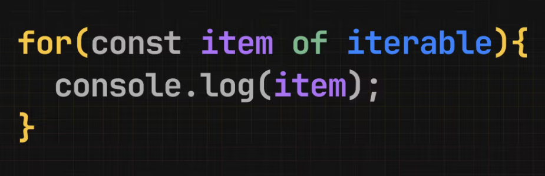

# For Of



El bucle for...of ejecuta el bloque de código para cada elemento de un iterable (Array, String, y hay otros que vamos a ver más adelante) en los cuales cada iteración contará con una variable para el valor de esa posición.

Podemos leer esta sentencia como: por cada elemento de este iterable ejecutá esto.

```javascript
const iterable = [1, 2, 3];
for (const elemento of iterable) {
  console.log(elemento);
}
// Vamos a ver:
// 1
// 2
// 3

const palabra = "Hola";
for (const elemento of palabra) {
  console.log(elemento);
}

// Vamos a ver:
// H
// o
// l
// a
```

## Listas

Sabemos que los bucles son especialmente útiles para recorrer listas y hacer operaciones en cada elemento. En este caso for...of nos va a ahorrar la necesidad de declarar un iterador y vamos a poder recorrer una collection (o cualquier tipo de array) sin necesidad de una variable extra (indice).

```javascript
const videos = [
  {
    title:
      "Usando webhooks para recibir la confirmación de un pago - Pagos online -  Parte 3/4",
    url: "https://www.youtube.com/watch?v=NK4CbPxzZQU",
    duration: "12:30",
  },
  {
    title: "Pensando objetivos del año con OKRs",
    url: "https://www.youtube.com/watch?v=4S1jDNY08Q8",
    duration: "10:15",
  },
  {
    title:
      "Generando un link de pago con la API de Mercado Pago - Pagos online -  Parte 2/4",
    url: "https://www.youtube.com/watch?v=yIRWzNIacJc",
    duration: "14:05",
  },
  {
    title: "Pagos online - Introducción - Parte 1/4",
    url: "https://www.youtube.com/watch?v=LttJdPtXmw4",
    duration: "15:00",
  },
  {
    title: "Usando AI para programar profesionalmente",
    url: "https://www.youtube.com/watch?v=ZjwMQkherN4",
    duration: "11:45",
  },
  {
    title: "Mi primera línea de código",
    url: "https://www.youtube.com/watch?v=IC4c_XOCDGw",
    duration: "9:30",
  },
  {
    title: "¿Por qué uso mac?",
    url: "https://www.youtube.com/watch?v=iQeMY2Qj80U",
    duration: "8:20",
  },
  {
    title: "Plan de estudios",
    url: "https://www.youtube.com/watch?v=4sC-Cf_eDHo",
    duration: "13:00",
  },
];

// Con while necesitamos un indice para recorrer el array
let indice = 0;
while (indice < videos.length) {
  const v = videos[indice];
  console.log(`video: ${v.title}, Duración: ${v.duration}`);
  indice++;
}

// Con for...of esto es más sencillo
for (const v of videos) {
  console.log(`Nombre: ${v.title}, Duración: ${v.duration}`);
}
```

## Usalo

Este es el bucle que más uso en mi día a día. Cuando tengas que recorrer un array (o cualquier otro iterable) de principio a fin y no necesites el número de posición, este es tu bucle favorito.
