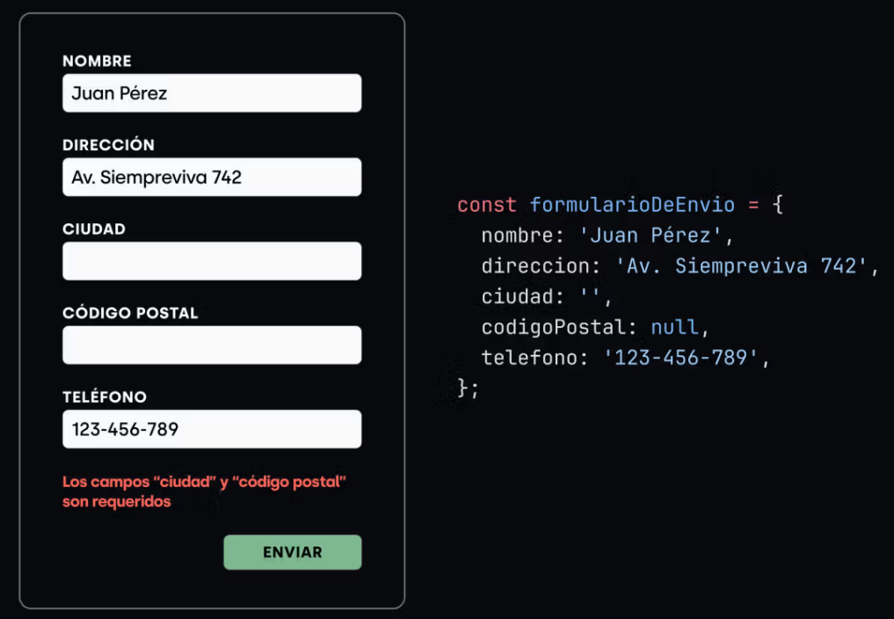

## Formulario de envío

Desafío
En este ejercicio vamos a validar un objeto que representa los datos cargados por un usuario en un formulario de envíos. Por cada campo que esté vacío (falsy) tenés que guardar el nombre del dato y mostrar que datos están faltando al final.

