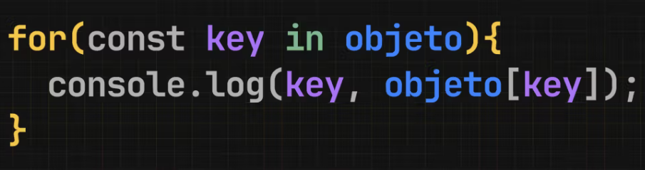

## For In



El bucle for...in es similar a for...of pero, en este caso las iteraciones contendrán una variable para acceder a la key (clave) de cada elemento del iterable.

Esto quiere decir que si iteramos un array, la variable contendrá el índice de su iteración (la posición en la cual nos encontramos).

```javascript
const redes = ["instagram", "tiktok", "twitch"];

for (const key in redes) {
  console.log(key);
}
// Veremos:
// 0
// 1
// 2

for (const key in redes) {
  console.log(redes[key]);
}

// Veremos:
// instagram
// tiktok
// twitch
```

Ya conocemos for...of y sabemos que es más práctico para recorrer elementos de una lista. Por eso for...in es usado, más que nada, para iterar arrays cuando necesitamos conocer la posición del array en cada iteración.

```javascript
const canciones = [
  { titulo: "Don", duracion: 4.5 },
  { titulo: "Perfecta", duracion: 3.2 },
  { titulo: "Mentía", duracion: 2.8 },
  { titulo: "Yo Te Diré", duracion: 5.1 },
  { titulo: "El Profe", duracion: 3.5 },
  { titulo: "Traición", duracion: 2.7 },
];

// Usamos for...in para recorrer el array
for (const indice in canciones) {
  // Esto sería más corto con un for...of pero no tendríamos
  // acceso al indice
  if (canciones[indice].duracion > 3) {
    console.log(
      `La canción "${canciones[indice].titulo}" tiene más de 3 minutos y está en la posición ${indice} del array.`
    );
  }
}
```

O para recorrer objetos.

```javascript
// producto por id
const productos = {
  p001: {
    nombre: "Laptop",
    marca: "Dell",
    precio: 1200,
  },
  p002: {
    nombre: "Monitor",
    marca: "Samsung",
    precio: 300,
  },
  p003: {
    nombre: "Teclado Mecánico",
    marca: "Logitech",
    precio: 100,
  },
};

// Usando un bucle for...in para recorrer el objeto
for (const id in productos) {
  console.log(`ID: ${id}`);
  console.log(`Nombre: ${productos[id].nombre}`);
  console.log(`Marca: ${productos[id].marca}`);
  console.log(`Precio: $${productos[id].precio}`);
}
```

En este caso hay que tener en cuenta que las propiedades de un objeto no tienen un orden. Las vemos en orden porque las declaramos así, pero el for...in no está obligado a respetar ese orden. Para listas ordenadas usamos arrays.

### ¿Por qué iriamos a recorrer objetos?

La respuesta es: diccionarios.

Un diccionario (también a veces mencionado como mapa) es una forma de organizar datos para que sean más fáciles de acceder.

Veamos un ejemplo un cachitín avanzando para entender porque tendríamos un objeto en vez de un array.

## Videos y likes

Normalmente existe un objeto que representa al usuario que está en nuestro sistema. En este caso, este usuario tiene un array de los videos que likeó históricamente.

```javascript
const user = {
  email: "marce@apx.school",
  id: "x1s2d3f4g5",
  likes: [
    {
      id: "yt-video-NK4CbPxzZQU",
      nombre: "Usando webhooks para recibir la confirmación de un pago",
    },
    {
      id: "yt-video-4S1jDNY08Q8",
      nombre: "Pensando objetivos del año con OKRs",
    },
    {
      id: "yt-video-yIRWzNIacJc",
      nombre: "Generando un link de pago con la API de Mercado Pago",
    },
  ],
};
```

Cuando el usuario entra al ver todos los videos, le mostramos la lista de videos del canal, y si encontramos en su registro que le dio like a un video, lo mostramos con un corazón.

```javascript
const videos = [
  {
    id: "yt-video-NK4CbPxzZQU",
    nombre: "Usando webhooks para recibir la confirmación de un pago",
    duracion: "12:34",
  },
  {
    id: "yt-video-4S1jDNY08Q8",
    nombre: "Pensando objetivos del año con OKRs",
    duracion: "10:15",
  },
  {
    id: "yt-video-yIRWzNIacJc",
    nombre: "Generando un link de pago con la API de Mercado Pago",
    duracion: "08:45",
  },
  {
    id: "yt-video-LttJdPtXmw4",
    nombre: "Pagos online - Introducción - Parte 1/4",
    duracion: "09:30",
  },
  {
    id: "yt-video-ZjwMQkherN4",
    nombre: "Usando AI para programar profesionalmente",
    duracion: "11:20",
  },
  {
    id: "yt-video-IC4c_XOCDGw",
    nombre: "Mi primera línea de código",
    duracion: "07:50",
  },
];

for (const video of videos) {
  let mensaje = `Video: ${video.nombre}`;

  // Verificar si el video está en los likes
  for (const like of user.likes) {
    if (like.id === video.id) {
      mensaje += " ❤️"; // Agregar un corazón si está en los likes
    }
  }

  console.log(mensaje);
}
```

El problema con esto es que para cada video del canal, tenemos que recorrer todo el array de likes del usuario. Esto quiere decir que si el canal tiene 100 videos para mostrar en la pantalla y el usuario tiene 100 likes en su historial, tenemos que hacer 10.000 ifs (100 x 100) para mostrar los videos que tengan like. Este es un problema un poco avanzado pero es muy común y vamos a ver más sobre esto cuando hablemos de algoritmos.

Para optimizar esto y ahorrarnos el segundo for...of en el ejemplo, podemos guardar los likes del usuario como un objeto en vez de un array.

```javascript
const user = {
  email: "marce@apx.school",
  id: "x1s2d3f4g5",
  likes: {
    "yt-video-NK4CbPxzZQU": {
      nombre: "Usando webhooks para recibir la confirmación de un pago",
      duracion: "12:34",
    },
    "yt-video-4S1jDNY08Q8": {
      nombre: "Pensando objetivos del año con OKRs",
      duracion: "10:15",
    },
    "yt-video-yIRWzNIacJc": {
      nombre: "Generando un link de pago con la API de Mercado Pago",
      duracion: "08:45",
    },
  },
};
```

Esta "sutil" diferencia hace que podamos recorrer todos los videos del canal y saber rápidamente a cual likeamos.

```javascript
for (const video of videos) {
  let mensaje = `Video: ${video.nombre}`;

  // Verificar si el video está en los likes
  // ahora podemos saberlo sin iterar otro array
  if (user.likes[video.id]) {
    mensaje += " ❤️"; // Agregar un corazón si está en los likes
  }

  console.log(mensaje);
}
```

Con este cambio, si tuvieramos 100 videos en el canal que mostrar y 100 likes en el objeto user, solo tendríamos que hacer 100 ifs y no 10.000 como antes. Cada if es una pregunta que el procesador evalúa y esto multiplicado por miles o millones de usuarios que entran a una web puede hacer una gran diferencia.

Vamos a entender mucho mejor esto cuando veamos algoritmos, por ahora solo queremos entender cuando vamos a tener que recorrer objetos.
Como vimos, nos conviene guardar los likes en forma de un objeto que tenga el id de cada video como key, pero que pasa si queremos mostrar la lista de likes de un usuario. Ahora si, podemos usar un for...in.
|

```javascript
for (const key in user.likes) {
  const element = user.likes[key];
  console.log("Likes del usuario");
  console.log(`Video: ${element.nombre} - Duración: ${element.duracion} ❤️`);
}
```

Dimos toda una vuelta para encontrar un caso realista pero esta es la verdad. Solo vamos a usar for...in si queremos recorrer un diccionario/mapa o en el caso de que queramos recorrer un array y tener a mano el indice. No te preocupes, cuando vayamos viendo más y más código y necesitemos usar for...in vamos a darnos cuenta porque no nos va a quedar otra opción.
